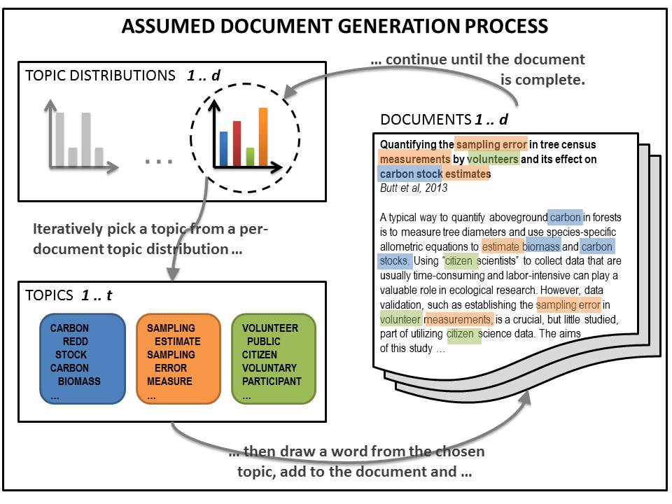

---
output:
  md_document:
    variant: markdown
---

```{r setup, include=FALSE}
# pandoc cmd snippet:
# pandoc -t revealjs --template=./topicmodels/slides/custom_pandoc_template/default.revealjs -s -o ./topicmodels/slides/index.html ./topicmodels/slides/index.md ./topicmodels/slides/index_metadata.yaml -V revealjs-url=./reveal.js-3.6.0 --mathjax --no-highlight -V highlighting-css=zenburn -V controlsLayout=edges --bibliography ./topicmodels/slides/topicmodels-ds4sd.bib

# create pdf
# decktape -s 1920x1080 reveal ./topicmodels/slides/index.html ./topicmodels/slides/2025-ds4sd-topicmodels.pdf

# create screenshots
# decktape reveal ./topicmodels/slides/index.html ./topicmodels/slides/2025-ds4sd-topicmodels.pdf --screenshots --screenshots-directory ./topicmodels/handouts/screenshots

knitr::opts_chunk$set(
  echo = FALSE,
  message = FALSE,
  warning = FALSE,
  collapse = TRUE,
  cache = FALSE,
  comment = ">#",
  fig.path = "figures/"
)

library(srcquantcourse)
library(dplyr)
library(tidyr)
library(stringr)
library(quanteda)
library(quanteda.textstats)
library(stm)
library(stminsights)
library(ggplot2)
library(gt)

library(gutenbergr)
library(tidytext)

# get text
#book <- gutenberg_download(c(244))
load("scarlet_book.Rdata")

# tidy the text into individual words
tidy_book <- book %>%
  #mutate(line = row_number()) %>%
  unnest_tokens(word, text)

# count the word/term frequency
word_count <- tidy_book %>%
  count(word, sort = TRUE)

# remove stopwords
word_count_filtered <- tidy_book %>%
  anti_join(stop_words) %>%
  count(word, sort = TRUE)

# ngrams as tokens
tidy_ngrams <- book %>%
  unnest_tokens(bigram, text, 
                token = "ngrams", n = 2,
                collapse = c("gutenberg_id")) %>%
  filter(!is.na(bigram)) %>%
  count(bigram, sort = TRUE)

# ngrams as tokens (stop words filtered)
tidy_ngrams_filtered <- book %>%
  unnest_tokens(bigram, text, 
                token = "ngrams", n = 2,
                collapse = c("gutenberg_id")) %>%
  filter(!is.na(bigram)) %>%
  tidyr::separate(bigram, c("token1", "token2"), sep = " ") %>%
  anti_join(by = c("token1" = "word"), stop_words) %>%
  anti_join(by = c("token2" = "word"), stop_words) %>%
  tidyr::unite(bigram, token1, token2, sep = " ")

bigram_count <- tidy_ngrams_filtered %>%
  count(bigram, sort = TRUE)

# sentiment sample
# index line numbers and tidy
tidy_book_indexed <- book %>%
  mutate(line = row_number()) %>%
  unnest_tokens(word, text)

# get a sentiment dictionary
afinn_dict <- get_sentiments("afinn")

# most frequent words that overlap
# with the AFINN sentiment dictionary
sentiment_count <- tidy_book_indexed %>%
  anti_join(stop_words) %>%
  count(word, sort = TRUE) %>%
  inner_join(afinn_dict)

# mean sentiment summarized for 
# blocks of 50 consecutive lines
sentiment_trend <- tidy_book_indexed %>%
  inner_join(afinn_dict) %>%
  group_by(index = line %/% 100) %>%
  summarise(mean_sentiment = mean(value)) %>%
  ungroup()
```

[//]: <> (Alternative background colours are #002b36 #333 #1E8C45)


## &nbsp; {.hideslideheader data-background="#061C30"}
<div style="display:table;width:100%;table-layout: fixed;">
  <div class="title-without-logo" style="display:table-cell;width:100%;padding-right:3%;padding-left:3%;vertical-align:middle;">
  SRC 2024/25 PhD course 'Data Science for Sustainable Development'
  
  Structural Topic Modeling with R

  &nbsp;
    
  &nbsp;
  
  &nbsp;
  
  &nbsp;
  </div>
</div>

<div style="display:table;width:100%;table-layout: fixed;">
  <div class="mytitlepage linksection" style="display:table-cell;width:30%;padding-left:3%;vertical-align:bottom;">
  *https://scitingly.net/*
  
  *stefan.daume@su.se*
  </div>
  
  
  <div class="mytitlepage authorsection" style="display:table-cell;width:70%;padding-right:3%;">
  &nbsp;
  **Stefan Daume**
  
  *[Stockholm Resilience Centre, Stockholm University](https://www.stockholmresilience.org/meet-our-team/staff/2021-01-27-daume.html)* 
  
  & *[Beijer Institute of Ecological Economics](https://beijer.kva.se/programmes/complexity/)*

  &nbsp;
  
  *11. April 2025*
  </div>
</div>


# "Text as data" - Basic text mining

## Text mining packages

Basic packages:

* tidytext
* stringr
* dplyr
* tidyr
* (SnowballC)
* (spacyr)
* (textdata)


## Basic text mining steps

1. get text (e.g., via gutenbergr)
2. tidy
3. tokenize
4. transform
5. (annotate)
6. analyze


## Basic analysis: get text, tidy, count

```{r eval=FALSE, echo=TRUE}
library(gutenbergr)
library(dplyr)
library(tidytext)

# get "mystery" text
book <- gutenberg_download(c(244))

# books are lines of text with associated book ID
# tibble [4,737 × 2] (S3: tbl_df/tbl/data.frame)
#  $ gutenberg_id: int [1:4737] 244 244 244  ...
#  $ text        : chr [1:4737] "" "" "" ...

# tidy the text into individual words
# also lowercases and remove punctuation
tidy_book <- book %>%
  unnest_tokens(output = word, input = text)

# count the word/term frequency
word_count <- tidy_book %>%
  count(word, sort = TRUE)
```

<aside class="notes">
* books from project gutenberg are returned as dataframes/tibbles with two columns that provide the text per line and the associated book ID
* `unnest_tokens()` both tokenizes and tidys the text (i.e., whitespace, punctuation is removed, the tokens are transformed to lowercase)  
</aside>


## Most frequent words

<div style="display:table;width:100%;table-layout:fixed;">
  <div style="display:table-cell;width:60%;padding-right:5%;text-align:left;vertical-align:top;">

```{r eval=FALSE, echo=TRUE}
library(gutenbergr)
library(dplyr)
library(tidytext)

# get "mystery" text
book <- gutenberg_download(c(244))

# tidy the text into individual words
# also lowercases and removes punctuation
tidy_book <- book %>%
  unnest_tokens(output = word, input = text)

# count the word/term frequency
word_count <- tidy_book %>%
  count(word, sort = TRUE)
```

  </div>
  
  
  <div style="display:table-cell;width:40%;padding-left:5%;text-align:left;vertical-align:top;">
  
```{r echo=FALSE}
word_count %>%
  slice_head(n = 10) %>%
  gt() %>%
  tab_header(
    title = stringr::str_to_title("Mystery book word count"),
    subtitle = md("(10 most frequent terms)")
  )
```

  </div>
</div>


<aside class="notes">

</aside>


## Exclude "stop words"

<div style="display:table;width:100%;table-layout:fixed;">
  <div style="display:table-cell;width:60%;padding-right:5%;text-align:left;vertical-align:top;">

```{r eval=FALSE, echo=TRUE}
library(gutenbergr)
library(dplyr)
library(tidytext)

# get "mystery" text
book <- gutenberg_download(c(244))

# tidy the text into individual words
# also lowercases and removes punctuation
tidy_book <- book %>%
  unnest_tokens(output = word, input = text)

# remove stopwords 
# (lexicon provided with tidytext)
word_count_filtered <- tidy_book %>%
  anti_join(stop_words, by = "word") %>%
  count(word, sort = TRUE)
```

  </div>
  
  
  <div style="display:table-cell;width:40%;padding-left:5%;text-align:left;vertical-align:top;">
  
```{r echo=FALSE}
stop_words %>%
  slice_head(n = 10) %>%
  gt() %>%
  tab_header(
    title = stringr::str_to_title("Sample stop words"),
    subtitle = md("(dataset included in `tidytext`)")
  )
```

  </div>
</div>


<aside class="notes">
* the removed stopwords represent only `r (nrow(word_count)-nrow(word_count_filtered))/nrow(word_count) * 100` % of the vocabulary (terms)
* but `r (sum(word_count$n)-sum(word_count_filtered$n))/sum(word_count$n) *100`% of all tokens 
</aside>


## Filtered word count

<div style="display:table;width:100%;table-layout:fixed;">
  <div style="display:table-cell;width:60%;padding-right:5%;text-align:left;vertical-align:top;">

```{r eval=FALSE, echo=TRUE}
library(gutenbergr)
library(dplyr)
library(tidytext)

# get "mystery" text
book <- gutenberg_download(c(244))

# tidy the text into individual words
# also lowercases and removes punctuation
tidy_book <- book %>%
  unnest_tokens(output = word, input = text)

# remove stopwords 
# (lexicon provided with tidytext)
word_count_filtered <- tidy_book %>%
  anti_join(stop_words, by = "word") %>%
  count(word, sort = TRUE)
```

  </div>
  
  
  <div style="display:table-cell;width:40%;padding-left:5%;text-align:left;vertical-align:top;">
  
```{r echo=FALSE}
word_count_filtered %>%
  slice_head(n = 10) %>%
  gt() %>%
  tab_header(
    title = stringr::str_to_title("Mystery book word count"),
    subtitle = md("(10 most frequent terms **without stopwords**)")
  )
```

  </div>
</div>


## Tokens can be more than words

<div style="display:table;width:100%;table-layout:fixed;">
  <div style="display:table-cell;width:70%;padding-right:5%;text-align:left;vertical-align:top;">

```{r eval=FALSE, echo=TRUE}
library(gutenbergr)
library(dplyr)
library(tidytext)

# get "mystery" text
book <- gutenberg_download(c(244))

# ngrams as tokens
tidy_ngrams <- book %>%
  unnest_tokens(bigram, text, 
                token = "ngrams", n = 2,
                collapse = c("gutenberg_id")) %>%
  filter(!is.na(bigram)) %>%
  count(bigram, sort = TRUE)
```

  </div>
  
  
  <div style="display:table-cell;width:30%;padding-left:5%;text-align:left;vertical-align:top;">
  
```{r echo=FALSE}
tidy_ngrams %>%
  slice_head(n = 10) %>%
  gt() %>%
  tab_header(
    title = md("Mystery Book *n-gram* Count"),
    subtitle = md("(10 most frequent terms)")
  )
```

  </div>
</div>

<aside class="notes">
* typically, in text analysis, individual words are used as tokens
* but what constitutes a relevant basic unit of information can vary
* sometimes, n-grams (multiple successive words) could be the tokens to analyse
</aside>


## "The game's afoot ..."

<div style="display:table;width:100%;table-layout:fixed;">
  <div style="display:table-cell;width:70%;padding-right:5%;text-align:left;vertical-align:top;">

```{r eval=FALSE, echo=TRUE}
library(gutenbergr)
library(dplyr)
library(tidytext)

# get "mystery" text
book <- gutenberg_download(c(244))

# ngrams as tokens (stop words filtered)
tidy_ngrams_filtered <- book %>%
  unnest_tokens(bigram, text, 
                token = "ngrams", n = 2,
                collapse = c("gutenberg_id")) %>%
  filter(!is.na(bigram)) %>%
  tidyr::separate(bigram, c("token1", "token2"), sep = " ") %>%
  anti_join(by = c("token1" = "word"), stop_words) %>%
  anti_join(by = c("token2" = "word"), stop_words) %>%
  tidyr::unite(bigram, token1, token2, sep = " ")

bigram_count <- tidy_ngrams_filtered %>%
  count(bigram, sort = TRUE)
```

  </div>
  
  
  <div style="display:table-cell;width:30%;padding-left:5%;text-align:left;vertical-align:top;">
  
```{r echo=FALSE}
bigram_count %>%
  slice_head(n = 10) %>%
  gt() %>%
  tab_header(
    title = md("Mystery Book *n-gram* Count"),
    subtitle = md("(10 most frequent n-grams <br> **without items containing a stop word**)")
  )
```

  </div>
</div>

<aside class="notes">
* typically, in text analysis, individual words are used as tokens
* but what constitutes a relevant basic unit of information can vary
* sometimes, n-grams (multiple successive words) could be the tokens to analyse
</aside>


## Further options: Sentiment Analysis

```{r echo=FALSE}
afinn_dict <- get_sentiments("afinn")

afinn_dict %>%
  slice_sample(n = 10) %>%
  gt() %>%
  tab_header(
    title = md("Sentiment words and valence"),
    subtitle = md("*AFINN sentiment dictionary*")
  )
```


## Frequent sentiment words

<div style="display:table;width:100%;table-layout:fixed;">
  <div style="display:table-cell;width:70%;padding-right:5%;text-align:left;vertical-align:top;">

```{r eval=FALSE, echo=TRUE}
library(gutenbergr)
library(dplyr)
library(tidytext)

# get text
book <- gutenberg_download(c(244))

# index line numbers and tidy
tidy_book_indexed <- book %>%
  mutate(line = row_number()) %>%
  unnest_tokens(word, text)

# get a sentiment dictionary
afinn_dict <- get_sentiments("afinn")

# most frequent words that overlap
# with the AFINN sentiment dictionary
sentiment_count <- tidy_book_indexed %>%
  anti_join(stop_words) %>%
  count(word, sort = TRUE) %>%
  inner_join(afinn_dict)
```

  </div>
  
  
  <div style="display:table-cell;width:30%;padding-left:5%;text-align:left;vertical-align:top;">
  
```{r echo=FALSE}
sentiment_count %>%
  slice_head(n = 10) %>%
  gt() %>%
  tab_header(
    title = md("Sentiment word count"),
    subtitle = md("(10 most frequent words overlapping <br> with the AFINN dictionary)")
  )
```

  </div>
</div>

<aside class="notes">
* typically, in text analysis, individual words are used as tokens
* but what constitutes a relevant basic unit of information can vary
* sometimes, n-grams (multiple successive words) could be the tokens to analyse
</aside>


## Sentiment trend

<div style="display:table;width:100%;table-layout:fixed;">
  <div style="display:table-cell;width:50%;padding-right:5%;text-align:left;vertical-align:top;">

```{r eval=FALSE, echo=TRUE}
library(gutenbergr)
library(dplyr)
library(tidytext)

# get text
book <- gutenberg_download(c(244))

# index line numbers and tidy
tidy_book_indexed <- book %>%
  mutate(line = row_number()) %>%
  unnest_tokens(word, text)

# get a sentiment dictionary
afinn_dict <- get_sentiments("afinn")

# mean sentiment summarized for 
# blocks of 50 consecutive lines
sentiment_trend <- tidy_book_indexed %>%
  inner_join(afinn_dict) %>%
  group_by(index = line %/% 100) %>%
  summarise(mean_sentiment = mean(value)) %>%
  ungroup()

ggplot(sentiment_trend, 
       aes(x = index, 
           y = mean_sentiment)) +
  geom_point() +
  geom_line() +
  geom_smooth()
```

  </div>
  
  
  <div style="display:table-cell;width:50%;padding-left:5%;text-align:left;vertical-align:top;">
  
```{r echo=FALSE}
ggplot(sentiment_trend, aes(x = index, y = mean_sentiment)) +
  geom_point() +
  geom_smooth()
```

  </div>
</div>

<aside class="notes">
* typically, in text analysis, individual words are used as tokens
* but what constitutes a relevant basic unit of information can vary
* sometimes, n-grams (multiple successive words) could be the tokens to analyse
</aside>


# "Text as data" - Topic modeling

## The notion of "latent topics"

Topic modeling applies **unsupervised probabilistic classification** to identify the **latent** ("hidden") topics in a collection of documents.

<aside class="notes">
* **"Latent Topics"**
  * e.g., if we review articles about urban sustainability, we would expect the major topics about *urban environments* and *sustainability* to be present
  * But how prevalent is each?
  * Which subtopics are emerging?
  * Which auxiliary topics (technology, social networks, AI)?
  * Are there unexpected topics? 
  * In which combinations do these topics occur?

* How do we find these? 
  * Manual analysis and categorisation. Possibly to create a labelled training data set for Machine Learning classifiers.
  * Or use unsupervised probabilistic classification, i.e. topic modeling.

* **NOTE:**
  * Requires document collections!
  * Topics are defined as collections of words that frequently co-occur.
</aside>


## Supervised vs unsupervised learning/classification

Key difference: supervised learning requires **labelled** training data

<aside class="notes">
* Key takeaway: this has substantial practical and economical implications for research  (different efforts, costs, teams)
* add examples of effort processes
</aside>


## Why topic modeling?

* summarize large text collections
* discover "latent" topics
* text-based (causal) inferences and testing social science theories

# Examples

## Long-term trends in climate change reports

A topography of climate change research [@CallaghanMinx_et_2020_NCC_10]

* more than 400.000 climate change publications analysed
* over-representation of social sciences are in recent assessment reports
* demand of more solution-oriented research


## Corporate sustainability reporting

Analysis of 9,500 corporate sustainability reports (published 1999 to 2015) [@SzekelyBrocke_2017_PO_12]:

* reports cover environmental, social, and economic sustainability
* economic sustainability is of increasing importance
* environmental sustainability is focused on emissions and energy
* biodiversity receives little attention

<aside class="notes">
* sustainability reports published between 1999 and 2015 for our study. We retrieved the PDF documents from the GRI website (http://database.globalreporting.org/search)
</aside>


## Climate communication

* **topic modeling** of **organizational climate communication** to identify **impact of corporate funding** on climate polarization [@Farell_2016_PNAS_113]

<aside class="notes">
* the last example is based on text and illustrates the use of the method we will focus on today
</aside>


## Perception and communication of policies

Analysis of open-ended survey responses asking why carbon taxes are unfair [@PovitkinaCarlssonJagers_et_2021_GEC_70]:

* impact of demographic factors on perceptions of fairness
* implications for policy design

<aside class="notes">
* Why are carbon taxes unfair? Disentangling public perceptions of fairness
* mention that this (open-ended survey responses) is also the original usecase for STM 

* **several usecases that might relate to your own research and give an indication where topic models may be useful**
* **also the reason we chose this techniques because we all deal with text in one way or another**
</aside>


# Topic modeling algorithm

## How does it work?

Generative model that reverses the assumed document generation process.


## Generative model {.xs-small-pg-text}

```{r out.width="60%"}
# add illustration figure

```

Illustration of the topic modeling process ([@DaumeAlbertEt2014_FORESTECOSYST_1] (adapted from [@Blei2012_COMMACM_55])).


## Topic modelling algorithms

* LSA - [Latent semantic analysis](https://asistdl.onlinelibrary.wiley.com/doi/10.1002/(SICI)1097-4571(199009)41:6%3C391::AID-ASI1%3E3.0.CO;2-9)
* LDA - Latent dirichlet allocation [@BleiNgEt2003_JMLR_3]
* CTM - Correlated topic model [@BleiLafferty2007_AAS_1]
* STM - Structural topic model [@RobertsStewart_et_2019_JSTATS_91]


## STM vs "vanilla LDA"

* STM extends CTM (i.e. assumes that topics are correlated) 
* STM can incorporate arbitrary document meta-data into the topic model


## Basic text mining concepts

* documents
* corpus
* tokens
* terms


## Basic Topic modeling steps

1. get documents to analyse
2. preprocess
3. create a corpus
4. tokenize
5. create document-term/feature matrix
6. *(evaluate alternative topic numbers)*
7. decide on K, the number of topics, and fit a topic model
8. *(validate semantic integrity of the topic model)*
9. test impact of document meta-data on topics


## R packages to use

* quanteda
* tidytext
* (snowballc)
* (spacyr)
* stringr
* stm


# Structural topic modeling applied

## A Topic model of Covid preprints

The following slides step through a detailed example of fitting a topic model to preprints on [bioRxiv](https://www.biorxiv.org/) and [medRxiv](https://www.medrxiv.org/) related to *Covid-19*. 

R code and detailed examples are available here:

* **Code**: https://github.com/sdaume/srcquantcourse
* **Documentation**: https://sdaume.github.io/srcquantcourse


## Motivation

* understand prevalent topics in preprints from [bioRxiv](https://www.biorxiv.org/) and [medRxiv](https://www.medrxiv.org/) 
* explore the effect of document metadata (covariates), such as:
  * Which preprint server it was published on?
  * When it was published?
  * If it has been published after peer review?


## Getting data

Preprint data on [bioRxiv](https://www.biorxiv.org/) and [medRxiv](https://www.medrxiv.org/) can be retrieved via a **public API** with the help of the [`medrxivr`](https://docs.ropensci.org/medrxivr/) R package.


## Preparing preprint metadata

```{r eval=FALSE, echo=TRUE}
library(dplyr)
library(medrxivr)

# get publications from medRxiv and bioRxiv
pubs_biorxiv_raw <- medrxivr::mx_api_content(server = "biorxiv",
                                             #from_date = "2019-01-01",
                                             to_date = "2023-12-31")

pubs_medrxiv_raw <- medrxivr::mx_api_content(server = "medrxiv",
                                             #from_date = "2019-01-01",
                                             to_date = "2023-12-31")

pubs_biorxiv_raw <- pubs_biorxiv_raw %>%
  mutate(server = "biorxiv")

pubs_medrxiv_raw <- pubs_medrxiv_raw %>%
  mutate(server = "medrxiv")

preprints_raw <- dplyr::bind_rows(pubs_biorxiv_raw, pubs_medrxiv_raw)

save(preprints_raw, file = "./data-raw/preprints_raw.Rdata")
```


## Preprint metadata

```
glimpse(preprints_raw)

Rows: 365,526
Columns: 16
$ doi                              <chr> "10.1101/001891", "10.1101/001867", "10.1101…
$ title                            <chr> "Population genomics of Saccharomyces cerevi…
$ authors                          <chr> "Carlotta De Filippo;Monica Di Paola;Irene S…
$ author_corresponding             <chr> "Duccio  Cavalieri", "David  Morrison", "Dav…
$ author_corresponding_institution <chr> "Fondazione E. Mach (FEM)", "Swedish Univers…
$ date                             <chr> "2014-01-17", "2014-01-17", "2014-01-17", "2…
$ version                          <chr> "1", "1", "1", "2", "1", "1", "1", "1", "2",…
$ license                          <chr> "cc_by_nc_nd", "cc_by_nc", "cc_by_nc", "cc_b…
$ category                         <chr> "Evolutionary Biology ", "Ecology ", "Molecu…
$ jatsxml                          <chr> "https://www.biorxiv.org/content/early/2014/…
$ abstract                         <chr> "The quest for the ecological niches of Sacc…
$ published                        <chr> "NA", "NA", "NA", "NA", "10.1093/bioinformat…
$ node                             <int> 1, 2, 3, 4, 5, 6, 7, 8, 9, 10, 11, 12, 13, 1…
$ link_page                        <chr> "https://www.biorxiv.org/content/10.1101/001…
$ link_pdf                         <chr> "https://www.biorxiv.org/content/10.1101/001…
$ server                           <chr> "biorxiv", "biorxiv", "biorxiv", "biorxiv", …
```


## Cleaning, filtering and annotating

```{r eval=FALSE, echo=TRUE}
library(dplyr)

preprints_cleaned <- preprints_raw %>%
  group_by(doi) %>%
  filter(version == max(version)) %>%
  ungroup() %>%
  distinct(doi, .keep_all = TRUE)
```


## Cleaning, filtering and annotating

```{r eval=FALSE, echo=TRUE}
preprints <- preprints_cleaned %>%
  mutate(published = stringr::str_trim(published)) %>%
  mutate(published = na_if(published, "NA")) %>%
  mutate(is_published = as.numeric(!is.na(published))) %>%
  mutate(is_published = case_when(is_published == 1 ~ "published",
                                  is_published == 0 ~ "not published",
                                  TRUE ~ "undefined")) %>%
  mutate(year = lubridate::year(date)) %>%
  filter(year >= 2020 & year <= 2023) %>% 
  select(doi, server, title, abstract, date, year, version, is_published)
```


## Cleaning, filtering and annotating

```{r eval=FALSE, echo=TRUE}
library(stringr)

keywords <- c("sars-cov", "covid")

search_pattern <- stringr::regex(paste(keywords, collapse = "|"), 
                                 ignore_case = TRUE)

covid_preprints <- preprints %>%
  filter(stringr::str_detect(title, pattern = search_pattern) |
           stringr::str_detect(abstract, pattern = search_pattern))
```


## Preprocessing the documents for text analysis

From text to data:

* create a corpus
* tokenize and preprocess
* create a document-feature matrix


## Preprocessing the documents for text analysis

Text preprocessing choices could strongly influence the results of a text analysis! 

&nbsp;

Choices need to be:

* thoroughly explained, 
* carefully evaluated and 
* ideally be based on theory (see [@DennySpirling_2018_PA_26])


## Create a corpus

```{r eval=FALSE, echo=TRUE}
library(quanteda)

pubs_corpus <- covid_preprints %>%
  quanteda::corpus(docid_field = "doi", text_field = "abstract")

# pubs_corpus
# Corpus consisting of 29,692 documents and 6 docvars.
```

<aside class="notes">
First, we create a **corpus** object from the dataframe of preprints. The corpus is essentially a library of documents that will be used for the next steps. It specifies which variable should be used to uniquely identify documents and which variable holds the textual content (here the preprint *abstracts*) that should be processed.

Echoing the corpus will provide some basic information. All other variables in the original dataframe will be interpreted and included as document metadata (*'docvars'*), which could later be included in the STM topic modelling process. 
</aside>


## Tokenize and preprocess

```{r eval=FALSE, echo=TRUE}
pubs_tokens <- pubs_corpus %>%
  quanteda::tokens(remove_punct = TRUE,
                   remove_symbols = TRUE,
                   remove_numbers = TRUE,
                   remove_url = TRUE,
                   remove_separators = TRUE,
                   split_hyphens = TRUE) 

```

<aside class="notes">
For further analysis the corpus documents have to be **tokenized**, i.e. further processing the texts have to be broken into semantic units that are relevant for our analysis. The most common approach is to interpret each *word* (typically designated by whitespaces or punctuation) as a token. This is applied here as well. `quanteda` offers several alternative approaches. Instead of individual words, sequences of words (*n-grams*) could for example be used.

The tokenization method also provides several options for preprocessing and filtering the tokens. Here for example, while tokenizing, we will simultaneously remove punctuation, numbers, special symbols and URLs. Furthermore, we split words containing hyphens, a word like *social-ecological* will thus be split into two individual tokens (*social* and *ecological*). 

The text preprocessing choices could strongly influence the results of a text analysis and should be thoroughly explained, carefully evaluated and ideally be based on theory (see [@DennySpirling_2018_PA_26]).
</aside>


## Create a Document-feature matrix

```{r eval=FALSE, echo=TRUE}
pubs_dfm <- pubs_tokens %>%
  quanteda::dfm()
```

<aside class="notes">
The **tokens** object is then used to create a *document-feature matrix*. For further statistical analysis this reduces the tokens to a matrix of documents (rows) and unique **terms** (columns) that counts the number of occurrences for each term in each document. `quanteda` captures this as *features* which supports more general options than **terms** (see the `quanteda` documentation for details).
</aside>


## Filter terms and documents

```{r eval=FALSE, echo=TRUE}
pubs_dfm <- pubs_dfm %>%
  quanteda::dfm_remove(pattern = quanteda::stopwords("english")) #%>%
  #quanteda::dfm_wordstem()
```
```
# echo the result
> pubs_dfm

Document-feature matrix of: 29,692 documents, 82,472 features (99.87% sparse) and 6 docvars.
                features
docs             nitric oxide synthesised three isoforms synthases viz nnos neurons enos
  10.1101/038398      6     6           1     1        1         1   1    1       2    1
  10.1101/058511      0     0           0     0        0         0   0    0       0    0
  10.1101/292979      0     0           0     2        0         0   0    0       0    0
  10.1101/402370      0     0           0     0        0         0   0    0       0    0
  10.1101/420737      0     0           0     0        0         0   0    0       0    0
  10.1101/596700      0     0           0     0        0         0   0    0       0    0
[ reached max_ndoc ... 29,686 more documents, reached max_nfeat ... 82,462 more features ]
```
<aside class="notes">
This is followed by other (optional) processing and filtering steps. A common option for example  --- to reduce the size of the data or assist in the interpretation --- is the removal of so-called **stopwords** (e.g. *"the", "and", "or"* etc).

A step omitted here is reducing words (terms) to their word stem. The stemming algorithm (several are available) reduces words to its word stem. The terms "universal", "university" and "universe" would for example be reduced to the same word stem of "univers"; this example indicates that this approach may require careful consideration.

Stemming has the advantage that it could potentially reduce the size of the matrix substantially. 
</aside>

## Stemming

*"Stemming"* will reduce the matrix, but could result in loosing semantic information.

For example: **"universal"**, **"university"** and **"universe"** all have the stem **"univers"**!


## More filtering 

```{r eval=FALSE, echo=TRUE}
pubs_dfm <- pubs_dfm %>%
  quanteda::dfm_remove(min_nchar = 2) %>%
  quanteda::dfm_trim(min_docfreq = 2, docfreq_type = "count") %>%
  quanteda::dfm_subset(quanteda::ntoken(.) > 4)
```
```
# echo the result
> pubs_dfm

Document-feature matrix of: 29,691 documents, 37,093 features (99.72% sparse) and 6 docvars.
                features
docs             nitric oxide synthesised three isoforms synthases viz neurons enos endothelial
  10.1101/038398      6     6           1     1        1         1   1       2    1           2
  10.1101/058511      0     0           0     0        0         0   0       0    0           0
  10.1101/292979      0     0           0     2        0         0   0       0    0           0
  10.1101/402370      0     0           0     0        0         0   0       0    0           0
  10.1101/420737      0     0           0     0        0         0   0       0    0           0
  10.1101/596700      0     0           0     0        0         0   0       0    0           0
[ reached max_ndoc ... 29,685 more documents, reached max_nfeat ... 37,083 more features ]
```

<aside class="notes">
Further options may be considered to reduce noise and/or the size of the matrix. The following code removes for example terms (or features) that consist only of one character, terms that do not appear in at least two different documents, and furthermore would remove documents that do not contain at least 5 tokens. In our example this drops one document and reduces the number of retained features by more than half. 
</aside>


## Fitting the STM topic model

```{r eval=FALSE, echo=TRUE}
library(stm)

covid_stm_docs <- quanteda::convert(pubs_dfm, to = "stm")

covid_model_K20 <- stm(documents = covid_stm_docs$documents,
                       vocab = covid_stm_docs$vocab,
                       data = covid_stm_docs$meta,
                       prevalence = ~ server * s(year),
                       K = 20,
                       verbose = TRUE,
                       seed = 9868467)
```

<aside class="notes">
The key input to any topic modelling algorithm is the number of topics (`K`) that the model should be fit to, which we here set to 20 (see the separate document for a discussion on suitable choices for the number of topics).

Before fitting the topic model we convert the document-feature matrix into the native STM format. In order to fit a topic model with the `stm()` function we need the set of `documents`, the `vocabulary` of which these documents are composed and a dataframe specifying the values of all document meta-data variables (`data`) which can be used in the process as "covariates" that might influence the prevalence of topics in a document. 

In the example below, we ask `stm` to incorporate the origin of the document (`server`) and the publication `year` when fitting the topic model. The argument `prevalence = ~ server * s(year)` expresses that we assume that the prevalence of topics in a document is influenced by these two variables, and that they also interact, i.e. we work with the hypothesis that different temporal trends could be expected for documents published on either of the two preprint servers^[NOTE we use the recommended spline function for the `year` variable. Consult the STM documentation for details on this.].

The consideration of covariates is optional. If omitted the model reduces to a *Correlated Topic Model* [@BleiLafferty2007_AAS_1; @RobertsStewart_et_2019_JSTATS_91].

We also supply a `seed`, which allows to replicate the results of the topic modeling. 
</aside>


## Choosing 'K'

```{r, fig.height=5, fig.width=7, dpi=100, out.width="80%"}

srcquantcourse::topicmodel_evaluations %>%
  filter(subset_label %in% c("Covid preprints")) %>%
  filter(!(model_metric %in% c("Converged", "Iterations"))) %>%
  #filter(K <= 70) %>%
  ggplot(aes(K, value, color = model_metric, group = subset_label)) +
  scale_x_continuous(breaks = seq.int(0, 100, 10), limits = c(0, NA)) +
  #geom_smooth(colour = "black") +
  geom_line(show.legend = TRUE, aes(colour = subset_label)) +
  geom_point(show.legend = TRUE, aes(colour = subset_label)) +
  facet_wrap(~model_metric, scales = "free_y", ncol = 2) +
  labs(x = "Number of topics (K)", y = NULL) +
  theme_minimal() +
  theme(panel.grid.major.x = ggplot2::element_line(colour = "#969696"),
        panel.grid.major.y = ggplot2::element_blank(),
        legend.position = "bottom")
```


## Choosing 'K'

```{r, fig.height=5, fig.width=7, dpi=100, out.width="80%"}
topicmodel_evaluations %>%
  filter(subset_label %in% c("SES preprints", 
                             #"ML/AI preprints",
                             "Biodiversity preprints")) %>%
  filter(!(model_metric %in% c("Converged", "Iterations"))) %>%
  #filter(K <= 70) %>%
  ggplot(aes(K, value, color = model_metric, group = subset_label)) +
  scale_x_continuous(breaks = seq.int(0, 100, 10), limits = c(0, NA)) +
  #geom_smooth(colour = "black") +
  geom_line(show.legend = TRUE, aes(colour = subset_label)) +
  geom_point(show.legend = TRUE, aes(colour = subset_label)) +
  facet_wrap(~model_metric, scales = "free_y", ncol = 2) +
  labs(x = "Number of topics (K)", y = NULL) +
  theme_minimal() +
  theme(panel.grid.major.x = ggplot2::element_line(colour = "#969696"),
        panel.grid.major.y = ggplot2::element_blank(),
        legend.position = "bottom")
```


## Estimating the effect of document covariates

```{r eval=FALSE, echo=TRUE}
covid_effect_K20 <- estimateEffect(1:20 ~ server * s(year),
                                   stmobj = covid_model_K20,
                                   metadata = covid_stm_docs$meta)
```

<aside class="notes">
Once the model has converged we can estimate the effect of document covariates on the topic prevalence. The `estimateEffect()` function allows to run regressions based on the formula specified as the first argument. It is here identical to the formula used when fitting the topic model, and regressions are run for all 20 topics. The same metadata as used previously needs to be supplied for this function in addition to the topic model object.  

This concludes fitting the model. The following sections step through a sample exploration of this topic model.
</aside>


## Basic topic model information

```{r echo=TRUE, dpi = 200, fig.height=7, fig.width=10, out.width="70%"}

plot(covid_model_K20, n = 5)

```

<aside class="notes">
The topic model is defined by two matrices that capture probability distributions of topics over documents (*gamma* matrix) and words (or terms) over topics (*beta* matrix). We can start exploring these with some of the built-in functions of `stm`. 

The `plot()` function plots a chart showing topic proportions for all topics in the model. A topic is identified by a unique ID (1-20) and in the plot below the five words (or terms) that have the highest probability of being associated with the given topic. This gives an early indication of the distinct latent topics in the analysed subset of preprints. 
</aside>


## Topic words

```{r echo=TRUE}
summary(covid_model_K20)

```

<aside class="notes">
The `summary()` function provides a more detailed view of the topics and can help to begin interpreting and labeling the 20 topics. Specifically, the output shows four different sets of words associated with a topic. *'Highest Prob'* lists the words that have the highest probability of being associated with a topic. A comparison of different topics highlights that a term such as *covid* has a high probability for several topics. The list of *'FREX'* words summarizes words that are frequent and exclusive in a topic, i.e. characterize a topic in comparison to other topics (consult `stm::labelTopics()` for details as well as *Lift* and *Score* word sets). 
</aside>


## Topic-document ('gamma') distribution

```{r echo=TRUE}
# retrieve the 'gamma' matrix
gamma <- tidytext::tidy(covid_model_K20, matrix = "gamma")

glimpse(gamma)
```

<aside class="notes">
As mentioned, the topic model is defined by the *gamma* (distribution of topics over words) and *beta* (distribution of terms over topics) matrices. With the help of the `tidytext` package we can extract those into dataframes for a more detailed analysis. 

Each row in the following dataframe lists the probability (`gamma`) of a given `topic` occurring in a given `document`^[NOTE that for each document a non-zero probability for all topics is assigned.].
</aside>


## Term-topic ('beta') distribution

```{r echo=TRUE}
# retrieve the 'beta' matrix
beta <- tidytext::tidy(covid_model_K20, matrix = "beta")

glimpse(beta)
```


<aside class="notes">

Similarly, the *beta* matrix (extracted into a dataframe) lists for each row the probability (`beta`) of a given `term` occurring in a given `topic`.

Starting with the *beta* matrix we can create word clouds to explore useful semantic labels for each topic. 
</aside>


## Understanding and labeling topics

```{r echo=FALSE, warning=FALSE, fig.width=8, fig.height=4, fig.dpi=200, out.width="80%",  fig.cap="**Word clouds showing the 50 most probable terms for selected topics.** *FREX* terms are highlighted in orange. Words are scaled by normalized probability."}
library(tidyr)
library(tibble)

# get the top FREX words
frex_top20 <- as.data.frame(labelTopics(covid_model_K20, n = 20)$frex) %>%
  rownames_to_column(var = "topic") %>%
  pivot_longer(starts_with("V"), values_to = "term") %>%
  mutate(is_frex = 1) %>%
  select(-name)

topic_words <- tidytext::tidy(covid_model_K20, matrix = "beta") %>%
  #filter(!(term %in% c("sars", "cov", "covid"))) %>% 
  mutate(topic = as.character(topic)) %>%
  group_by(topic) %>%
  arrange(-beta) %>%
  slice_head(n = 50) %>%
  mutate(beta_norm = (beta - min(beta)) / (max(beta) - min(beta))) %>%
  ungroup() %>%
  left_join(frex_top20, by = c("topic", "term")) %>%
  mutate(is_frex = ifelse(is.na(is_frex), "0", "1")) %>%
  filter(!(term %in% c("sars", "cov", "covid"))) %>%
  filter(topic %in% c(1, 11, 16, 17, 2, 3, 4, 9)) %>%
  mutate(topic = paste("Topic", topic))

ggplot(topic_words, aes(label = term, size = beta_norm, color = is_frex)) +
  ggwordcloud::geom_text_wordcloud_area(shape = "square",
                                        family = "Arial",
                                        rm_outside = TRUE) +
  scale_radius(range = c(4, 15)) +
  scale_color_manual(values = c("0" = "black", "1" = "#D55E00")) + 
  facet_wrap(~topic, ncol = 4)
```


<aside class="notes">
As mentioned previously `stm` can use the word probabilities to also compute *FREX* (frequent and exclusive) words per topic. Those can be retrieved with the `stm::labelTopics()` function, which returns ordered lists of the different word sets characterizing a topic. We can combine the information about *high probability* and *FREX* words to create word clouds for each topic, which might help to assign a summary label for each topic.   

From the review of this combination of *FREX* and *high probability* terms distinct topics are emerging, such as: "epidemic models" (Topic 1), "vaccines" (Topic 11), "testing" (Topic 16), "virus variants" (Topic 17), "treatments" (Topic 2), "mortality risks" (Topic 3), "mental health" (Topic 4), "country-wise case reports" (Topic 8), "virus molecular structure" (Topic 9).

Deriving semantic labels will also benefit from a review of sample documents that are representative for certain topics, i.e. where the topic model assigns a high topic proportion of a given topic to the document. Furthermore, the consistency of assigned semantic labels should be checked prior to further analysis (see for example the [`oolong` package](https://github.com/gesistsa/oolong) for a systematic approach).
</aside>


```{r eval=FALSE}
# might be useful to add an example for stm::findThoughts() here
```


## Covariate effects

```{r echo=TRUE}

summary(covid_effect_K20)

```

<aside class="notes">
A key feature of STM is the incorporation of document covariates into the topic model. In our example we considered the publication year and the preprint server as covariates that might influence the prevalence of a topic in a document. We also applied a regression for these covariates to the fit model, which were extracted with `stm::estimateEffect()`. 

As a first exploration we can print the regression tables for all or selected topics. 
</aside>


## Publication year

```{r echo=FALSE, eval=TRUE, fig.height=7, fig.width=10, out.width="70%"}
plot(covid_effect_K20,
     covariate = "year",
     method = "continuous",
     model = covid_model_K20,
     topics = c(1, 16, 11),
     xaxt = "n",
     main = 'Effect of publication year on prevalence of Topic 1 ("epidemic \nmodels"), Topic 16 ("testing") and Topic 11 ("vaccines")',
     labeltype = "prob",
     xlab = "Publication year")
axis(1, at = c("2020","2021","2022","2023"), labels = c(2020, 2021, 2022, 2023))
```

<aside class="notes">
`stm` offers several built-in methods to explore the covariate effects visually. The visualization of the effect of preprint *publication year* on *expected topic proportions* confirm some trends that appear to match intuitively with different phases of the Covid-19 pandemic. Modelling the spread of infections (Topic 1) had a high relevance initially, but declined later, the same applies to (PCR-)testing (Topic 16), while vaccines (Topic 11) received limited coverage in earlier preprints, but became more important in later years as they were developed and distributed.  
</aside>


## Plotting with `stm`

```{r echo=TRUE, eval=FALSE, fig.height=7, fig.width=10}
plot(covid_effect_K20,
     covariate = "year",
     method = "continuous",
     model = covid_model_K20,
     topics = c(1, 16, 11),
     xaxt = "n",
     main = 'Effect of publication year on prevalence of Topic 1 ("epidemic \nmodels"), Topic 16 ("testing") and Topic 11 ("vaccines")',
     labeltype = "prob",
     xlab = "Publication year")
axis(1, at = c("2020","2021","2022","2023"), labels = c(2020, 2021, 2022, 2023))
```


## Plotting with `stminsights`

```{r echo=FALSE, warning=FALSE, fig.width=8, fig.height=4, fig.dpi=200, out.width="80%"}
library(stminsights)

year_effect <- get_effects(estimates = covid_effect_K20, 
                           variable = "year",
                           type = "continuous")

year_effect %>%
  filter(topic %in% c(1, 11, 16, 17, 2, 3, 4, 9)) %>%
  mutate(topic = as.character(topic)) %>%
  mutate(topic = paste("Topic", topic)) %>%
    ggplot(aes(x = value, y = proportion)) +
      geom_line() +
      geom_ribbon(aes(ymin = lower, ymax = upper), 
                  alpha = 0.2, linetype = 0)  +
      xlab("Publication year") +
      ylab("Topic prevalence") +
      facet_wrap(~topic, ncol = 4) +
      theme_minimal()
```

<aside class="notes">
Alternatively, the `stminsights` package could be used to extract the same regression information from the `stm` effects object and create customized charts.
</aside>


## 'Treatment' effect: preprint server

```{r echo=FALSE, fig.dpi=150, fig.height=6, fig.width=12}
plot(covid_effect_K20, 
     covariate = "server",
     topics = c(4, 11, 10, 9),
     model = covid_model_K20, 
     method = "difference",
     cov.value1 = "medrxiv", cov.value2 = "biorxiv",
     xlab = "higher biorxiv prevalence ... higher medrxiv prevalence",
     xlim = c(-0.19, 0.1),
     #labeltype = "prob",
     main = "Effect of preprint server ('treatment medrxiv')")
```

<aside class="notes">
The model also incorporated the preprint server (*bioRxiv* and *medRxiv*) as a covariate. We hypothesized that the prevalence of certain topics will be influenced by this covariate, i.e. that we are more likely to see certain topics on either *bioRxiv* and *medRxiv*. STM interprets this as a *treatment* (see [@RobertsStewart_et_2014_AJPS_58] for background and examples) and we can extract the effect of this treatment from the regression object returned by `estimateEffect()`. 

The `stm::plot()` offers different methods to explore those effects. The figure below lists the effect of *'treatment medrxiv'* for all topics in the model. The treatment can have a positive or negative effect. Here we can for example see that Topic 4 ("mental health") can be expected with higher prevalence in *medRxiv* preprints, whereas Topic 9 ("virus molecular structure") will have a much lower prevalence in *medRxiv* preprints, i.e. should be expected with higher prevalence in *bioRxiv* preprints.
</aside>

## 'Treatment' effect: preprint server

```{r echo=FALSE}
plot(covid_effect_K20, 
     covariate = "server",
     topics = c(9),
     model = covid_model_K20, 
      method = "pointestimate",
     xlab = "Topical prevalence",
     xlim = c(-0.04, 0.2),
     #labeltype = "prob",
     main = "Effect of preprint server covariate for Topic 9")

```

<aside class="notes">
We can also compare the topical prevalence effect of covariate values for a single topic. The figure below confirms the previous observation for Topic 9 ("virus molecular structure") which has a prevalence close to zero in *medRxiv* preprints but a prevalence of approximately 0.17 for *bioRxiv* preprints, i.e. it seems to appear almost exclusively in the latter.
</aside>


## Combination of preprint server and publication year

```{r echo=FALSE, eval=TRUE, fig.width=10, fig.height=7, dpi=150, out.width="70%"}
plot(covid_effect_K20,
     topics = c(17),
     covariate = "year",
     model = covid_model_K20,
     ci.level = 0.95,
     method = "continuous",
     moderator = "server",
     moderator.value = "medrxiv",
     linecol = "#619CFF", lwd = 4,
     xlab = "Publication year",
     ylim = c(0, .15),
     main = 'Effect of preprint server on Topic 17 ("virus variants")',
     xaxt = "n",
     printlegend = F)
plot(covid_effect_K20,
     topics = c(17),
     covariate = "year",
     model = covid_model_K20,
     method = "continuous",
     moderator = "server",
     moderator.value = "biorxiv",
     linecol = "#F8766D", lwd = 2,
     add = T,
     printlegend = F)
legend(2020, .15, c("medRxiv", "bioRxiv"), lwd = 2, col = c("#619CFF", "#F8766D"))
axis(1, at = c("2020","2021","2022","2023"), labels = c(2020, 2021, 2022, 2023))
```

<aside class="notes">
Finally, we can also explore the combined effect of covariates; we assumed an interacting effect of the two covariates `server` and `year`. The plot below visualizes this for Topic 17 ("virus variants") and illustrates that the topical prevalence increased throughout the pandemic in all preprints but that the topic apparently received more coverage in *bioRxiv* preprints.
</aside>

##  Using `stminsight`

```{r echo=FALSE, warning=FALSE, fig.width=8, fig.height=4, fig.dpi=200, out.width="80%"}
biorxiv_effect <- get_effects(covid_effect_K20,
                              variable = "year", type = "continuous", 
                              moderator = "server", modval = "biorxiv")

medrxiv_effect <- get_effects(covid_effect_K20,
                              variable = "year", type = "continuous", 
                              moderator = "server", modval = "medrxiv")

server_effects <- bind_rows(biorxiv_effect, medrxiv_effect)

server_effects %>%
  filter(topic %in% c(1, 11, 16, 17, 2, 3, 4, 9)) %>%
  mutate(topic = as.character(topic)) %>%
  mutate(topic = paste("Topic", topic)) %>%
    ggplot(aes(x = value, y = proportion, color = moderator,
               group = moderator, fill = moderator)) +
      geom_line() +
      geom_ribbon(aes(ymin = lower, ymax = upper, 
                      fill = moderator), alpha = 0.2, linetype = 0) +
      xlab("Publication year") +
      ylab("Topic prevalence") +
      facet_wrap(~topic, ncol = 4) +
      theme_minimal() +
      theme(legend.position = "bottom") 
```

<aside class="notes">
Again, `stminsights` can be used to retrieve this information and create customized visualizations for the combined covariate effect.
</aside>


## Exploring the topic structure

## Topic correlations

```{r echo=TRUE, fig.dpi=200, out.width="80%"}
covid_topic_correlations <- topicCorr(covid_model_K20)
plot(covid_topic_correlations)
```

<aside class="notes">
Finally, considering that STM is extending [@RobertsStewart_et_2019_JSTATS_91] a correlated topic model [@BleiLafferty2007_AAS_1] we may also explore if topics are frequently cooccuring. A a topic correlation matrix is retrieved with `stm::topicCorr()` which can then be plotted. The resulting figure below indicates at least two clusters of topics.  
</aside>


## Network analysis of topics

```{r echo=FALSE, eval=FALSE}
library(networkD3)

corrCutoff <- 0.01
topicModel <- covid_model_K20
nLabelWords <- 2

topic_correlation_matrix <- topicCorr(topicModel, cutoff = corrCutoff)

topic_igraph <- topic_correlation_matrix$poscor %>%
  igraph::graph.adjacency(mode = "undirected", weighted = TRUE, diag = FALSE)

topic_clusters <- igraph::cluster_louvain(topic_igraph)

d3_network <- topic_igraph %>%
  networkD3::igraph_to_networkD3(group = igraph::membership(topic_clusters))

topic_edges <- d3_network$links %>%
  mutate(value = value/min(value)) 

topic_labels <- as.data.frame(labelTopics(covid_model_K20, n = 4)$prob) %>%
  tibble::rownames_to_column(var = "topic_id") %>%
  tidyr::unite(col = "topic_label", starts_with("V"), sep = ", ")

node_centralities <- igraph::centr_betw(topic_igraph)$res
node_sizes <- data.frame(topic_id = seq_along(along.with = node_centralities),
                         size = node_centralities) %>%
  mutate(size = size/max(size))

# the name in the "nodes" DF is a factor, but the ordering has to be preserved
# when modifying the DF, otherwise the links are incorrectly interpreted
topic_nodes <- d3_network$nodes %>% 
  mutate(topic_id = as.numeric(row.names(.))) %>%
  merge(topic_labels, by = "topic_id") %>%
  merge(node_sizes, by = "topic_id") %>%
  rowwise() %>%
  mutate(name = paste(name, ": ", paste(topic_label, collapse = ", "), sep = "")) %>%
  arrange(topic_id)
  
topic_net <- networkD3::forceNetwork(Links = topic_edges, Nodes = topic_nodes,
                          Source = "source", Target = "target",
                          Value = "value", NodeID = "name",
                          Group = "group", Nodesize = "size",
                          radiusCalculation = JS("d.nodesize*20+4"),
                          #linkWidth = JS("function(d) { return d.value*5+1; }"),
                          charge = -250, 
                          #width = 1000, 
                          height = 500, 
                          opacity = 0.9, opacityNoHover = 1, 
                          fontFamily = "'Share Tech', 'Source Sans Pro'",
                          fontSize = 16, linkColour = "#c1c1c1",
                          colourScale = "d3.scaleOrdinal(d3.schemeCategory10)",
                          zoom = TRUE, bounded = TRUE)
topic_net
#saveNetwork(topic_net, "topic_correlation.html", selfcontained = TRUE)
```

```{r echo=FALSE, eval=FALSE}
htmltools::includeHTML("topic_correlation.html")
```

<div class="fig-container" data-file="topic_correlation.html"></div>

<aside class="notes">
The correlation matrix can be used for further analysis (e.g. networks and clusters) or alternative visualizations. Both are outside the scope of this example and the course module.  For illustration, the following figure creates an alternative network visualization, with nodes colored according to a community analysis of the topical network, which here reveals four distinct topical clusters.  
</aside>


# Exercises

## Exploring biodiversity preprints

* Create a subset of preprints referencing "biodiversity"; fit a topic model with 10 topics and explore the interacting effect of covariates `is_published` and `year` (not `s(year)`).  


# Thank You!


## Key Resources

* [quanteda R package](http://quanteda.io/)
* [stm: An R Package for Structural Topic Models](https://www.jstatsoft.org/article/view/v091i02) [@RobertsStewart_et_2019_JSTATS_91]
* [oolong R package](https://github.com/chainsawriot/oolong)


## References {.top-aligned-slide}

<div id="refs"></div>


## Colophon {.colophon}
**"Structural Topic Modeling with R"** by *Stefan Daume*

&nbsp;

Presented at DS4SD SRC R course on 11. April 2025.

&nbsp;

This presentation can be cited using: *doi:...*

&nbsp;

**PRESENTATION DETAILS**

**Author/Affiliation:** Stefan Daume, Stockholm Resilience Centre, Stockholm University

**Presentation URL:** https://sdaume.github.io/ds4sd-2024-modules/topicmodels/slides/

**Presentation Source:** [TBD]

**Presentation PDF:** [TBD]

&nbsp;

**CREDITS & LICENSES**

This presentation is delivered with the help of several free and open source tools and libraries. It utilises the [reveal.js](https://revealjs.com/) presentation framework and has been created using [RMarkdown](https://rmarkdown.rstudio.com), [knitr](https://yihui.name/knitr/), [RStudio](https://www.rstudio.com) and [Pandoc](https://pandoc.org/). [highlight.js](https://highlightjs.org) provides syntax highlighting for code sections. [MathJax](https://www.mathjax.org) supports the rendering of mathematical notations. PDF and JPG copies of this presentation were generated with [DeckTape](https://github.com/astefanutti/decktape). Please note the respective licenses of these tools and libraries.


&nbsp;

If not noted and attributed otherwise, the contents (text, charts, images) of this presentation are **Copyright &copy; 2025 of the Author** and provided under a *CC BY 4.0* public domain license. 


