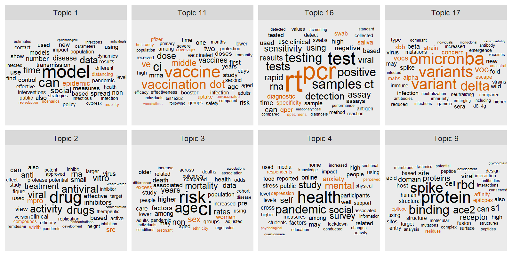
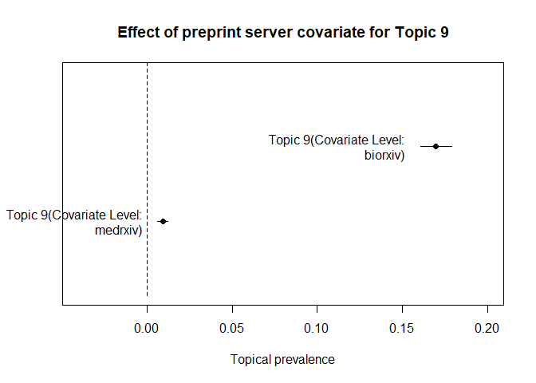

##   {#section .hideslideheader data-background="#061C30"}

::: {style="display:table;width:100%;table-layout: fixed;"}
::: {.title-without-logo style="display:table-cell;width:100%;padding-right:3%;padding-left:3%;vertical-align:middle;"}
SRC 2024/25 PhD course 'Data Science for Sustainable Development'

Structural Topic Modeling with R

 

 

 

 
:::
:::

::: {style="display:table;width:100%;table-layout: fixed;"}
::: {.mytitlepage .linksection style="display:table-cell;width:30%;padding-left:3%;vertical-align:bottom;"}
*<https://scitingly.net/>*

*<stefan.daume@su.se>*
:::

::: {.mytitlepage .authorsection style="display:table-cell;width:70%;padding-right:3%;"}
  **Stefan Daume**

*[Stockholm Resilience Centre, Stockholm
University](https://www.stockholmresilience.org/meet-our-team/staff/2021-01-27-daume.html)*

& *[Beijer Institute of Ecological
Economics](https://beijer.kva.se/programmes/complexity/)*

 

*11. April 2025*
:::
:::

# "Text as data" - Basic text mining

## Text mining packages

Basic packages:

-   tidytext
-   stringr
-   dplyr
-   tidyr
-   (SnowballC)
-   (spacyr)
-   (textdata)

## Basic text mining steps

1.  get text (e.g., via gutenbergr)
2.  tidy
3.  tokenize
4.  transform
5.  (annotate)
6.  analyze

## Basic analysis: get text, tidy, count

``` r
library(gutenbergr)
library(dplyr)
library(tidytext)

# get "mystery" text
book <- gutenberg_download(c(244))

# books are lines of text with associated book ID
# tibble [4,737 × 2] (S3: tbl_df/tbl/data.frame)
#  $ gutenberg_id: int [1:4737] 244 244 244  ...
#  $ text        : chr [1:4737] "" "" "" ...

# tidy the text into individual words
# also lowercases and remove punctuation
tidy_book <- book %>%
  unnest_tokens(output = word, input = text)

# count the word/term frequency
word_count <- tidy_book %>%
  count(word, sort = TRUE)
```

```{=html}
<aside class="notes">
```
-   books from project gutenberg are returned as dataframes/tibbles with
    two columns that provide the text per line and the associated book
    ID
-   `unnest_tokens()` both tokenizes and tidys the text (i.e.,
    whitespace, punctuation is removed, the tokens are transformed to
    lowercase)\

```{=html}
</aside>
```
## Most frequent words

::: {style="display:table;width:100%;table-layout:fixed;"}
::: {style="display:table-cell;width:60%;padding-right:5%;text-align:left;vertical-align:top;"}
``` r
library(gutenbergr)
library(dplyr)
library(tidytext)

# get "mystery" text
book <- gutenberg_download(c(244))

# tidy the text into individual words
# also lowercases and removes punctuation
tidy_book <- book %>%
  unnest_tokens(output = word, input = text)

# count the word/term frequency
word_count <- tidy_book %>%
  count(word, sort = TRUE)
```
:::

::: {style="display:table-cell;width:40%;padding-left:5%;text-align:left;vertical-align:top;"}
```{=html}
<div id="ensxouokkw" style="padding-left:0px;padding-right:0px;padding-top:10px;padding-bottom:10px;overflow-x:auto;overflow-y:auto;width:auto;height:auto;">
<style>#ensxouokkw table {
  font-family: system-ui, 'Segoe UI', Roboto, Helvetica, Arial, sans-serif, 'Apple Color Emoji', 'Segoe UI Emoji', 'Segoe UI Symbol', 'Noto Color Emoji';
  -webkit-font-smoothing: antialiased;
  -moz-osx-font-smoothing: grayscale;
}

#ensxouokkw thead, #ensxouokkw tbody, #ensxouokkw tfoot, #ensxouokkw tr, #ensxouokkw td, #ensxouokkw th {
  border-style: none;
}

#ensxouokkw p {
  margin: 0;
  padding: 0;
}

#ensxouokkw .gt_table {
  display: table;
  border-collapse: collapse;
  line-height: normal;
  margin-left: auto;
  margin-right: auto;
  color: #333333;
  font-size: 16px;
  font-weight: normal;
  font-style: normal;
  background-color: #FFFFFF;
  width: auto;
  border-top-style: solid;
  border-top-width: 2px;
  border-top-color: #A8A8A8;
  border-right-style: none;
  border-right-width: 2px;
  border-right-color: #D3D3D3;
  border-bottom-style: solid;
  border-bottom-width: 2px;
  border-bottom-color: #A8A8A8;
  border-left-style: none;
  border-left-width: 2px;
  border-left-color: #D3D3D3;
}

#ensxouokkw .gt_caption {
  padding-top: 4px;
  padding-bottom: 4px;
}

#ensxouokkw .gt_title {
  color: #333333;
  font-size: 125%;
  font-weight: initial;
  padding-top: 4px;
  padding-bottom: 4px;
  padding-left: 5px;
  padding-right: 5px;
  border-bottom-color: #FFFFFF;
  border-bottom-width: 0;
}

#ensxouokkw .gt_subtitle {
  color: #333333;
  font-size: 85%;
  font-weight: initial;
  padding-top: 3px;
  padding-bottom: 5px;
  padding-left: 5px;
  padding-right: 5px;
  border-top-color: #FFFFFF;
  border-top-width: 0;
}

#ensxouokkw .gt_heading {
  background-color: #FFFFFF;
  text-align: center;
  border-bottom-color: #FFFFFF;
  border-left-style: none;
  border-left-width: 1px;
  border-left-color: #D3D3D3;
  border-right-style: none;
  border-right-width: 1px;
  border-right-color: #D3D3D3;
}

#ensxouokkw .gt_bottom_border {
  border-bottom-style: solid;
  border-bottom-width: 2px;
  border-bottom-color: #D3D3D3;
}

#ensxouokkw .gt_col_headings {
  border-top-style: solid;
  border-top-width: 2px;
  border-top-color: #D3D3D3;
  border-bottom-style: solid;
  border-bottom-width: 2px;
  border-bottom-color: #D3D3D3;
  border-left-style: none;
  border-left-width: 1px;
  border-left-color: #D3D3D3;
  border-right-style: none;
  border-right-width: 1px;
  border-right-color: #D3D3D3;
}

#ensxouokkw .gt_col_heading {
  color: #333333;
  background-color: #FFFFFF;
  font-size: 100%;
  font-weight: normal;
  text-transform: inherit;
  border-left-style: none;
  border-left-width: 1px;
  border-left-color: #D3D3D3;
  border-right-style: none;
  border-right-width: 1px;
  border-right-color: #D3D3D3;
  vertical-align: bottom;
  padding-top: 5px;
  padding-bottom: 6px;
  padding-left: 5px;
  padding-right: 5px;
  overflow-x: hidden;
}

#ensxouokkw .gt_column_spanner_outer {
  color: #333333;
  background-color: #FFFFFF;
  font-size: 100%;
  font-weight: normal;
  text-transform: inherit;
  padding-top: 0;
  padding-bottom: 0;
  padding-left: 4px;
  padding-right: 4px;
}

#ensxouokkw .gt_column_spanner_outer:first-child {
  padding-left: 0;
}

#ensxouokkw .gt_column_spanner_outer:last-child {
  padding-right: 0;
}

#ensxouokkw .gt_column_spanner {
  border-bottom-style: solid;
  border-bottom-width: 2px;
  border-bottom-color: #D3D3D3;
  vertical-align: bottom;
  padding-top: 5px;
  padding-bottom: 5px;
  overflow-x: hidden;
  display: inline-block;
  width: 100%;
}

#ensxouokkw .gt_spanner_row {
  border-bottom-style: hidden;
}

#ensxouokkw .gt_group_heading {
  padding-top: 8px;
  padding-bottom: 8px;
  padding-left: 5px;
  padding-right: 5px;
  color: #333333;
  background-color: #FFFFFF;
  font-size: 100%;
  font-weight: initial;
  text-transform: inherit;
  border-top-style: solid;
  border-top-width: 2px;
  border-top-color: #D3D3D3;
  border-bottom-style: solid;
  border-bottom-width: 2px;
  border-bottom-color: #D3D3D3;
  border-left-style: none;
  border-left-width: 1px;
  border-left-color: #D3D3D3;
  border-right-style: none;
  border-right-width: 1px;
  border-right-color: #D3D3D3;
  vertical-align: middle;
  text-align: left;
}

#ensxouokkw .gt_empty_group_heading {
  padding: 0.5px;
  color: #333333;
  background-color: #FFFFFF;
  font-size: 100%;
  font-weight: initial;
  border-top-style: solid;
  border-top-width: 2px;
  border-top-color: #D3D3D3;
  border-bottom-style: solid;
  border-bottom-width: 2px;
  border-bottom-color: #D3D3D3;
  vertical-align: middle;
}

#ensxouokkw .gt_from_md > :first-child {
  margin-top: 0;
}

#ensxouokkw .gt_from_md > :last-child {
  margin-bottom: 0;
}

#ensxouokkw .gt_row {
  padding-top: 8px;
  padding-bottom: 8px;
  padding-left: 5px;
  padding-right: 5px;
  margin: 10px;
  border-top-style: solid;
  border-top-width: 1px;
  border-top-color: #D3D3D3;
  border-left-style: none;
  border-left-width: 1px;
  border-left-color: #D3D3D3;
  border-right-style: none;
  border-right-width: 1px;
  border-right-color: #D3D3D3;
  vertical-align: middle;
  overflow-x: hidden;
}

#ensxouokkw .gt_stub {
  color: #333333;
  background-color: #FFFFFF;
  font-size: 100%;
  font-weight: initial;
  text-transform: inherit;
  border-right-style: solid;
  border-right-width: 2px;
  border-right-color: #D3D3D3;
  padding-left: 5px;
  padding-right: 5px;
}

#ensxouokkw .gt_stub_row_group {
  color: #333333;
  background-color: #FFFFFF;
  font-size: 100%;
  font-weight: initial;
  text-transform: inherit;
  border-right-style: solid;
  border-right-width: 2px;
  border-right-color: #D3D3D3;
  padding-left: 5px;
  padding-right: 5px;
  vertical-align: top;
}

#ensxouokkw .gt_row_group_first td {
  border-top-width: 2px;
}

#ensxouokkw .gt_row_group_first th {
  border-top-width: 2px;
}

#ensxouokkw .gt_summary_row {
  color: #333333;
  background-color: #FFFFFF;
  text-transform: inherit;
  padding-top: 8px;
  padding-bottom: 8px;
  padding-left: 5px;
  padding-right: 5px;
}

#ensxouokkw .gt_first_summary_row {
  border-top-style: solid;
  border-top-color: #D3D3D3;
}

#ensxouokkw .gt_first_summary_row.thick {
  border-top-width: 2px;
}

#ensxouokkw .gt_last_summary_row {
  padding-top: 8px;
  padding-bottom: 8px;
  padding-left: 5px;
  padding-right: 5px;
  border-bottom-style: solid;
  border-bottom-width: 2px;
  border-bottom-color: #D3D3D3;
}

#ensxouokkw .gt_grand_summary_row {
  color: #333333;
  background-color: #FFFFFF;
  text-transform: inherit;
  padding-top: 8px;
  padding-bottom: 8px;
  padding-left: 5px;
  padding-right: 5px;
}

#ensxouokkw .gt_first_grand_summary_row {
  padding-top: 8px;
  padding-bottom: 8px;
  padding-left: 5px;
  padding-right: 5px;
  border-top-style: double;
  border-top-width: 6px;
  border-top-color: #D3D3D3;
}

#ensxouokkw .gt_last_grand_summary_row_top {
  padding-top: 8px;
  padding-bottom: 8px;
  padding-left: 5px;
  padding-right: 5px;
  border-bottom-style: double;
  border-bottom-width: 6px;
  border-bottom-color: #D3D3D3;
}

#ensxouokkw .gt_striped {
  background-color: rgba(128, 128, 128, 0.05);
}

#ensxouokkw .gt_table_body {
  border-top-style: solid;
  border-top-width: 2px;
  border-top-color: #D3D3D3;
  border-bottom-style: solid;
  border-bottom-width: 2px;
  border-bottom-color: #D3D3D3;
}

#ensxouokkw .gt_footnotes {
  color: #333333;
  background-color: #FFFFFF;
  border-bottom-style: none;
  border-bottom-width: 2px;
  border-bottom-color: #D3D3D3;
  border-left-style: none;
  border-left-width: 2px;
  border-left-color: #D3D3D3;
  border-right-style: none;
  border-right-width: 2px;
  border-right-color: #D3D3D3;
}

#ensxouokkw .gt_footnote {
  margin: 0px;
  font-size: 90%;
  padding-top: 4px;
  padding-bottom: 4px;
  padding-left: 5px;
  padding-right: 5px;
}

#ensxouokkw .gt_sourcenotes {
  color: #333333;
  background-color: #FFFFFF;
  border-bottom-style: none;
  border-bottom-width: 2px;
  border-bottom-color: #D3D3D3;
  border-left-style: none;
  border-left-width: 2px;
  border-left-color: #D3D3D3;
  border-right-style: none;
  border-right-width: 2px;
  border-right-color: #D3D3D3;
}

#ensxouokkw .gt_sourcenote {
  font-size: 90%;
  padding-top: 4px;
  padding-bottom: 4px;
  padding-left: 5px;
  padding-right: 5px;
}

#ensxouokkw .gt_left {
  text-align: left;
}

#ensxouokkw .gt_center {
  text-align: center;
}

#ensxouokkw .gt_right {
  text-align: right;
  font-variant-numeric: tabular-nums;
}

#ensxouokkw .gt_font_normal {
  font-weight: normal;
}

#ensxouokkw .gt_font_bold {
  font-weight: bold;
}

#ensxouokkw .gt_font_italic {
  font-style: italic;
}

#ensxouokkw .gt_super {
  font-size: 65%;
}

#ensxouokkw .gt_footnote_marks {
  font-size: 75%;
  vertical-align: 0.4em;
  position: initial;
}

#ensxouokkw .gt_asterisk {
  font-size: 100%;
  vertical-align: 0;
}

#ensxouokkw .gt_indent_1 {
  text-indent: 5px;
}

#ensxouokkw .gt_indent_2 {
  text-indent: 10px;
}

#ensxouokkw .gt_indent_3 {
  text-indent: 15px;
}

#ensxouokkw .gt_indent_4 {
  text-indent: 20px;
}

#ensxouokkw .gt_indent_5 {
  text-indent: 25px;
}

#ensxouokkw .katex-display {
  display: inline-flex !important;
  margin-bottom: 0.75em !important;
}

#ensxouokkw div.Reactable > div.rt-table > div.rt-thead > div.rt-tr.rt-tr-group-header > div.rt-th-group:after {
  height: 0px !important;
}
</style>
<table class="gt_table" data-quarto-disable-processing="false" data-quarto-bootstrap="false">
  <thead>
    <tr class="gt_heading">
      <td colspan="2" class="gt_heading gt_title gt_font_normal" style>Mystery Book Word Count</td>
    </tr>
    <tr class="gt_heading">
      <td colspan="2" class="gt_heading gt_subtitle gt_font_normal gt_bottom_border" style><span class='gt_from_md'>(10 most frequent terms)</span></td>
    </tr>
    <tr class="gt_col_headings">
      <th class="gt_col_heading gt_columns_bottom_border gt_left" rowspan="1" colspan="1" scope="col" id="word">word</th>
      <th class="gt_col_heading gt_columns_bottom_border gt_right" rowspan="1" colspan="1" scope="col" id="n">n</th>
    </tr>
  </thead>
  <tbody class="gt_table_body">
    <tr><td headers="word" class="gt_row gt_left">the</td>
<td headers="n" class="gt_row gt_right">2536</td></tr>
    <tr><td headers="word" class="gt_row gt_left">and</td>
<td headers="n" class="gt_row gt_right">1356</td></tr>
    <tr><td headers="word" class="gt_row gt_left">of</td>
<td headers="n" class="gt_row gt_right">1213</td></tr>
    <tr><td headers="word" class="gt_row gt_left">to</td>
<td headers="n" class="gt_row gt_right">1093</td></tr>
    <tr><td headers="word" class="gt_row gt_left">a</td>
<td headers="n" class="gt_row gt_right">1010</td></tr>
    <tr><td headers="word" class="gt_row gt_left">i</td>
<td headers="n" class="gt_row gt_right">904</td></tr>
    <tr><td headers="word" class="gt_row gt_left">he</td>
<td headers="n" class="gt_row gt_right">795</td></tr>
    <tr><td headers="word" class="gt_row gt_left">in</td>
<td headers="n" class="gt_row gt_right">727</td></tr>
    <tr><td headers="word" class="gt_row gt_left">that</td>
<td headers="n" class="gt_row gt_right">655</td></tr>
    <tr><td headers="word" class="gt_row gt_left">his</td>
<td headers="n" class="gt_row gt_right">652</td></tr>
  </tbody>
  
  
</table>
</div>
```
:::
:::

```{=html}
<aside class="notes">
```
```{=html}
</aside>
```
## Exclude "stop words"

::: {style="display:table;width:100%;table-layout:fixed;"}
::: {style="display:table-cell;width:60%;padding-right:5%;text-align:left;vertical-align:top;"}
``` r
library(gutenbergr)
library(dplyr)
library(tidytext)

# get "mystery" text
book <- gutenberg_download(c(244))

# tidy the text into individual words
# also lowercases and removes punctuation
tidy_book <- book %>%
  unnest_tokens(output = word, input = text)

# remove stopwords 
# (lexicon provided with tidytext)
word_count_filtered <- tidy_book %>%
  anti_join(stop_words, by = "word") %>%
  count(word, sort = TRUE)
```
:::

::: {style="display:table-cell;width:40%;padding-left:5%;text-align:left;vertical-align:top;"}
```{=html}
<div id="aaordfrlxb" style="padding-left:0px;padding-right:0px;padding-top:10px;padding-bottom:10px;overflow-x:auto;overflow-y:auto;width:auto;height:auto;">
<style>#aaordfrlxb table {
  font-family: system-ui, 'Segoe UI', Roboto, Helvetica, Arial, sans-serif, 'Apple Color Emoji', 'Segoe UI Emoji', 'Segoe UI Symbol', 'Noto Color Emoji';
  -webkit-font-smoothing: antialiased;
  -moz-osx-font-smoothing: grayscale;
}

#aaordfrlxb thead, #aaordfrlxb tbody, #aaordfrlxb tfoot, #aaordfrlxb tr, #aaordfrlxb td, #aaordfrlxb th {
  border-style: none;
}

#aaordfrlxb p {
  margin: 0;
  padding: 0;
}

#aaordfrlxb .gt_table {
  display: table;
  border-collapse: collapse;
  line-height: normal;
  margin-left: auto;
  margin-right: auto;
  color: #333333;
  font-size: 16px;
  font-weight: normal;
  font-style: normal;
  background-color: #FFFFFF;
  width: auto;
  border-top-style: solid;
  border-top-width: 2px;
  border-top-color: #A8A8A8;
  border-right-style: none;
  border-right-width: 2px;
  border-right-color: #D3D3D3;
  border-bottom-style: solid;
  border-bottom-width: 2px;
  border-bottom-color: #A8A8A8;
  border-left-style: none;
  border-left-width: 2px;
  border-left-color: #D3D3D3;
}

#aaordfrlxb .gt_caption {
  padding-top: 4px;
  padding-bottom: 4px;
}

#aaordfrlxb .gt_title {
  color: #333333;
  font-size: 125%;
  font-weight: initial;
  padding-top: 4px;
  padding-bottom: 4px;
  padding-left: 5px;
  padding-right: 5px;
  border-bottom-color: #FFFFFF;
  border-bottom-width: 0;
}

#aaordfrlxb .gt_subtitle {
  color: #333333;
  font-size: 85%;
  font-weight: initial;
  padding-top: 3px;
  padding-bottom: 5px;
  padding-left: 5px;
  padding-right: 5px;
  border-top-color: #FFFFFF;
  border-top-width: 0;
}

#aaordfrlxb .gt_heading {
  background-color: #FFFFFF;
  text-align: center;
  border-bottom-color: #FFFFFF;
  border-left-style: none;
  border-left-width: 1px;
  border-left-color: #D3D3D3;
  border-right-style: none;
  border-right-width: 1px;
  border-right-color: #D3D3D3;
}

#aaordfrlxb .gt_bottom_border {
  border-bottom-style: solid;
  border-bottom-width: 2px;
  border-bottom-color: #D3D3D3;
}

#aaordfrlxb .gt_col_headings {
  border-top-style: solid;
  border-top-width: 2px;
  border-top-color: #D3D3D3;
  border-bottom-style: solid;
  border-bottom-width: 2px;
  border-bottom-color: #D3D3D3;
  border-left-style: none;
  border-left-width: 1px;
  border-left-color: #D3D3D3;
  border-right-style: none;
  border-right-width: 1px;
  border-right-color: #D3D3D3;
}

#aaordfrlxb .gt_col_heading {
  color: #333333;
  background-color: #FFFFFF;
  font-size: 100%;
  font-weight: normal;
  text-transform: inherit;
  border-left-style: none;
  border-left-width: 1px;
  border-left-color: #D3D3D3;
  border-right-style: none;
  border-right-width: 1px;
  border-right-color: #D3D3D3;
  vertical-align: bottom;
  padding-top: 5px;
  padding-bottom: 6px;
  padding-left: 5px;
  padding-right: 5px;
  overflow-x: hidden;
}

#aaordfrlxb .gt_column_spanner_outer {
  color: #333333;
  background-color: #FFFFFF;
  font-size: 100%;
  font-weight: normal;
  text-transform: inherit;
  padding-top: 0;
  padding-bottom: 0;
  padding-left: 4px;
  padding-right: 4px;
}

#aaordfrlxb .gt_column_spanner_outer:first-child {
  padding-left: 0;
}

#aaordfrlxb .gt_column_spanner_outer:last-child {
  padding-right: 0;
}

#aaordfrlxb .gt_column_spanner {
  border-bottom-style: solid;
  border-bottom-width: 2px;
  border-bottom-color: #D3D3D3;
  vertical-align: bottom;
  padding-top: 5px;
  padding-bottom: 5px;
  overflow-x: hidden;
  display: inline-block;
  width: 100%;
}

#aaordfrlxb .gt_spanner_row {
  border-bottom-style: hidden;
}

#aaordfrlxb .gt_group_heading {
  padding-top: 8px;
  padding-bottom: 8px;
  padding-left: 5px;
  padding-right: 5px;
  color: #333333;
  background-color: #FFFFFF;
  font-size: 100%;
  font-weight: initial;
  text-transform: inherit;
  border-top-style: solid;
  border-top-width: 2px;
  border-top-color: #D3D3D3;
  border-bottom-style: solid;
  border-bottom-width: 2px;
  border-bottom-color: #D3D3D3;
  border-left-style: none;
  border-left-width: 1px;
  border-left-color: #D3D3D3;
  border-right-style: none;
  border-right-width: 1px;
  border-right-color: #D3D3D3;
  vertical-align: middle;
  text-align: left;
}

#aaordfrlxb .gt_empty_group_heading {
  padding: 0.5px;
  color: #333333;
  background-color: #FFFFFF;
  font-size: 100%;
  font-weight: initial;
  border-top-style: solid;
  border-top-width: 2px;
  border-top-color: #D3D3D3;
  border-bottom-style: solid;
  border-bottom-width: 2px;
  border-bottom-color: #D3D3D3;
  vertical-align: middle;
}

#aaordfrlxb .gt_from_md > :first-child {
  margin-top: 0;
}

#aaordfrlxb .gt_from_md > :last-child {
  margin-bottom: 0;
}

#aaordfrlxb .gt_row {
  padding-top: 8px;
  padding-bottom: 8px;
  padding-left: 5px;
  padding-right: 5px;
  margin: 10px;
  border-top-style: solid;
  border-top-width: 1px;
  border-top-color: #D3D3D3;
  border-left-style: none;
  border-left-width: 1px;
  border-left-color: #D3D3D3;
  border-right-style: none;
  border-right-width: 1px;
  border-right-color: #D3D3D3;
  vertical-align: middle;
  overflow-x: hidden;
}

#aaordfrlxb .gt_stub {
  color: #333333;
  background-color: #FFFFFF;
  font-size: 100%;
  font-weight: initial;
  text-transform: inherit;
  border-right-style: solid;
  border-right-width: 2px;
  border-right-color: #D3D3D3;
  padding-left: 5px;
  padding-right: 5px;
}

#aaordfrlxb .gt_stub_row_group {
  color: #333333;
  background-color: #FFFFFF;
  font-size: 100%;
  font-weight: initial;
  text-transform: inherit;
  border-right-style: solid;
  border-right-width: 2px;
  border-right-color: #D3D3D3;
  padding-left: 5px;
  padding-right: 5px;
  vertical-align: top;
}

#aaordfrlxb .gt_row_group_first td {
  border-top-width: 2px;
}

#aaordfrlxb .gt_row_group_first th {
  border-top-width: 2px;
}

#aaordfrlxb .gt_summary_row {
  color: #333333;
  background-color: #FFFFFF;
  text-transform: inherit;
  padding-top: 8px;
  padding-bottom: 8px;
  padding-left: 5px;
  padding-right: 5px;
}

#aaordfrlxb .gt_first_summary_row {
  border-top-style: solid;
  border-top-color: #D3D3D3;
}

#aaordfrlxb .gt_first_summary_row.thick {
  border-top-width: 2px;
}

#aaordfrlxb .gt_last_summary_row {
  padding-top: 8px;
  padding-bottom: 8px;
  padding-left: 5px;
  padding-right: 5px;
  border-bottom-style: solid;
  border-bottom-width: 2px;
  border-bottom-color: #D3D3D3;
}

#aaordfrlxb .gt_grand_summary_row {
  color: #333333;
  background-color: #FFFFFF;
  text-transform: inherit;
  padding-top: 8px;
  padding-bottom: 8px;
  padding-left: 5px;
  padding-right: 5px;
}

#aaordfrlxb .gt_first_grand_summary_row {
  padding-top: 8px;
  padding-bottom: 8px;
  padding-left: 5px;
  padding-right: 5px;
  border-top-style: double;
  border-top-width: 6px;
  border-top-color: #D3D3D3;
}

#aaordfrlxb .gt_last_grand_summary_row_top {
  padding-top: 8px;
  padding-bottom: 8px;
  padding-left: 5px;
  padding-right: 5px;
  border-bottom-style: double;
  border-bottom-width: 6px;
  border-bottom-color: #D3D3D3;
}

#aaordfrlxb .gt_striped {
  background-color: rgba(128, 128, 128, 0.05);
}

#aaordfrlxb .gt_table_body {
  border-top-style: solid;
  border-top-width: 2px;
  border-top-color: #D3D3D3;
  border-bottom-style: solid;
  border-bottom-width: 2px;
  border-bottom-color: #D3D3D3;
}

#aaordfrlxb .gt_footnotes {
  color: #333333;
  background-color: #FFFFFF;
  border-bottom-style: none;
  border-bottom-width: 2px;
  border-bottom-color: #D3D3D3;
  border-left-style: none;
  border-left-width: 2px;
  border-left-color: #D3D3D3;
  border-right-style: none;
  border-right-width: 2px;
  border-right-color: #D3D3D3;
}

#aaordfrlxb .gt_footnote {
  margin: 0px;
  font-size: 90%;
  padding-top: 4px;
  padding-bottom: 4px;
  padding-left: 5px;
  padding-right: 5px;
}

#aaordfrlxb .gt_sourcenotes {
  color: #333333;
  background-color: #FFFFFF;
  border-bottom-style: none;
  border-bottom-width: 2px;
  border-bottom-color: #D3D3D3;
  border-left-style: none;
  border-left-width: 2px;
  border-left-color: #D3D3D3;
  border-right-style: none;
  border-right-width: 2px;
  border-right-color: #D3D3D3;
}

#aaordfrlxb .gt_sourcenote {
  font-size: 90%;
  padding-top: 4px;
  padding-bottom: 4px;
  padding-left: 5px;
  padding-right: 5px;
}

#aaordfrlxb .gt_left {
  text-align: left;
}

#aaordfrlxb .gt_center {
  text-align: center;
}

#aaordfrlxb .gt_right {
  text-align: right;
  font-variant-numeric: tabular-nums;
}

#aaordfrlxb .gt_font_normal {
  font-weight: normal;
}

#aaordfrlxb .gt_font_bold {
  font-weight: bold;
}

#aaordfrlxb .gt_font_italic {
  font-style: italic;
}

#aaordfrlxb .gt_super {
  font-size: 65%;
}

#aaordfrlxb .gt_footnote_marks {
  font-size: 75%;
  vertical-align: 0.4em;
  position: initial;
}

#aaordfrlxb .gt_asterisk {
  font-size: 100%;
  vertical-align: 0;
}

#aaordfrlxb .gt_indent_1 {
  text-indent: 5px;
}

#aaordfrlxb .gt_indent_2 {
  text-indent: 10px;
}

#aaordfrlxb .gt_indent_3 {
  text-indent: 15px;
}

#aaordfrlxb .gt_indent_4 {
  text-indent: 20px;
}

#aaordfrlxb .gt_indent_5 {
  text-indent: 25px;
}

#aaordfrlxb .katex-display {
  display: inline-flex !important;
  margin-bottom: 0.75em !important;
}

#aaordfrlxb div.Reactable > div.rt-table > div.rt-thead > div.rt-tr.rt-tr-group-header > div.rt-th-group:after {
  height: 0px !important;
}
</style>
<table class="gt_table" data-quarto-disable-processing="false" data-quarto-bootstrap="false">
  <thead>
    <tr class="gt_heading">
      <td colspan="2" class="gt_heading gt_title gt_font_normal" style>Sample Stop Words</td>
    </tr>
    <tr class="gt_heading">
      <td colspan="2" class="gt_heading gt_subtitle gt_font_normal gt_bottom_border" style><span class='gt_from_md'>(dataset included in <code>tidytext</code>)</span></td>
    </tr>
    <tr class="gt_col_headings">
      <th class="gt_col_heading gt_columns_bottom_border gt_left" rowspan="1" colspan="1" scope="col" id="word">word</th>
      <th class="gt_col_heading gt_columns_bottom_border gt_left" rowspan="1" colspan="1" scope="col" id="lexicon">lexicon</th>
    </tr>
  </thead>
  <tbody class="gt_table_body">
    <tr><td headers="word" class="gt_row gt_left">a</td>
<td headers="lexicon" class="gt_row gt_left">SMART</td></tr>
    <tr><td headers="word" class="gt_row gt_left">a's</td>
<td headers="lexicon" class="gt_row gt_left">SMART</td></tr>
    <tr><td headers="word" class="gt_row gt_left">able</td>
<td headers="lexicon" class="gt_row gt_left">SMART</td></tr>
    <tr><td headers="word" class="gt_row gt_left">about</td>
<td headers="lexicon" class="gt_row gt_left">SMART</td></tr>
    <tr><td headers="word" class="gt_row gt_left">above</td>
<td headers="lexicon" class="gt_row gt_left">SMART</td></tr>
    <tr><td headers="word" class="gt_row gt_left">according</td>
<td headers="lexicon" class="gt_row gt_left">SMART</td></tr>
    <tr><td headers="word" class="gt_row gt_left">accordingly</td>
<td headers="lexicon" class="gt_row gt_left">SMART</td></tr>
    <tr><td headers="word" class="gt_row gt_left">across</td>
<td headers="lexicon" class="gt_row gt_left">SMART</td></tr>
    <tr><td headers="word" class="gt_row gt_left">actually</td>
<td headers="lexicon" class="gt_row gt_left">SMART</td></tr>
    <tr><td headers="word" class="gt_row gt_left">after</td>
<td headers="lexicon" class="gt_row gt_left">SMART</td></tr>
  </tbody>
  
  
</table>
</div>
```
:::
:::

```{=html}
<aside class="notes">
```
-   the removed stopwords represent only 8.778626 % of the vocabulary
    (terms)
-   but 66.9513783% of all tokens

```{=html}
</aside>
```
## Filtered word count

::: {style="display:table;width:100%;table-layout:fixed;"}
::: {style="display:table-cell;width:60%;padding-right:5%;text-align:left;vertical-align:top;"}
``` r
library(gutenbergr)
library(dplyr)
library(tidytext)

# get "mystery" text
book <- gutenberg_download(c(244))

# tidy the text into individual words
# also lowercases and removes punctuation
tidy_book <- book %>%
  unnest_tokens(output = word, input = text)

# remove stopwords 
# (lexicon provided with tidytext)
word_count_filtered <- tidy_book %>%
  anti_join(stop_words, by = "word") %>%
  count(word, sort = TRUE)
```
:::

::: {style="display:table-cell;width:40%;padding-left:5%;text-align:left;vertical-align:top;"}
```{=html}
<div id="uqcdpeishl" style="padding-left:0px;padding-right:0px;padding-top:10px;padding-bottom:10px;overflow-x:auto;overflow-y:auto;width:auto;height:auto;">
<style>#uqcdpeishl table {
  font-family: system-ui, 'Segoe UI', Roboto, Helvetica, Arial, sans-serif, 'Apple Color Emoji', 'Segoe UI Emoji', 'Segoe UI Symbol', 'Noto Color Emoji';
  -webkit-font-smoothing: antialiased;
  -moz-osx-font-smoothing: grayscale;
}

#uqcdpeishl thead, #uqcdpeishl tbody, #uqcdpeishl tfoot, #uqcdpeishl tr, #uqcdpeishl td, #uqcdpeishl th {
  border-style: none;
}

#uqcdpeishl p {
  margin: 0;
  padding: 0;
}

#uqcdpeishl .gt_table {
  display: table;
  border-collapse: collapse;
  line-height: normal;
  margin-left: auto;
  margin-right: auto;
  color: #333333;
  font-size: 16px;
  font-weight: normal;
  font-style: normal;
  background-color: #FFFFFF;
  width: auto;
  border-top-style: solid;
  border-top-width: 2px;
  border-top-color: #A8A8A8;
  border-right-style: none;
  border-right-width: 2px;
  border-right-color: #D3D3D3;
  border-bottom-style: solid;
  border-bottom-width: 2px;
  border-bottom-color: #A8A8A8;
  border-left-style: none;
  border-left-width: 2px;
  border-left-color: #D3D3D3;
}

#uqcdpeishl .gt_caption {
  padding-top: 4px;
  padding-bottom: 4px;
}

#uqcdpeishl .gt_title {
  color: #333333;
  font-size: 125%;
  font-weight: initial;
  padding-top: 4px;
  padding-bottom: 4px;
  padding-left: 5px;
  padding-right: 5px;
  border-bottom-color: #FFFFFF;
  border-bottom-width: 0;
}

#uqcdpeishl .gt_subtitle {
  color: #333333;
  font-size: 85%;
  font-weight: initial;
  padding-top: 3px;
  padding-bottom: 5px;
  padding-left: 5px;
  padding-right: 5px;
  border-top-color: #FFFFFF;
  border-top-width: 0;
}

#uqcdpeishl .gt_heading {
  background-color: #FFFFFF;
  text-align: center;
  border-bottom-color: #FFFFFF;
  border-left-style: none;
  border-left-width: 1px;
  border-left-color: #D3D3D3;
  border-right-style: none;
  border-right-width: 1px;
  border-right-color: #D3D3D3;
}

#uqcdpeishl .gt_bottom_border {
  border-bottom-style: solid;
  border-bottom-width: 2px;
  border-bottom-color: #D3D3D3;
}

#uqcdpeishl .gt_col_headings {
  border-top-style: solid;
  border-top-width: 2px;
  border-top-color: #D3D3D3;
  border-bottom-style: solid;
  border-bottom-width: 2px;
  border-bottom-color: #D3D3D3;
  border-left-style: none;
  border-left-width: 1px;
  border-left-color: #D3D3D3;
  border-right-style: none;
  border-right-width: 1px;
  border-right-color: #D3D3D3;
}

#uqcdpeishl .gt_col_heading {
  color: #333333;
  background-color: #FFFFFF;
  font-size: 100%;
  font-weight: normal;
  text-transform: inherit;
  border-left-style: none;
  border-left-width: 1px;
  border-left-color: #D3D3D3;
  border-right-style: none;
  border-right-width: 1px;
  border-right-color: #D3D3D3;
  vertical-align: bottom;
  padding-top: 5px;
  padding-bottom: 6px;
  padding-left: 5px;
  padding-right: 5px;
  overflow-x: hidden;
}

#uqcdpeishl .gt_column_spanner_outer {
  color: #333333;
  background-color: #FFFFFF;
  font-size: 100%;
  font-weight: normal;
  text-transform: inherit;
  padding-top: 0;
  padding-bottom: 0;
  padding-left: 4px;
  padding-right: 4px;
}

#uqcdpeishl .gt_column_spanner_outer:first-child {
  padding-left: 0;
}

#uqcdpeishl .gt_column_spanner_outer:last-child {
  padding-right: 0;
}

#uqcdpeishl .gt_column_spanner {
  border-bottom-style: solid;
  border-bottom-width: 2px;
  border-bottom-color: #D3D3D3;
  vertical-align: bottom;
  padding-top: 5px;
  padding-bottom: 5px;
  overflow-x: hidden;
  display: inline-block;
  width: 100%;
}

#uqcdpeishl .gt_spanner_row {
  border-bottom-style: hidden;
}

#uqcdpeishl .gt_group_heading {
  padding-top: 8px;
  padding-bottom: 8px;
  padding-left: 5px;
  padding-right: 5px;
  color: #333333;
  background-color: #FFFFFF;
  font-size: 100%;
  font-weight: initial;
  text-transform: inherit;
  border-top-style: solid;
  border-top-width: 2px;
  border-top-color: #D3D3D3;
  border-bottom-style: solid;
  border-bottom-width: 2px;
  border-bottom-color: #D3D3D3;
  border-left-style: none;
  border-left-width: 1px;
  border-left-color: #D3D3D3;
  border-right-style: none;
  border-right-width: 1px;
  border-right-color: #D3D3D3;
  vertical-align: middle;
  text-align: left;
}

#uqcdpeishl .gt_empty_group_heading {
  padding: 0.5px;
  color: #333333;
  background-color: #FFFFFF;
  font-size: 100%;
  font-weight: initial;
  border-top-style: solid;
  border-top-width: 2px;
  border-top-color: #D3D3D3;
  border-bottom-style: solid;
  border-bottom-width: 2px;
  border-bottom-color: #D3D3D3;
  vertical-align: middle;
}

#uqcdpeishl .gt_from_md > :first-child {
  margin-top: 0;
}

#uqcdpeishl .gt_from_md > :last-child {
  margin-bottom: 0;
}

#uqcdpeishl .gt_row {
  padding-top: 8px;
  padding-bottom: 8px;
  padding-left: 5px;
  padding-right: 5px;
  margin: 10px;
  border-top-style: solid;
  border-top-width: 1px;
  border-top-color: #D3D3D3;
  border-left-style: none;
  border-left-width: 1px;
  border-left-color: #D3D3D3;
  border-right-style: none;
  border-right-width: 1px;
  border-right-color: #D3D3D3;
  vertical-align: middle;
  overflow-x: hidden;
}

#uqcdpeishl .gt_stub {
  color: #333333;
  background-color: #FFFFFF;
  font-size: 100%;
  font-weight: initial;
  text-transform: inherit;
  border-right-style: solid;
  border-right-width: 2px;
  border-right-color: #D3D3D3;
  padding-left: 5px;
  padding-right: 5px;
}

#uqcdpeishl .gt_stub_row_group {
  color: #333333;
  background-color: #FFFFFF;
  font-size: 100%;
  font-weight: initial;
  text-transform: inherit;
  border-right-style: solid;
  border-right-width: 2px;
  border-right-color: #D3D3D3;
  padding-left: 5px;
  padding-right: 5px;
  vertical-align: top;
}

#uqcdpeishl .gt_row_group_first td {
  border-top-width: 2px;
}

#uqcdpeishl .gt_row_group_first th {
  border-top-width: 2px;
}

#uqcdpeishl .gt_summary_row {
  color: #333333;
  background-color: #FFFFFF;
  text-transform: inherit;
  padding-top: 8px;
  padding-bottom: 8px;
  padding-left: 5px;
  padding-right: 5px;
}

#uqcdpeishl .gt_first_summary_row {
  border-top-style: solid;
  border-top-color: #D3D3D3;
}

#uqcdpeishl .gt_first_summary_row.thick {
  border-top-width: 2px;
}

#uqcdpeishl .gt_last_summary_row {
  padding-top: 8px;
  padding-bottom: 8px;
  padding-left: 5px;
  padding-right: 5px;
  border-bottom-style: solid;
  border-bottom-width: 2px;
  border-bottom-color: #D3D3D3;
}

#uqcdpeishl .gt_grand_summary_row {
  color: #333333;
  background-color: #FFFFFF;
  text-transform: inherit;
  padding-top: 8px;
  padding-bottom: 8px;
  padding-left: 5px;
  padding-right: 5px;
}

#uqcdpeishl .gt_first_grand_summary_row {
  padding-top: 8px;
  padding-bottom: 8px;
  padding-left: 5px;
  padding-right: 5px;
  border-top-style: double;
  border-top-width: 6px;
  border-top-color: #D3D3D3;
}

#uqcdpeishl .gt_last_grand_summary_row_top {
  padding-top: 8px;
  padding-bottom: 8px;
  padding-left: 5px;
  padding-right: 5px;
  border-bottom-style: double;
  border-bottom-width: 6px;
  border-bottom-color: #D3D3D3;
}

#uqcdpeishl .gt_striped {
  background-color: rgba(128, 128, 128, 0.05);
}

#uqcdpeishl .gt_table_body {
  border-top-style: solid;
  border-top-width: 2px;
  border-top-color: #D3D3D3;
  border-bottom-style: solid;
  border-bottom-width: 2px;
  border-bottom-color: #D3D3D3;
}

#uqcdpeishl .gt_footnotes {
  color: #333333;
  background-color: #FFFFFF;
  border-bottom-style: none;
  border-bottom-width: 2px;
  border-bottom-color: #D3D3D3;
  border-left-style: none;
  border-left-width: 2px;
  border-left-color: #D3D3D3;
  border-right-style: none;
  border-right-width: 2px;
  border-right-color: #D3D3D3;
}

#uqcdpeishl .gt_footnote {
  margin: 0px;
  font-size: 90%;
  padding-top: 4px;
  padding-bottom: 4px;
  padding-left: 5px;
  padding-right: 5px;
}

#uqcdpeishl .gt_sourcenotes {
  color: #333333;
  background-color: #FFFFFF;
  border-bottom-style: none;
  border-bottom-width: 2px;
  border-bottom-color: #D3D3D3;
  border-left-style: none;
  border-left-width: 2px;
  border-left-color: #D3D3D3;
  border-right-style: none;
  border-right-width: 2px;
  border-right-color: #D3D3D3;
}

#uqcdpeishl .gt_sourcenote {
  font-size: 90%;
  padding-top: 4px;
  padding-bottom: 4px;
  padding-left: 5px;
  padding-right: 5px;
}

#uqcdpeishl .gt_left {
  text-align: left;
}

#uqcdpeishl .gt_center {
  text-align: center;
}

#uqcdpeishl .gt_right {
  text-align: right;
  font-variant-numeric: tabular-nums;
}

#uqcdpeishl .gt_font_normal {
  font-weight: normal;
}

#uqcdpeishl .gt_font_bold {
  font-weight: bold;
}

#uqcdpeishl .gt_font_italic {
  font-style: italic;
}

#uqcdpeishl .gt_super {
  font-size: 65%;
}

#uqcdpeishl .gt_footnote_marks {
  font-size: 75%;
  vertical-align: 0.4em;
  position: initial;
}

#uqcdpeishl .gt_asterisk {
  font-size: 100%;
  vertical-align: 0;
}

#uqcdpeishl .gt_indent_1 {
  text-indent: 5px;
}

#uqcdpeishl .gt_indent_2 {
  text-indent: 10px;
}

#uqcdpeishl .gt_indent_3 {
  text-indent: 15px;
}

#uqcdpeishl .gt_indent_4 {
  text-indent: 20px;
}

#uqcdpeishl .gt_indent_5 {
  text-indent: 25px;
}

#uqcdpeishl .katex-display {
  display: inline-flex !important;
  margin-bottom: 0.75em !important;
}

#uqcdpeishl div.Reactable > div.rt-table > div.rt-thead > div.rt-tr.rt-tr-group-header > div.rt-th-group:after {
  height: 0px !important;
}
</style>
<table class="gt_table" data-quarto-disable-processing="false" data-quarto-bootstrap="false">
  <thead>
    <tr class="gt_heading">
      <td colspan="2" class="gt_heading gt_title gt_font_normal" style>Mystery Book Word Count</td>
    </tr>
    <tr class="gt_heading">
      <td colspan="2" class="gt_heading gt_subtitle gt_font_normal gt_bottom_border" style><span class='gt_from_md'>(10 most frequent terms <strong>without stopwords</strong>)</span></td>
    </tr>
    <tr class="gt_col_headings">
      <th class="gt_col_heading gt_columns_bottom_border gt_left" rowspan="1" colspan="1" scope="col" id="word">word</th>
      <th class="gt_col_heading gt_columns_bottom_border gt_right" rowspan="1" colspan="1" scope="col" id="n">n</th>
    </tr>
  </thead>
  <tbody class="gt_table_body">
    <tr><td headers="word" class="gt_row gt_left">holmes</td>
<td headers="n" class="gt_row gt_right">97</td></tr>
    <tr><td headers="word" class="gt_row gt_left">time</td>
<td headers="n" class="gt_row gt_right">77</td></tr>
    <tr><td headers="word" class="gt_row gt_left">answered</td>
<td headers="n" class="gt_row gt_right">59</td></tr>
    <tr><td headers="word" class="gt_row gt_left">eyes</td>
<td headers="n" class="gt_row gt_right">59</td></tr>
    <tr><td headers="word" class="gt_row gt_left">hand</td>
<td headers="n" class="gt_row gt_right">57</td></tr>
    <tr><td headers="word" class="gt_row gt_left">ferrier</td>
<td headers="n" class="gt_row gt_right">56</td></tr>
    <tr><td headers="word" class="gt_row gt_left">found</td>
<td headers="n" class="gt_row gt_right">55</td></tr>
    <tr><td headers="word" class="gt_row gt_left">hope</td>
<td headers="n" class="gt_row gt_right">55</td></tr>
    <tr><td headers="word" class="gt_row gt_left">drebber</td>
<td headers="n" class="gt_row gt_right">53</td></tr>
    <tr><td headers="word" class="gt_row gt_left">sherlock</td>
<td headers="n" class="gt_row gt_right">52</td></tr>
  </tbody>
  
  
</table>
</div>
```
:::
:::

## Tokens can be more than words

::: {style="display:table;width:100%;table-layout:fixed;"}
::: {style="display:table-cell;width:70%;padding-right:5%;text-align:left;vertical-align:top;"}
``` r
library(gutenbergr)
library(dplyr)
library(tidytext)

# get "mystery" text
book <- gutenberg_download(c(244))

# ngrams as tokens
tidy_ngrams <- book %>%
  unnest_tokens(bigram, text, 
                token = "ngrams", n = 2,
                collapse = c("gutenberg_id")) %>%
  filter(!is.na(bigram)) %>%
  count(bigram, sort = TRUE)
```
:::

::: {style="display:table-cell;width:30%;padding-left:5%;text-align:left;vertical-align:top;"}
```{=html}
<div id="sbdlaopmvo" style="padding-left:0px;padding-right:0px;padding-top:10px;padding-bottom:10px;overflow-x:auto;overflow-y:auto;width:auto;height:auto;">
<style>#sbdlaopmvo table {
  font-family: system-ui, 'Segoe UI', Roboto, Helvetica, Arial, sans-serif, 'Apple Color Emoji', 'Segoe UI Emoji', 'Segoe UI Symbol', 'Noto Color Emoji';
  -webkit-font-smoothing: antialiased;
  -moz-osx-font-smoothing: grayscale;
}

#sbdlaopmvo thead, #sbdlaopmvo tbody, #sbdlaopmvo tfoot, #sbdlaopmvo tr, #sbdlaopmvo td, #sbdlaopmvo th {
  border-style: none;
}

#sbdlaopmvo p {
  margin: 0;
  padding: 0;
}

#sbdlaopmvo .gt_table {
  display: table;
  border-collapse: collapse;
  line-height: normal;
  margin-left: auto;
  margin-right: auto;
  color: #333333;
  font-size: 16px;
  font-weight: normal;
  font-style: normal;
  background-color: #FFFFFF;
  width: auto;
  border-top-style: solid;
  border-top-width: 2px;
  border-top-color: #A8A8A8;
  border-right-style: none;
  border-right-width: 2px;
  border-right-color: #D3D3D3;
  border-bottom-style: solid;
  border-bottom-width: 2px;
  border-bottom-color: #A8A8A8;
  border-left-style: none;
  border-left-width: 2px;
  border-left-color: #D3D3D3;
}

#sbdlaopmvo .gt_caption {
  padding-top: 4px;
  padding-bottom: 4px;
}

#sbdlaopmvo .gt_title {
  color: #333333;
  font-size: 125%;
  font-weight: initial;
  padding-top: 4px;
  padding-bottom: 4px;
  padding-left: 5px;
  padding-right: 5px;
  border-bottom-color: #FFFFFF;
  border-bottom-width: 0;
}

#sbdlaopmvo .gt_subtitle {
  color: #333333;
  font-size: 85%;
  font-weight: initial;
  padding-top: 3px;
  padding-bottom: 5px;
  padding-left: 5px;
  padding-right: 5px;
  border-top-color: #FFFFFF;
  border-top-width: 0;
}

#sbdlaopmvo .gt_heading {
  background-color: #FFFFFF;
  text-align: center;
  border-bottom-color: #FFFFFF;
  border-left-style: none;
  border-left-width: 1px;
  border-left-color: #D3D3D3;
  border-right-style: none;
  border-right-width: 1px;
  border-right-color: #D3D3D3;
}

#sbdlaopmvo .gt_bottom_border {
  border-bottom-style: solid;
  border-bottom-width: 2px;
  border-bottom-color: #D3D3D3;
}

#sbdlaopmvo .gt_col_headings {
  border-top-style: solid;
  border-top-width: 2px;
  border-top-color: #D3D3D3;
  border-bottom-style: solid;
  border-bottom-width: 2px;
  border-bottom-color: #D3D3D3;
  border-left-style: none;
  border-left-width: 1px;
  border-left-color: #D3D3D3;
  border-right-style: none;
  border-right-width: 1px;
  border-right-color: #D3D3D3;
}

#sbdlaopmvo .gt_col_heading {
  color: #333333;
  background-color: #FFFFFF;
  font-size: 100%;
  font-weight: normal;
  text-transform: inherit;
  border-left-style: none;
  border-left-width: 1px;
  border-left-color: #D3D3D3;
  border-right-style: none;
  border-right-width: 1px;
  border-right-color: #D3D3D3;
  vertical-align: bottom;
  padding-top: 5px;
  padding-bottom: 6px;
  padding-left: 5px;
  padding-right: 5px;
  overflow-x: hidden;
}

#sbdlaopmvo .gt_column_spanner_outer {
  color: #333333;
  background-color: #FFFFFF;
  font-size: 100%;
  font-weight: normal;
  text-transform: inherit;
  padding-top: 0;
  padding-bottom: 0;
  padding-left: 4px;
  padding-right: 4px;
}

#sbdlaopmvo .gt_column_spanner_outer:first-child {
  padding-left: 0;
}

#sbdlaopmvo .gt_column_spanner_outer:last-child {
  padding-right: 0;
}

#sbdlaopmvo .gt_column_spanner {
  border-bottom-style: solid;
  border-bottom-width: 2px;
  border-bottom-color: #D3D3D3;
  vertical-align: bottom;
  padding-top: 5px;
  padding-bottom: 5px;
  overflow-x: hidden;
  display: inline-block;
  width: 100%;
}

#sbdlaopmvo .gt_spanner_row {
  border-bottom-style: hidden;
}

#sbdlaopmvo .gt_group_heading {
  padding-top: 8px;
  padding-bottom: 8px;
  padding-left: 5px;
  padding-right: 5px;
  color: #333333;
  background-color: #FFFFFF;
  font-size: 100%;
  font-weight: initial;
  text-transform: inherit;
  border-top-style: solid;
  border-top-width: 2px;
  border-top-color: #D3D3D3;
  border-bottom-style: solid;
  border-bottom-width: 2px;
  border-bottom-color: #D3D3D3;
  border-left-style: none;
  border-left-width: 1px;
  border-left-color: #D3D3D3;
  border-right-style: none;
  border-right-width: 1px;
  border-right-color: #D3D3D3;
  vertical-align: middle;
  text-align: left;
}

#sbdlaopmvo .gt_empty_group_heading {
  padding: 0.5px;
  color: #333333;
  background-color: #FFFFFF;
  font-size: 100%;
  font-weight: initial;
  border-top-style: solid;
  border-top-width: 2px;
  border-top-color: #D3D3D3;
  border-bottom-style: solid;
  border-bottom-width: 2px;
  border-bottom-color: #D3D3D3;
  vertical-align: middle;
}

#sbdlaopmvo .gt_from_md > :first-child {
  margin-top: 0;
}

#sbdlaopmvo .gt_from_md > :last-child {
  margin-bottom: 0;
}

#sbdlaopmvo .gt_row {
  padding-top: 8px;
  padding-bottom: 8px;
  padding-left: 5px;
  padding-right: 5px;
  margin: 10px;
  border-top-style: solid;
  border-top-width: 1px;
  border-top-color: #D3D3D3;
  border-left-style: none;
  border-left-width: 1px;
  border-left-color: #D3D3D3;
  border-right-style: none;
  border-right-width: 1px;
  border-right-color: #D3D3D3;
  vertical-align: middle;
  overflow-x: hidden;
}

#sbdlaopmvo .gt_stub {
  color: #333333;
  background-color: #FFFFFF;
  font-size: 100%;
  font-weight: initial;
  text-transform: inherit;
  border-right-style: solid;
  border-right-width: 2px;
  border-right-color: #D3D3D3;
  padding-left: 5px;
  padding-right: 5px;
}

#sbdlaopmvo .gt_stub_row_group {
  color: #333333;
  background-color: #FFFFFF;
  font-size: 100%;
  font-weight: initial;
  text-transform: inherit;
  border-right-style: solid;
  border-right-width: 2px;
  border-right-color: #D3D3D3;
  padding-left: 5px;
  padding-right: 5px;
  vertical-align: top;
}

#sbdlaopmvo .gt_row_group_first td {
  border-top-width: 2px;
}

#sbdlaopmvo .gt_row_group_first th {
  border-top-width: 2px;
}

#sbdlaopmvo .gt_summary_row {
  color: #333333;
  background-color: #FFFFFF;
  text-transform: inherit;
  padding-top: 8px;
  padding-bottom: 8px;
  padding-left: 5px;
  padding-right: 5px;
}

#sbdlaopmvo .gt_first_summary_row {
  border-top-style: solid;
  border-top-color: #D3D3D3;
}

#sbdlaopmvo .gt_first_summary_row.thick {
  border-top-width: 2px;
}

#sbdlaopmvo .gt_last_summary_row {
  padding-top: 8px;
  padding-bottom: 8px;
  padding-left: 5px;
  padding-right: 5px;
  border-bottom-style: solid;
  border-bottom-width: 2px;
  border-bottom-color: #D3D3D3;
}

#sbdlaopmvo .gt_grand_summary_row {
  color: #333333;
  background-color: #FFFFFF;
  text-transform: inherit;
  padding-top: 8px;
  padding-bottom: 8px;
  padding-left: 5px;
  padding-right: 5px;
}

#sbdlaopmvo .gt_first_grand_summary_row {
  padding-top: 8px;
  padding-bottom: 8px;
  padding-left: 5px;
  padding-right: 5px;
  border-top-style: double;
  border-top-width: 6px;
  border-top-color: #D3D3D3;
}

#sbdlaopmvo .gt_last_grand_summary_row_top {
  padding-top: 8px;
  padding-bottom: 8px;
  padding-left: 5px;
  padding-right: 5px;
  border-bottom-style: double;
  border-bottom-width: 6px;
  border-bottom-color: #D3D3D3;
}

#sbdlaopmvo .gt_striped {
  background-color: rgba(128, 128, 128, 0.05);
}

#sbdlaopmvo .gt_table_body {
  border-top-style: solid;
  border-top-width: 2px;
  border-top-color: #D3D3D3;
  border-bottom-style: solid;
  border-bottom-width: 2px;
  border-bottom-color: #D3D3D3;
}

#sbdlaopmvo .gt_footnotes {
  color: #333333;
  background-color: #FFFFFF;
  border-bottom-style: none;
  border-bottom-width: 2px;
  border-bottom-color: #D3D3D3;
  border-left-style: none;
  border-left-width: 2px;
  border-left-color: #D3D3D3;
  border-right-style: none;
  border-right-width: 2px;
  border-right-color: #D3D3D3;
}

#sbdlaopmvo .gt_footnote {
  margin: 0px;
  font-size: 90%;
  padding-top: 4px;
  padding-bottom: 4px;
  padding-left: 5px;
  padding-right: 5px;
}

#sbdlaopmvo .gt_sourcenotes {
  color: #333333;
  background-color: #FFFFFF;
  border-bottom-style: none;
  border-bottom-width: 2px;
  border-bottom-color: #D3D3D3;
  border-left-style: none;
  border-left-width: 2px;
  border-left-color: #D3D3D3;
  border-right-style: none;
  border-right-width: 2px;
  border-right-color: #D3D3D3;
}

#sbdlaopmvo .gt_sourcenote {
  font-size: 90%;
  padding-top: 4px;
  padding-bottom: 4px;
  padding-left: 5px;
  padding-right: 5px;
}

#sbdlaopmvo .gt_left {
  text-align: left;
}

#sbdlaopmvo .gt_center {
  text-align: center;
}

#sbdlaopmvo .gt_right {
  text-align: right;
  font-variant-numeric: tabular-nums;
}

#sbdlaopmvo .gt_font_normal {
  font-weight: normal;
}

#sbdlaopmvo .gt_font_bold {
  font-weight: bold;
}

#sbdlaopmvo .gt_font_italic {
  font-style: italic;
}

#sbdlaopmvo .gt_super {
  font-size: 65%;
}

#sbdlaopmvo .gt_footnote_marks {
  font-size: 75%;
  vertical-align: 0.4em;
  position: initial;
}

#sbdlaopmvo .gt_asterisk {
  font-size: 100%;
  vertical-align: 0;
}

#sbdlaopmvo .gt_indent_1 {
  text-indent: 5px;
}

#sbdlaopmvo .gt_indent_2 {
  text-indent: 10px;
}

#sbdlaopmvo .gt_indent_3 {
  text-indent: 15px;
}

#sbdlaopmvo .gt_indent_4 {
  text-indent: 20px;
}

#sbdlaopmvo .gt_indent_5 {
  text-indent: 25px;
}

#sbdlaopmvo .katex-display {
  display: inline-flex !important;
  margin-bottom: 0.75em !important;
}

#sbdlaopmvo div.Reactable > div.rt-table > div.rt-thead > div.rt-tr.rt-tr-group-header > div.rt-th-group:after {
  height: 0px !important;
}
</style>
<table class="gt_table" data-quarto-disable-processing="false" data-quarto-bootstrap="false">
  <thead>
    <tr class="gt_heading">
      <td colspan="2" class="gt_heading gt_title gt_font_normal" style><span class='gt_from_md'>Mystery Book <em>n-gram</em> Count</span></td>
    </tr>
    <tr class="gt_heading">
      <td colspan="2" class="gt_heading gt_subtitle gt_font_normal gt_bottom_border" style><span class='gt_from_md'>(10 most frequent terms)</span></td>
    </tr>
    <tr class="gt_col_headings">
      <th class="gt_col_heading gt_columns_bottom_border gt_left" rowspan="1" colspan="1" scope="col" id="bigram">bigram</th>
      <th class="gt_col_heading gt_columns_bottom_border gt_right" rowspan="1" colspan="1" scope="col" id="n">n</th>
    </tr>
  </thead>
  <tbody class="gt_table_body">
    <tr><td headers="bigram" class="gt_row gt_left">of the</td>
<td headers="n" class="gt_row gt_right">302</td></tr>
    <tr><td headers="bigram" class="gt_row gt_left">in the</td>
<td headers="n" class="gt_row gt_right">210</td></tr>
    <tr><td headers="bigram" class="gt_row gt_left">to the</td>
<td headers="n" class="gt_row gt_right">136</td></tr>
    <tr><td headers="bigram" class="gt_row gt_left">to be</td>
<td headers="n" class="gt_row gt_right">98</td></tr>
    <tr><td headers="bigram" class="gt_row gt_left">it was</td>
<td headers="n" class="gt_row gt_right">95</td></tr>
    <tr><td headers="bigram" class="gt_row gt_left">he had</td>
<td headers="n" class="gt_row gt_right">94</td></tr>
    <tr><td headers="bigram" class="gt_row gt_left">and the</td>
<td headers="n" class="gt_row gt_right">89</td></tr>
    <tr><td headers="bigram" class="gt_row gt_left">upon the</td>
<td headers="n" class="gt_row gt_right">88</td></tr>
    <tr><td headers="bigram" class="gt_row gt_left">at the</td>
<td headers="n" class="gt_row gt_right">85</td></tr>
    <tr><td headers="bigram" class="gt_row gt_left">he was</td>
<td headers="n" class="gt_row gt_right">83</td></tr>
  </tbody>
  
  
</table>
</div>
```
:::
:::

```{=html}
<aside class="notes">
```
-   typically, in text analysis, individual words are used as tokens
-   but what constitutes a relevant basic unit of information can vary
-   sometimes, n-grams (multiple successive words) could be the tokens
    to analyse

```{=html}
</aside>
```
## "The game's afoot ..."

::: {style="display:table;width:100%;table-layout:fixed;"}
::: {style="display:table-cell;width:70%;padding-right:5%;text-align:left;vertical-align:top;"}
``` r
library(gutenbergr)
library(dplyr)
library(tidytext)

# get "mystery" text
book <- gutenberg_download(c(244))

# ngrams as tokens (stop words filtered)
tidy_ngrams_filtered <- book %>%
  unnest_tokens(bigram, text, 
                token = "ngrams", n = 2,
                collapse = c("gutenberg_id")) %>%
  filter(!is.na(bigram)) %>%
  tidyr::separate(bigram, c("token1", "token2"), sep = " ") %>%
  anti_join(by = c("token1" = "word"), stop_words) %>%
  anti_join(by = c("token2" = "word"), stop_words) %>%
  tidyr::unite(bigram, token1, token2, sep = " ")

bigram_count <- tidy_ngrams_filtered %>%
  count(bigram, sort = TRUE)
```
:::

::: {style="display:table-cell;width:30%;padding-left:5%;text-align:left;vertical-align:top;"}
```{=html}
<div id="udadfqmzqt" style="padding-left:0px;padding-right:0px;padding-top:10px;padding-bottom:10px;overflow-x:auto;overflow-y:auto;width:auto;height:auto;">
<style>#udadfqmzqt table {
  font-family: system-ui, 'Segoe UI', Roboto, Helvetica, Arial, sans-serif, 'Apple Color Emoji', 'Segoe UI Emoji', 'Segoe UI Symbol', 'Noto Color Emoji';
  -webkit-font-smoothing: antialiased;
  -moz-osx-font-smoothing: grayscale;
}

#udadfqmzqt thead, #udadfqmzqt tbody, #udadfqmzqt tfoot, #udadfqmzqt tr, #udadfqmzqt td, #udadfqmzqt th {
  border-style: none;
}

#udadfqmzqt p {
  margin: 0;
  padding: 0;
}

#udadfqmzqt .gt_table {
  display: table;
  border-collapse: collapse;
  line-height: normal;
  margin-left: auto;
  margin-right: auto;
  color: #333333;
  font-size: 16px;
  font-weight: normal;
  font-style: normal;
  background-color: #FFFFFF;
  width: auto;
  border-top-style: solid;
  border-top-width: 2px;
  border-top-color: #A8A8A8;
  border-right-style: none;
  border-right-width: 2px;
  border-right-color: #D3D3D3;
  border-bottom-style: solid;
  border-bottom-width: 2px;
  border-bottom-color: #A8A8A8;
  border-left-style: none;
  border-left-width: 2px;
  border-left-color: #D3D3D3;
}

#udadfqmzqt .gt_caption {
  padding-top: 4px;
  padding-bottom: 4px;
}

#udadfqmzqt .gt_title {
  color: #333333;
  font-size: 125%;
  font-weight: initial;
  padding-top: 4px;
  padding-bottom: 4px;
  padding-left: 5px;
  padding-right: 5px;
  border-bottom-color: #FFFFFF;
  border-bottom-width: 0;
}

#udadfqmzqt .gt_subtitle {
  color: #333333;
  font-size: 85%;
  font-weight: initial;
  padding-top: 3px;
  padding-bottom: 5px;
  padding-left: 5px;
  padding-right: 5px;
  border-top-color: #FFFFFF;
  border-top-width: 0;
}

#udadfqmzqt .gt_heading {
  background-color: #FFFFFF;
  text-align: center;
  border-bottom-color: #FFFFFF;
  border-left-style: none;
  border-left-width: 1px;
  border-left-color: #D3D3D3;
  border-right-style: none;
  border-right-width: 1px;
  border-right-color: #D3D3D3;
}

#udadfqmzqt .gt_bottom_border {
  border-bottom-style: solid;
  border-bottom-width: 2px;
  border-bottom-color: #D3D3D3;
}

#udadfqmzqt .gt_col_headings {
  border-top-style: solid;
  border-top-width: 2px;
  border-top-color: #D3D3D3;
  border-bottom-style: solid;
  border-bottom-width: 2px;
  border-bottom-color: #D3D3D3;
  border-left-style: none;
  border-left-width: 1px;
  border-left-color: #D3D3D3;
  border-right-style: none;
  border-right-width: 1px;
  border-right-color: #D3D3D3;
}

#udadfqmzqt .gt_col_heading {
  color: #333333;
  background-color: #FFFFFF;
  font-size: 100%;
  font-weight: normal;
  text-transform: inherit;
  border-left-style: none;
  border-left-width: 1px;
  border-left-color: #D3D3D3;
  border-right-style: none;
  border-right-width: 1px;
  border-right-color: #D3D3D3;
  vertical-align: bottom;
  padding-top: 5px;
  padding-bottom: 6px;
  padding-left: 5px;
  padding-right: 5px;
  overflow-x: hidden;
}

#udadfqmzqt .gt_column_spanner_outer {
  color: #333333;
  background-color: #FFFFFF;
  font-size: 100%;
  font-weight: normal;
  text-transform: inherit;
  padding-top: 0;
  padding-bottom: 0;
  padding-left: 4px;
  padding-right: 4px;
}

#udadfqmzqt .gt_column_spanner_outer:first-child {
  padding-left: 0;
}

#udadfqmzqt .gt_column_spanner_outer:last-child {
  padding-right: 0;
}

#udadfqmzqt .gt_column_spanner {
  border-bottom-style: solid;
  border-bottom-width: 2px;
  border-bottom-color: #D3D3D3;
  vertical-align: bottom;
  padding-top: 5px;
  padding-bottom: 5px;
  overflow-x: hidden;
  display: inline-block;
  width: 100%;
}

#udadfqmzqt .gt_spanner_row {
  border-bottom-style: hidden;
}

#udadfqmzqt .gt_group_heading {
  padding-top: 8px;
  padding-bottom: 8px;
  padding-left: 5px;
  padding-right: 5px;
  color: #333333;
  background-color: #FFFFFF;
  font-size: 100%;
  font-weight: initial;
  text-transform: inherit;
  border-top-style: solid;
  border-top-width: 2px;
  border-top-color: #D3D3D3;
  border-bottom-style: solid;
  border-bottom-width: 2px;
  border-bottom-color: #D3D3D3;
  border-left-style: none;
  border-left-width: 1px;
  border-left-color: #D3D3D3;
  border-right-style: none;
  border-right-width: 1px;
  border-right-color: #D3D3D3;
  vertical-align: middle;
  text-align: left;
}

#udadfqmzqt .gt_empty_group_heading {
  padding: 0.5px;
  color: #333333;
  background-color: #FFFFFF;
  font-size: 100%;
  font-weight: initial;
  border-top-style: solid;
  border-top-width: 2px;
  border-top-color: #D3D3D3;
  border-bottom-style: solid;
  border-bottom-width: 2px;
  border-bottom-color: #D3D3D3;
  vertical-align: middle;
}

#udadfqmzqt .gt_from_md > :first-child {
  margin-top: 0;
}

#udadfqmzqt .gt_from_md > :last-child {
  margin-bottom: 0;
}

#udadfqmzqt .gt_row {
  padding-top: 8px;
  padding-bottom: 8px;
  padding-left: 5px;
  padding-right: 5px;
  margin: 10px;
  border-top-style: solid;
  border-top-width: 1px;
  border-top-color: #D3D3D3;
  border-left-style: none;
  border-left-width: 1px;
  border-left-color: #D3D3D3;
  border-right-style: none;
  border-right-width: 1px;
  border-right-color: #D3D3D3;
  vertical-align: middle;
  overflow-x: hidden;
}

#udadfqmzqt .gt_stub {
  color: #333333;
  background-color: #FFFFFF;
  font-size: 100%;
  font-weight: initial;
  text-transform: inherit;
  border-right-style: solid;
  border-right-width: 2px;
  border-right-color: #D3D3D3;
  padding-left: 5px;
  padding-right: 5px;
}

#udadfqmzqt .gt_stub_row_group {
  color: #333333;
  background-color: #FFFFFF;
  font-size: 100%;
  font-weight: initial;
  text-transform: inherit;
  border-right-style: solid;
  border-right-width: 2px;
  border-right-color: #D3D3D3;
  padding-left: 5px;
  padding-right: 5px;
  vertical-align: top;
}

#udadfqmzqt .gt_row_group_first td {
  border-top-width: 2px;
}

#udadfqmzqt .gt_row_group_first th {
  border-top-width: 2px;
}

#udadfqmzqt .gt_summary_row {
  color: #333333;
  background-color: #FFFFFF;
  text-transform: inherit;
  padding-top: 8px;
  padding-bottom: 8px;
  padding-left: 5px;
  padding-right: 5px;
}

#udadfqmzqt .gt_first_summary_row {
  border-top-style: solid;
  border-top-color: #D3D3D3;
}

#udadfqmzqt .gt_first_summary_row.thick {
  border-top-width: 2px;
}

#udadfqmzqt .gt_last_summary_row {
  padding-top: 8px;
  padding-bottom: 8px;
  padding-left: 5px;
  padding-right: 5px;
  border-bottom-style: solid;
  border-bottom-width: 2px;
  border-bottom-color: #D3D3D3;
}

#udadfqmzqt .gt_grand_summary_row {
  color: #333333;
  background-color: #FFFFFF;
  text-transform: inherit;
  padding-top: 8px;
  padding-bottom: 8px;
  padding-left: 5px;
  padding-right: 5px;
}

#udadfqmzqt .gt_first_grand_summary_row {
  padding-top: 8px;
  padding-bottom: 8px;
  padding-left: 5px;
  padding-right: 5px;
  border-top-style: double;
  border-top-width: 6px;
  border-top-color: #D3D3D3;
}

#udadfqmzqt .gt_last_grand_summary_row_top {
  padding-top: 8px;
  padding-bottom: 8px;
  padding-left: 5px;
  padding-right: 5px;
  border-bottom-style: double;
  border-bottom-width: 6px;
  border-bottom-color: #D3D3D3;
}

#udadfqmzqt .gt_striped {
  background-color: rgba(128, 128, 128, 0.05);
}

#udadfqmzqt .gt_table_body {
  border-top-style: solid;
  border-top-width: 2px;
  border-top-color: #D3D3D3;
  border-bottom-style: solid;
  border-bottom-width: 2px;
  border-bottom-color: #D3D3D3;
}

#udadfqmzqt .gt_footnotes {
  color: #333333;
  background-color: #FFFFFF;
  border-bottom-style: none;
  border-bottom-width: 2px;
  border-bottom-color: #D3D3D3;
  border-left-style: none;
  border-left-width: 2px;
  border-left-color: #D3D3D3;
  border-right-style: none;
  border-right-width: 2px;
  border-right-color: #D3D3D3;
}

#udadfqmzqt .gt_footnote {
  margin: 0px;
  font-size: 90%;
  padding-top: 4px;
  padding-bottom: 4px;
  padding-left: 5px;
  padding-right: 5px;
}

#udadfqmzqt .gt_sourcenotes {
  color: #333333;
  background-color: #FFFFFF;
  border-bottom-style: none;
  border-bottom-width: 2px;
  border-bottom-color: #D3D3D3;
  border-left-style: none;
  border-left-width: 2px;
  border-left-color: #D3D3D3;
  border-right-style: none;
  border-right-width: 2px;
  border-right-color: #D3D3D3;
}

#udadfqmzqt .gt_sourcenote {
  font-size: 90%;
  padding-top: 4px;
  padding-bottom: 4px;
  padding-left: 5px;
  padding-right: 5px;
}

#udadfqmzqt .gt_left {
  text-align: left;
}

#udadfqmzqt .gt_center {
  text-align: center;
}

#udadfqmzqt .gt_right {
  text-align: right;
  font-variant-numeric: tabular-nums;
}

#udadfqmzqt .gt_font_normal {
  font-weight: normal;
}

#udadfqmzqt .gt_font_bold {
  font-weight: bold;
}

#udadfqmzqt .gt_font_italic {
  font-style: italic;
}

#udadfqmzqt .gt_super {
  font-size: 65%;
}

#udadfqmzqt .gt_footnote_marks {
  font-size: 75%;
  vertical-align: 0.4em;
  position: initial;
}

#udadfqmzqt .gt_asterisk {
  font-size: 100%;
  vertical-align: 0;
}

#udadfqmzqt .gt_indent_1 {
  text-indent: 5px;
}

#udadfqmzqt .gt_indent_2 {
  text-indent: 10px;
}

#udadfqmzqt .gt_indent_3 {
  text-indent: 15px;
}

#udadfqmzqt .gt_indent_4 {
  text-indent: 20px;
}

#udadfqmzqt .gt_indent_5 {
  text-indent: 25px;
}

#udadfqmzqt .katex-display {
  display: inline-flex !important;
  margin-bottom: 0.75em !important;
}

#udadfqmzqt div.Reactable > div.rt-table > div.rt-thead > div.rt-tr.rt-tr-group-header > div.rt-th-group:after {
  height: 0px !important;
}
</style>
<table class="gt_table" data-quarto-disable-processing="false" data-quarto-bootstrap="false">
  <thead>
    <tr class="gt_heading">
      <td colspan="2" class="gt_heading gt_title gt_font_normal" style><span class='gt_from_md'>Mystery Book <em>n-gram</em> Count</span></td>
    </tr>
    <tr class="gt_heading">
      <td colspan="2" class="gt_heading gt_subtitle gt_font_normal gt_bottom_border" style><span class='gt_from_md'>(10 most frequent n-grams <br> <strong>without items containing a stop word</strong>)</span></td>
    </tr>
    <tr class="gt_col_headings">
      <th class="gt_col_heading gt_columns_bottom_border gt_left" rowspan="1" colspan="1" scope="col" id="bigram">bigram</th>
      <th class="gt_col_heading gt_columns_bottom_border gt_right" rowspan="1" colspan="1" scope="col" id="n">n</th>
    </tr>
  </thead>
  <tbody class="gt_table_body">
    <tr><td headers="bigram" class="gt_row gt_left">sherlock holmes</td>
<td headers="n" class="gt_row gt_right">52</td></tr>
    <tr><td headers="bigram" class="gt_row gt_left">jefferson hope</td>
<td headers="n" class="gt_row gt_right">34</td></tr>
    <tr><td headers="bigram" class="gt_row gt_left">john ferrier</td>
<td headers="n" class="gt_row gt_right">25</td></tr>
    <tr><td headers="bigram" class="gt_row gt_left">brixton road</td>
<td headers="n" class="gt_row gt_right">13</td></tr>
    <tr><td headers="bigram" class="gt_row gt_left">joseph stangerson</td>
<td headers="n" class="gt_row gt_right">10</td></tr>
    <tr><td headers="bigram" class="gt_row gt_left">salt lake</td>
<td headers="n" class="gt_row gt_right">10</td></tr>
    <tr><td headers="bigram" class="gt_row gt_left">lake city</td>
<td headers="n" class="gt_row gt_right">9</td></tr>
    <tr><td headers="bigram" class="gt_row gt_left">lucy ferrier</td>
<td headers="n" class="gt_row gt_right">9</td></tr>
    <tr><td headers="bigram" class="gt_row gt_left">baker street</td>
<td headers="n" class="gt_row gt_right">6</td></tr>
    <tr><td headers="bigram" class="gt_row gt_left">lauriston gardens</td>
<td headers="n" class="gt_row gt_right">6</td></tr>
  </tbody>
  
  
</table>
</div>
```
:::
:::

```{=html}
<aside class="notes">
```
-   typically, in text analysis, individual words are used as tokens
-   but what constitutes a relevant basic unit of information can vary
-   sometimes, n-grams (multiple successive words) could be the tokens
    to analyse

```{=html}
</aside>
```
## Further options: Sentiment Analysis

```{=html}
<div id="kopjzjomoz" style="padding-left:0px;padding-right:0px;padding-top:10px;padding-bottom:10px;overflow-x:auto;overflow-y:auto;width:auto;height:auto;">
<style>#kopjzjomoz table {
  font-family: system-ui, 'Segoe UI', Roboto, Helvetica, Arial, sans-serif, 'Apple Color Emoji', 'Segoe UI Emoji', 'Segoe UI Symbol', 'Noto Color Emoji';
  -webkit-font-smoothing: antialiased;
  -moz-osx-font-smoothing: grayscale;
}

#kopjzjomoz thead, #kopjzjomoz tbody, #kopjzjomoz tfoot, #kopjzjomoz tr, #kopjzjomoz td, #kopjzjomoz th {
  border-style: none;
}

#kopjzjomoz p {
  margin: 0;
  padding: 0;
}

#kopjzjomoz .gt_table {
  display: table;
  border-collapse: collapse;
  line-height: normal;
  margin-left: auto;
  margin-right: auto;
  color: #333333;
  font-size: 16px;
  font-weight: normal;
  font-style: normal;
  background-color: #FFFFFF;
  width: auto;
  border-top-style: solid;
  border-top-width: 2px;
  border-top-color: #A8A8A8;
  border-right-style: none;
  border-right-width: 2px;
  border-right-color: #D3D3D3;
  border-bottom-style: solid;
  border-bottom-width: 2px;
  border-bottom-color: #A8A8A8;
  border-left-style: none;
  border-left-width: 2px;
  border-left-color: #D3D3D3;
}

#kopjzjomoz .gt_caption {
  padding-top: 4px;
  padding-bottom: 4px;
}

#kopjzjomoz .gt_title {
  color: #333333;
  font-size: 125%;
  font-weight: initial;
  padding-top: 4px;
  padding-bottom: 4px;
  padding-left: 5px;
  padding-right: 5px;
  border-bottom-color: #FFFFFF;
  border-bottom-width: 0;
}

#kopjzjomoz .gt_subtitle {
  color: #333333;
  font-size: 85%;
  font-weight: initial;
  padding-top: 3px;
  padding-bottom: 5px;
  padding-left: 5px;
  padding-right: 5px;
  border-top-color: #FFFFFF;
  border-top-width: 0;
}

#kopjzjomoz .gt_heading {
  background-color: #FFFFFF;
  text-align: center;
  border-bottom-color: #FFFFFF;
  border-left-style: none;
  border-left-width: 1px;
  border-left-color: #D3D3D3;
  border-right-style: none;
  border-right-width: 1px;
  border-right-color: #D3D3D3;
}

#kopjzjomoz .gt_bottom_border {
  border-bottom-style: solid;
  border-bottom-width: 2px;
  border-bottom-color: #D3D3D3;
}

#kopjzjomoz .gt_col_headings {
  border-top-style: solid;
  border-top-width: 2px;
  border-top-color: #D3D3D3;
  border-bottom-style: solid;
  border-bottom-width: 2px;
  border-bottom-color: #D3D3D3;
  border-left-style: none;
  border-left-width: 1px;
  border-left-color: #D3D3D3;
  border-right-style: none;
  border-right-width: 1px;
  border-right-color: #D3D3D3;
}

#kopjzjomoz .gt_col_heading {
  color: #333333;
  background-color: #FFFFFF;
  font-size: 100%;
  font-weight: normal;
  text-transform: inherit;
  border-left-style: none;
  border-left-width: 1px;
  border-left-color: #D3D3D3;
  border-right-style: none;
  border-right-width: 1px;
  border-right-color: #D3D3D3;
  vertical-align: bottom;
  padding-top: 5px;
  padding-bottom: 6px;
  padding-left: 5px;
  padding-right: 5px;
  overflow-x: hidden;
}

#kopjzjomoz .gt_column_spanner_outer {
  color: #333333;
  background-color: #FFFFFF;
  font-size: 100%;
  font-weight: normal;
  text-transform: inherit;
  padding-top: 0;
  padding-bottom: 0;
  padding-left: 4px;
  padding-right: 4px;
}

#kopjzjomoz .gt_column_spanner_outer:first-child {
  padding-left: 0;
}

#kopjzjomoz .gt_column_spanner_outer:last-child {
  padding-right: 0;
}

#kopjzjomoz .gt_column_spanner {
  border-bottom-style: solid;
  border-bottom-width: 2px;
  border-bottom-color: #D3D3D3;
  vertical-align: bottom;
  padding-top: 5px;
  padding-bottom: 5px;
  overflow-x: hidden;
  display: inline-block;
  width: 100%;
}

#kopjzjomoz .gt_spanner_row {
  border-bottom-style: hidden;
}

#kopjzjomoz .gt_group_heading {
  padding-top: 8px;
  padding-bottom: 8px;
  padding-left: 5px;
  padding-right: 5px;
  color: #333333;
  background-color: #FFFFFF;
  font-size: 100%;
  font-weight: initial;
  text-transform: inherit;
  border-top-style: solid;
  border-top-width: 2px;
  border-top-color: #D3D3D3;
  border-bottom-style: solid;
  border-bottom-width: 2px;
  border-bottom-color: #D3D3D3;
  border-left-style: none;
  border-left-width: 1px;
  border-left-color: #D3D3D3;
  border-right-style: none;
  border-right-width: 1px;
  border-right-color: #D3D3D3;
  vertical-align: middle;
  text-align: left;
}

#kopjzjomoz .gt_empty_group_heading {
  padding: 0.5px;
  color: #333333;
  background-color: #FFFFFF;
  font-size: 100%;
  font-weight: initial;
  border-top-style: solid;
  border-top-width: 2px;
  border-top-color: #D3D3D3;
  border-bottom-style: solid;
  border-bottom-width: 2px;
  border-bottom-color: #D3D3D3;
  vertical-align: middle;
}

#kopjzjomoz .gt_from_md > :first-child {
  margin-top: 0;
}

#kopjzjomoz .gt_from_md > :last-child {
  margin-bottom: 0;
}

#kopjzjomoz .gt_row {
  padding-top: 8px;
  padding-bottom: 8px;
  padding-left: 5px;
  padding-right: 5px;
  margin: 10px;
  border-top-style: solid;
  border-top-width: 1px;
  border-top-color: #D3D3D3;
  border-left-style: none;
  border-left-width: 1px;
  border-left-color: #D3D3D3;
  border-right-style: none;
  border-right-width: 1px;
  border-right-color: #D3D3D3;
  vertical-align: middle;
  overflow-x: hidden;
}

#kopjzjomoz .gt_stub {
  color: #333333;
  background-color: #FFFFFF;
  font-size: 100%;
  font-weight: initial;
  text-transform: inherit;
  border-right-style: solid;
  border-right-width: 2px;
  border-right-color: #D3D3D3;
  padding-left: 5px;
  padding-right: 5px;
}

#kopjzjomoz .gt_stub_row_group {
  color: #333333;
  background-color: #FFFFFF;
  font-size: 100%;
  font-weight: initial;
  text-transform: inherit;
  border-right-style: solid;
  border-right-width: 2px;
  border-right-color: #D3D3D3;
  padding-left: 5px;
  padding-right: 5px;
  vertical-align: top;
}

#kopjzjomoz .gt_row_group_first td {
  border-top-width: 2px;
}

#kopjzjomoz .gt_row_group_first th {
  border-top-width: 2px;
}

#kopjzjomoz .gt_summary_row {
  color: #333333;
  background-color: #FFFFFF;
  text-transform: inherit;
  padding-top: 8px;
  padding-bottom: 8px;
  padding-left: 5px;
  padding-right: 5px;
}

#kopjzjomoz .gt_first_summary_row {
  border-top-style: solid;
  border-top-color: #D3D3D3;
}

#kopjzjomoz .gt_first_summary_row.thick {
  border-top-width: 2px;
}

#kopjzjomoz .gt_last_summary_row {
  padding-top: 8px;
  padding-bottom: 8px;
  padding-left: 5px;
  padding-right: 5px;
  border-bottom-style: solid;
  border-bottom-width: 2px;
  border-bottom-color: #D3D3D3;
}

#kopjzjomoz .gt_grand_summary_row {
  color: #333333;
  background-color: #FFFFFF;
  text-transform: inherit;
  padding-top: 8px;
  padding-bottom: 8px;
  padding-left: 5px;
  padding-right: 5px;
}

#kopjzjomoz .gt_first_grand_summary_row {
  padding-top: 8px;
  padding-bottom: 8px;
  padding-left: 5px;
  padding-right: 5px;
  border-top-style: double;
  border-top-width: 6px;
  border-top-color: #D3D3D3;
}

#kopjzjomoz .gt_last_grand_summary_row_top {
  padding-top: 8px;
  padding-bottom: 8px;
  padding-left: 5px;
  padding-right: 5px;
  border-bottom-style: double;
  border-bottom-width: 6px;
  border-bottom-color: #D3D3D3;
}

#kopjzjomoz .gt_striped {
  background-color: rgba(128, 128, 128, 0.05);
}

#kopjzjomoz .gt_table_body {
  border-top-style: solid;
  border-top-width: 2px;
  border-top-color: #D3D3D3;
  border-bottom-style: solid;
  border-bottom-width: 2px;
  border-bottom-color: #D3D3D3;
}

#kopjzjomoz .gt_footnotes {
  color: #333333;
  background-color: #FFFFFF;
  border-bottom-style: none;
  border-bottom-width: 2px;
  border-bottom-color: #D3D3D3;
  border-left-style: none;
  border-left-width: 2px;
  border-left-color: #D3D3D3;
  border-right-style: none;
  border-right-width: 2px;
  border-right-color: #D3D3D3;
}

#kopjzjomoz .gt_footnote {
  margin: 0px;
  font-size: 90%;
  padding-top: 4px;
  padding-bottom: 4px;
  padding-left: 5px;
  padding-right: 5px;
}

#kopjzjomoz .gt_sourcenotes {
  color: #333333;
  background-color: #FFFFFF;
  border-bottom-style: none;
  border-bottom-width: 2px;
  border-bottom-color: #D3D3D3;
  border-left-style: none;
  border-left-width: 2px;
  border-left-color: #D3D3D3;
  border-right-style: none;
  border-right-width: 2px;
  border-right-color: #D3D3D3;
}

#kopjzjomoz .gt_sourcenote {
  font-size: 90%;
  padding-top: 4px;
  padding-bottom: 4px;
  padding-left: 5px;
  padding-right: 5px;
}

#kopjzjomoz .gt_left {
  text-align: left;
}

#kopjzjomoz .gt_center {
  text-align: center;
}

#kopjzjomoz .gt_right {
  text-align: right;
  font-variant-numeric: tabular-nums;
}

#kopjzjomoz .gt_font_normal {
  font-weight: normal;
}

#kopjzjomoz .gt_font_bold {
  font-weight: bold;
}

#kopjzjomoz .gt_font_italic {
  font-style: italic;
}

#kopjzjomoz .gt_super {
  font-size: 65%;
}

#kopjzjomoz .gt_footnote_marks {
  font-size: 75%;
  vertical-align: 0.4em;
  position: initial;
}

#kopjzjomoz .gt_asterisk {
  font-size: 100%;
  vertical-align: 0;
}

#kopjzjomoz .gt_indent_1 {
  text-indent: 5px;
}

#kopjzjomoz .gt_indent_2 {
  text-indent: 10px;
}

#kopjzjomoz .gt_indent_3 {
  text-indent: 15px;
}

#kopjzjomoz .gt_indent_4 {
  text-indent: 20px;
}

#kopjzjomoz .gt_indent_5 {
  text-indent: 25px;
}

#kopjzjomoz .katex-display {
  display: inline-flex !important;
  margin-bottom: 0.75em !important;
}

#kopjzjomoz div.Reactable > div.rt-table > div.rt-thead > div.rt-tr.rt-tr-group-header > div.rt-th-group:after {
  height: 0px !important;
}
</style>
<table class="gt_table" data-quarto-disable-processing="false" data-quarto-bootstrap="false">
  <thead>
    <tr class="gt_heading">
      <td colspan="2" class="gt_heading gt_title gt_font_normal" style><span class='gt_from_md'>Sentiment words and valence</span></td>
    </tr>
    <tr class="gt_heading">
      <td colspan="2" class="gt_heading gt_subtitle gt_font_normal gt_bottom_border" style><span class='gt_from_md'><em>AFINN sentiment dictionary</em></span></td>
    </tr>
    <tr class="gt_col_headings">
      <th class="gt_col_heading gt_columns_bottom_border gt_left" rowspan="1" colspan="1" scope="col" id="word">word</th>
      <th class="gt_col_heading gt_columns_bottom_border gt_right" rowspan="1" colspan="1" scope="col" id="value">value</th>
    </tr>
  </thead>
  <tbody class="gt_table_body">
    <tr><td headers="word" class="gt_row gt_left">huge</td>
<td headers="value" class="gt_row gt_right">1</td></tr>
    <tr><td headers="word" class="gt_row gt_left">superb</td>
<td headers="value" class="gt_row gt_right">5</td></tr>
    <tr><td headers="word" class="gt_row gt_left">hooliganism</td>
<td headers="value" class="gt_row gt_right">-2</td></tr>
    <tr><td headers="word" class="gt_row gt_left">mischief</td>
<td headers="value" class="gt_row gt_right">-1</td></tr>
    <tr><td headers="word" class="gt_row gt_left">shared</td>
<td headers="value" class="gt_row gt_right">1</td></tr>
    <tr><td headers="word" class="gt_row gt_left">regretted</td>
<td headers="value" class="gt_row gt_right">-2</td></tr>
    <tr><td headers="word" class="gt_row gt_left">mock</td>
<td headers="value" class="gt_row gt_right">-2</td></tr>
    <tr><td headers="word" class="gt_row gt_left">grave</td>
<td headers="value" class="gt_row gt_right">-2</td></tr>
    <tr><td headers="word" class="gt_row gt_left">greenwashers</td>
<td headers="value" class="gt_row gt_right">-3</td></tr>
    <tr><td headers="word" class="gt_row gt_left">abducted</td>
<td headers="value" class="gt_row gt_right">-2</td></tr>
  </tbody>
  
  
</table>
</div>
```
## Frequent sentiment words

::: {style="display:table;width:100%;table-layout:fixed;"}
::: {style="display:table-cell;width:70%;padding-right:5%;text-align:left;vertical-align:top;"}
``` r
library(gutenbergr)
library(dplyr)
library(tidytext)

# get text
book <- gutenberg_download(c(244))

# index line numbers and tidy
tidy_book_indexed <- book %>%
  mutate(line = row_number()) %>%
  unnest_tokens(word, text)

# get a sentiment dictionary
afinn_dict <- get_sentiments("afinn")

# most frequent words that overlap
# with the AFINN sentiment dictionary
sentiment_count <- tidy_book_indexed %>%
  anti_join(stop_words) %>%
  count(word, sort = TRUE) %>%
  inner_join(afinn_dict)
```
:::

::: {style="display:table-cell;width:30%;padding-left:5%;text-align:left;vertical-align:top;"}
```{=html}
<div id="wdfgllqxdc" style="padding-left:0px;padding-right:0px;padding-top:10px;padding-bottom:10px;overflow-x:auto;overflow-y:auto;width:auto;height:auto;">
<style>#wdfgllqxdc table {
  font-family: system-ui, 'Segoe UI', Roboto, Helvetica, Arial, sans-serif, 'Apple Color Emoji', 'Segoe UI Emoji', 'Segoe UI Symbol', 'Noto Color Emoji';
  -webkit-font-smoothing: antialiased;
  -moz-osx-font-smoothing: grayscale;
}

#wdfgllqxdc thead, #wdfgllqxdc tbody, #wdfgllqxdc tfoot, #wdfgllqxdc tr, #wdfgllqxdc td, #wdfgllqxdc th {
  border-style: none;
}

#wdfgllqxdc p {
  margin: 0;
  padding: 0;
}

#wdfgllqxdc .gt_table {
  display: table;
  border-collapse: collapse;
  line-height: normal;
  margin-left: auto;
  margin-right: auto;
  color: #333333;
  font-size: 16px;
  font-weight: normal;
  font-style: normal;
  background-color: #FFFFFF;
  width: auto;
  border-top-style: solid;
  border-top-width: 2px;
  border-top-color: #A8A8A8;
  border-right-style: none;
  border-right-width: 2px;
  border-right-color: #D3D3D3;
  border-bottom-style: solid;
  border-bottom-width: 2px;
  border-bottom-color: #A8A8A8;
  border-left-style: none;
  border-left-width: 2px;
  border-left-color: #D3D3D3;
}

#wdfgllqxdc .gt_caption {
  padding-top: 4px;
  padding-bottom: 4px;
}

#wdfgllqxdc .gt_title {
  color: #333333;
  font-size: 125%;
  font-weight: initial;
  padding-top: 4px;
  padding-bottom: 4px;
  padding-left: 5px;
  padding-right: 5px;
  border-bottom-color: #FFFFFF;
  border-bottom-width: 0;
}

#wdfgllqxdc .gt_subtitle {
  color: #333333;
  font-size: 85%;
  font-weight: initial;
  padding-top: 3px;
  padding-bottom: 5px;
  padding-left: 5px;
  padding-right: 5px;
  border-top-color: #FFFFFF;
  border-top-width: 0;
}

#wdfgllqxdc .gt_heading {
  background-color: #FFFFFF;
  text-align: center;
  border-bottom-color: #FFFFFF;
  border-left-style: none;
  border-left-width: 1px;
  border-left-color: #D3D3D3;
  border-right-style: none;
  border-right-width: 1px;
  border-right-color: #D3D3D3;
}

#wdfgllqxdc .gt_bottom_border {
  border-bottom-style: solid;
  border-bottom-width: 2px;
  border-bottom-color: #D3D3D3;
}

#wdfgllqxdc .gt_col_headings {
  border-top-style: solid;
  border-top-width: 2px;
  border-top-color: #D3D3D3;
  border-bottom-style: solid;
  border-bottom-width: 2px;
  border-bottom-color: #D3D3D3;
  border-left-style: none;
  border-left-width: 1px;
  border-left-color: #D3D3D3;
  border-right-style: none;
  border-right-width: 1px;
  border-right-color: #D3D3D3;
}

#wdfgllqxdc .gt_col_heading {
  color: #333333;
  background-color: #FFFFFF;
  font-size: 100%;
  font-weight: normal;
  text-transform: inherit;
  border-left-style: none;
  border-left-width: 1px;
  border-left-color: #D3D3D3;
  border-right-style: none;
  border-right-width: 1px;
  border-right-color: #D3D3D3;
  vertical-align: bottom;
  padding-top: 5px;
  padding-bottom: 6px;
  padding-left: 5px;
  padding-right: 5px;
  overflow-x: hidden;
}

#wdfgllqxdc .gt_column_spanner_outer {
  color: #333333;
  background-color: #FFFFFF;
  font-size: 100%;
  font-weight: normal;
  text-transform: inherit;
  padding-top: 0;
  padding-bottom: 0;
  padding-left: 4px;
  padding-right: 4px;
}

#wdfgllqxdc .gt_column_spanner_outer:first-child {
  padding-left: 0;
}

#wdfgllqxdc .gt_column_spanner_outer:last-child {
  padding-right: 0;
}

#wdfgllqxdc .gt_column_spanner {
  border-bottom-style: solid;
  border-bottom-width: 2px;
  border-bottom-color: #D3D3D3;
  vertical-align: bottom;
  padding-top: 5px;
  padding-bottom: 5px;
  overflow-x: hidden;
  display: inline-block;
  width: 100%;
}

#wdfgllqxdc .gt_spanner_row {
  border-bottom-style: hidden;
}

#wdfgllqxdc .gt_group_heading {
  padding-top: 8px;
  padding-bottom: 8px;
  padding-left: 5px;
  padding-right: 5px;
  color: #333333;
  background-color: #FFFFFF;
  font-size: 100%;
  font-weight: initial;
  text-transform: inherit;
  border-top-style: solid;
  border-top-width: 2px;
  border-top-color: #D3D3D3;
  border-bottom-style: solid;
  border-bottom-width: 2px;
  border-bottom-color: #D3D3D3;
  border-left-style: none;
  border-left-width: 1px;
  border-left-color: #D3D3D3;
  border-right-style: none;
  border-right-width: 1px;
  border-right-color: #D3D3D3;
  vertical-align: middle;
  text-align: left;
}

#wdfgllqxdc .gt_empty_group_heading {
  padding: 0.5px;
  color: #333333;
  background-color: #FFFFFF;
  font-size: 100%;
  font-weight: initial;
  border-top-style: solid;
  border-top-width: 2px;
  border-top-color: #D3D3D3;
  border-bottom-style: solid;
  border-bottom-width: 2px;
  border-bottom-color: #D3D3D3;
  vertical-align: middle;
}

#wdfgllqxdc .gt_from_md > :first-child {
  margin-top: 0;
}

#wdfgllqxdc .gt_from_md > :last-child {
  margin-bottom: 0;
}

#wdfgllqxdc .gt_row {
  padding-top: 8px;
  padding-bottom: 8px;
  padding-left: 5px;
  padding-right: 5px;
  margin: 10px;
  border-top-style: solid;
  border-top-width: 1px;
  border-top-color: #D3D3D3;
  border-left-style: none;
  border-left-width: 1px;
  border-left-color: #D3D3D3;
  border-right-style: none;
  border-right-width: 1px;
  border-right-color: #D3D3D3;
  vertical-align: middle;
  overflow-x: hidden;
}

#wdfgllqxdc .gt_stub {
  color: #333333;
  background-color: #FFFFFF;
  font-size: 100%;
  font-weight: initial;
  text-transform: inherit;
  border-right-style: solid;
  border-right-width: 2px;
  border-right-color: #D3D3D3;
  padding-left: 5px;
  padding-right: 5px;
}

#wdfgllqxdc .gt_stub_row_group {
  color: #333333;
  background-color: #FFFFFF;
  font-size: 100%;
  font-weight: initial;
  text-transform: inherit;
  border-right-style: solid;
  border-right-width: 2px;
  border-right-color: #D3D3D3;
  padding-left: 5px;
  padding-right: 5px;
  vertical-align: top;
}

#wdfgllqxdc .gt_row_group_first td {
  border-top-width: 2px;
}

#wdfgllqxdc .gt_row_group_first th {
  border-top-width: 2px;
}

#wdfgllqxdc .gt_summary_row {
  color: #333333;
  background-color: #FFFFFF;
  text-transform: inherit;
  padding-top: 8px;
  padding-bottom: 8px;
  padding-left: 5px;
  padding-right: 5px;
}

#wdfgllqxdc .gt_first_summary_row {
  border-top-style: solid;
  border-top-color: #D3D3D3;
}

#wdfgllqxdc .gt_first_summary_row.thick {
  border-top-width: 2px;
}

#wdfgllqxdc .gt_last_summary_row {
  padding-top: 8px;
  padding-bottom: 8px;
  padding-left: 5px;
  padding-right: 5px;
  border-bottom-style: solid;
  border-bottom-width: 2px;
  border-bottom-color: #D3D3D3;
}

#wdfgllqxdc .gt_grand_summary_row {
  color: #333333;
  background-color: #FFFFFF;
  text-transform: inherit;
  padding-top: 8px;
  padding-bottom: 8px;
  padding-left: 5px;
  padding-right: 5px;
}

#wdfgllqxdc .gt_first_grand_summary_row {
  padding-top: 8px;
  padding-bottom: 8px;
  padding-left: 5px;
  padding-right: 5px;
  border-top-style: double;
  border-top-width: 6px;
  border-top-color: #D3D3D3;
}

#wdfgllqxdc .gt_last_grand_summary_row_top {
  padding-top: 8px;
  padding-bottom: 8px;
  padding-left: 5px;
  padding-right: 5px;
  border-bottom-style: double;
  border-bottom-width: 6px;
  border-bottom-color: #D3D3D3;
}

#wdfgllqxdc .gt_striped {
  background-color: rgba(128, 128, 128, 0.05);
}

#wdfgllqxdc .gt_table_body {
  border-top-style: solid;
  border-top-width: 2px;
  border-top-color: #D3D3D3;
  border-bottom-style: solid;
  border-bottom-width: 2px;
  border-bottom-color: #D3D3D3;
}

#wdfgllqxdc .gt_footnotes {
  color: #333333;
  background-color: #FFFFFF;
  border-bottom-style: none;
  border-bottom-width: 2px;
  border-bottom-color: #D3D3D3;
  border-left-style: none;
  border-left-width: 2px;
  border-left-color: #D3D3D3;
  border-right-style: none;
  border-right-width: 2px;
  border-right-color: #D3D3D3;
}

#wdfgllqxdc .gt_footnote {
  margin: 0px;
  font-size: 90%;
  padding-top: 4px;
  padding-bottom: 4px;
  padding-left: 5px;
  padding-right: 5px;
}

#wdfgllqxdc .gt_sourcenotes {
  color: #333333;
  background-color: #FFFFFF;
  border-bottom-style: none;
  border-bottom-width: 2px;
  border-bottom-color: #D3D3D3;
  border-left-style: none;
  border-left-width: 2px;
  border-left-color: #D3D3D3;
  border-right-style: none;
  border-right-width: 2px;
  border-right-color: #D3D3D3;
}

#wdfgllqxdc .gt_sourcenote {
  font-size: 90%;
  padding-top: 4px;
  padding-bottom: 4px;
  padding-left: 5px;
  padding-right: 5px;
}

#wdfgllqxdc .gt_left {
  text-align: left;
}

#wdfgllqxdc .gt_center {
  text-align: center;
}

#wdfgllqxdc .gt_right {
  text-align: right;
  font-variant-numeric: tabular-nums;
}

#wdfgllqxdc .gt_font_normal {
  font-weight: normal;
}

#wdfgllqxdc .gt_font_bold {
  font-weight: bold;
}

#wdfgllqxdc .gt_font_italic {
  font-style: italic;
}

#wdfgllqxdc .gt_super {
  font-size: 65%;
}

#wdfgllqxdc .gt_footnote_marks {
  font-size: 75%;
  vertical-align: 0.4em;
  position: initial;
}

#wdfgllqxdc .gt_asterisk {
  font-size: 100%;
  vertical-align: 0;
}

#wdfgllqxdc .gt_indent_1 {
  text-indent: 5px;
}

#wdfgllqxdc .gt_indent_2 {
  text-indent: 10px;
}

#wdfgllqxdc .gt_indent_3 {
  text-indent: 15px;
}

#wdfgllqxdc .gt_indent_4 {
  text-indent: 20px;
}

#wdfgllqxdc .gt_indent_5 {
  text-indent: 25px;
}

#wdfgllqxdc .katex-display {
  display: inline-flex !important;
  margin-bottom: 0.75em !important;
}

#wdfgllqxdc div.Reactable > div.rt-table > div.rt-thead > div.rt-tr.rt-tr-group-header > div.rt-th-group:after {
  height: 0px !important;
}
</style>
<table class="gt_table" data-quarto-disable-processing="false" data-quarto-bootstrap="false">
  <thead>
    <tr class="gt_heading">
      <td colspan="3" class="gt_heading gt_title gt_font_normal" style><span class='gt_from_md'>Sentiment word count</span></td>
    </tr>
    <tr class="gt_heading">
      <td colspan="3" class="gt_heading gt_subtitle gt_font_normal gt_bottom_border" style><span class='gt_from_md'>(10 most frequent words overlapping <br> with the AFINN dictionary)</span></td>
    </tr>
    <tr class="gt_col_headings">
      <th class="gt_col_heading gt_columns_bottom_border gt_left" rowspan="1" colspan="1" scope="col" id="word">word</th>
      <th class="gt_col_heading gt_columns_bottom_border gt_right" rowspan="1" colspan="1" scope="col" id="n">n</th>
      <th class="gt_col_heading gt_columns_bottom_border gt_right" rowspan="1" colspan="1" scope="col" id="value">value</th>
    </tr>
  </thead>
  <tbody class="gt_table_body">
    <tr><td headers="word" class="gt_row gt_left">hope</td>
<td headers="n" class="gt_row gt_right">55</td>
<td headers="value" class="gt_row gt_right">2</td></tr>
    <tr><td headers="word" class="gt_row gt_left">cried</td>
<td headers="n" class="gt_row gt_right">49</td>
<td headers="value" class="gt_row gt_right">-2</td></tr>
    <tr><td headers="word" class="gt_row gt_left">death</td>
<td headers="n" class="gt_row gt_right">29</td>
<td headers="value" class="gt_row gt_right">-2</td></tr>
    <tr><td headers="word" class="gt_row gt_left">matter</td>
<td headers="n" class="gt_row gt_right">29</td>
<td headers="value" class="gt_row gt_right">1</td></tr>
    <tr><td headers="word" class="gt_row gt_left">doubt</td>
<td headers="n" class="gt_row gt_right">19</td>
<td headers="value" class="gt_row gt_right">-1</td></tr>
    <tr><td headers="word" class="gt_row gt_left">terrible</td>
<td headers="n" class="gt_row gt_right">19</td>
<td headers="value" class="gt_row gt_right">-3</td></tr>
    <tr><td headers="word" class="gt_row gt_left">murder</td>
<td headers="n" class="gt_row gt_right">18</td>
<td headers="value" class="gt_row gt_right">-2</td></tr>
    <tr><td headers="word" class="gt_row gt_left">chance</td>
<td headers="n" class="gt_row gt_right">16</td>
<td headers="value" class="gt_row gt_right">2</td></tr>
    <tr><td headers="word" class="gt_row gt_left">leave</td>
<td headers="n" class="gt_row gt_right">16</td>
<td headers="value" class="gt_row gt_right">-1</td></tr>
    <tr><td headers="word" class="gt_row gt_left">crime</td>
<td headers="n" class="gt_row gt_right">15</td>
<td headers="value" class="gt_row gt_right">-3</td></tr>
  </tbody>
  
  
</table>
</div>
```
:::
:::

```{=html}
<aside class="notes">
```
-   typically, in text analysis, individual words are used as tokens
-   but what constitutes a relevant basic unit of information can vary
-   sometimes, n-grams (multiple successive words) could be the tokens
    to analyse

```{=html}
</aside>
```
## Sentiment trend

::: {style="display:table;width:100%;table-layout:fixed;"}
::: {style="display:table-cell;width:50%;padding-right:5%;text-align:left;vertical-align:top;"}
``` r
library(gutenbergr)
library(dplyr)
library(tidytext)

# get text
book <- gutenberg_download(c(244))

# index line numbers and tidy
tidy_book_indexed <- book %>%
  mutate(line = row_number()) %>%
  unnest_tokens(word, text)

# get a sentiment dictionary
afinn_dict <- get_sentiments("afinn")

# mean sentiment summarized for 
# blocks of 50 consecutive lines
sentiment_trend <- tidy_book_indexed %>%
  inner_join(afinn_dict) %>%
  group_by(index = line %/% 100) %>%
  summarise(mean_sentiment = mean(value)) %>%
  ungroup()

ggplot(sentiment_trend, 
       aes(x = index, 
           y = mean_sentiment)) +
  geom_point() +
  geom_line() +
  geom_smooth()
```
:::

::: {style="display:table-cell;width:50%;padding-left:5%;text-align:left;vertical-align:top;"}

:::
:::

```{=html}
<aside class="notes">
```
-   typically, in text analysis, individual words are used as tokens
-   but what constitutes a relevant basic unit of information can vary
-   sometimes, n-grams (multiple successive words) could be the tokens
    to analyse

```{=html}
</aside>
```
# "Text as data" - Topic modeling

## The notion of "latent topics"

Topic modeling applies **unsupervised probabilistic classification** to
identify the **latent** ("hidden") topics in a collection of documents.

```{=html}
<aside class="notes">
```
-   **"Latent Topics"**
    -   e.g., if we review articles about urban sustainability, we would
        expect the major topics about *urban environments* and
        *sustainability* to be present
    -   But how prevalent is each?
    -   Which subtopics are emerging?
    -   Which auxiliary topics (technology, social networks, AI)?
    -   Are there unexpected topics?
    -   In which combinations do these topics occur?
-   How do we find these?
    -   Manual analysis and categorisation. Possibly to create a
        labelled training data set for Machine Learning classifiers.
    -   Or use unsupervised probabilistic classification, i.e. topic
        modeling.
-   **NOTE:**
    -   Requires document collections!
    -   Topics are defined as collections of words that frequently
        co-occur.

```{=html}
</aside>
```
## Supervised vs unsupervised learning/classification

Key difference: supervised learning requires **labelled** training data

```{=html}
<aside class="notes">
```
-   Key takeaway: this has substantial practical and economical
    implications for research (different efforts, costs, teams)
-   add examples of effort processes

```{=html}
</aside>
```
## Why topic modeling?

-   summarize large text collections
-   discover "latent" topics
-   text-based (causal) inferences and testing social science theories

# Examples

## Long-term trends in climate change reports

A topography of climate change research [@CallaghanMinx_et_2020_NCC_10]

-   more than 400.000 climate change publications analysed
-   over-representation of social sciences are in recent assessment
    reports
-   demand of more solution-oriented research

## Corporate sustainability reporting

Analysis of 9,500 corporate sustainability reports (published 1999 to
2015) [@SzekelyBrocke_2017_PO_12]:

-   reports cover environmental, social, and economic sustainability
-   economic sustainability is of increasing importance
-   environmental sustainability is focused on emissions and energy
-   biodiversity receives little attention

```{=html}
<aside class="notes">
```
-   sustainability reports published between 1999 and 2015 for our
    study. We retrieved the PDF documents from the GRI website
    (<http://database.globalreporting.org/search>)

```{=html}
</aside>
```
## Climate communication

-   **topic modeling** of **organizational climate communication** to
    identify **impact of corporate funding** on climate polarization
    [@Farell_2016_PNAS_113]

```{=html}
<aside class="notes">
```
-   the last example is based on text and illustrates the use of the
    method we will focus on today

```{=html}
</aside>
```
## Perception and communication of policies

Analysis of open-ended survey responses asking why carbon taxes are
unfair [@PovitkinaCarlssonJagers_et_2021_GEC_70]:

-   impact of demographic factors on perceptions of fairness
-   implications for policy design

```{=html}
<aside class="notes">
```
-   Why are carbon taxes unfair? Disentangling public perceptions of
    fairness

-   mention that this (open-ended survey responses) is also the original
    usecase for STM

-   **several usecases that might relate to your own research and give
    an indication where topic models may be useful**

-   **also the reason we chose this techniques because we all deal with
    text in one way or another**

```{=html}
</aside>
```
# Topic modeling algorithm

## How does it work?

Generative model that reverses the assumed document generation process.

## Generative model {#generative-model .xs-small-pg-text}

``{=html}

Illustration of the topic modeling process
([@DaumeAlbertEt2014_FORESTECOSYST_1] (adapted from
[@Blei2012_COMMACM_55])).

## Topic modelling algorithms

-   LSA - [Latent semantic
    analysis](https://asistdl.onlinelibrary.wiley.com/doi/10.1002/(SICI)1097-4571(199009)41:6%3C391::AID-ASI1%3E3.0.CO;2-9)
-   LDA - Latent dirichlet allocation [@BleiNgEt2003_JMLR_3]
-   CTM - Correlated topic model [@BleiLafferty2007_AAS_1]
-   STM - Structural topic model [@RobertsStewart_et_2019_JSTATS_91]

## STM vs "vanilla LDA"

-   STM extends CTM (i.e. assumes that topics are correlated)
-   STM can incorporate arbitrary document meta-data into the topic
    model

## Basic text mining concepts

-   documents
-   corpus
-   tokens
-   terms

## Basic Topic modeling steps

1.  get documents to analyse
2.  preprocess
3.  create a corpus
4.  tokenize
5.  create document-term/feature matrix
6.  *(evaluate alternative topic numbers)*
7.  decide on K, the number of topics, and fit a topic model
8.  *(validate semantic integrity of the topic model)*
9.  test impact of document meta-data on topics

## R packages to use

-   quanteda
-   tidytext
-   (snowballc)
-   (spacyr)
-   stringr
-   stm

# Structural topic modeling applied

## A Topic model of Covid preprints

The following slides step through a detailed example of fitting a topic
model to preprints on [bioRxiv](https://www.biorxiv.org/) and
[medRxiv](https://www.medrxiv.org/) related to *Covid-19*.

R code and detailed examples are available here:

-   **Code**: <https://github.com/sdaume/srcquantcourse>
-   **Documentation**: <https://sdaume.github.io/srcquantcourse>

## Motivation

-   understand prevalent topics in preprints from
    [bioRxiv](https://www.biorxiv.org/) and
    [medRxiv](https://www.medrxiv.org/)
-   explore the effect of document metadata (covariates), such as:
    -   Which preprint server it was published on?
    -   When it was published?
    -   If it has been published after peer review?

## Getting data

Preprint data on [bioRxiv](https://www.biorxiv.org/) and
[medRxiv](https://www.medrxiv.org/) can be retrieved via a **public
API** with the help of the
[`medrxivr`](https://docs.ropensci.org/medrxivr/) R package.

## Preparing preprint metadata

``` r
library(dplyr)
library(medrxivr)

# get publications from medRxiv and bioRxiv
pubs_biorxiv_raw <- medrxivr::mx_api_content(server = "biorxiv",
                                             #from_date = "2019-01-01",
                                             to_date = "2023-12-31")

pubs_medrxiv_raw <- medrxivr::mx_api_content(server = "medrxiv",
                                             #from_date = "2019-01-01",
                                             to_date = "2023-12-31")

pubs_biorxiv_raw <- pubs_biorxiv_raw %>%
  mutate(server = "biorxiv")

pubs_medrxiv_raw <- pubs_medrxiv_raw %>%
  mutate(server = "medrxiv")

preprints_raw <- dplyr::bind_rows(pubs_biorxiv_raw, pubs_medrxiv_raw)

save(preprints_raw, file = "./data-raw/preprints_raw.Rdata")
```

## Preprint metadata

    glimpse(preprints_raw)

    Rows: 365,526
    Columns: 16
    $ doi                              <chr> "10.1101/001891", "10.1101/001867", "10.1101…
    $ title                            <chr> "Population genomics of Saccharomyces cerevi…
    $ authors                          <chr> "Carlotta De Filippo;Monica Di Paola;Irene S…
    $ author_corresponding             <chr> "Duccio  Cavalieri", "David  Morrison", "Dav…
    $ author_corresponding_institution <chr> "Fondazione E. Mach (FEM)", "Swedish Univers…
    $ date                             <chr> "2014-01-17", "2014-01-17", "2014-01-17", "2…
    $ version                          <chr> "1", "1", "1", "2", "1", "1", "1", "1", "2",…
    $ license                          <chr> "cc_by_nc_nd", "cc_by_nc", "cc_by_nc", "cc_b…
    $ category                         <chr> "Evolutionary Biology ", "Ecology ", "Molecu…
    $ jatsxml                          <chr> "https://www.biorxiv.org/content/early/2014/…
    $ abstract                         <chr> "The quest for the ecological niches of Sacc…
    $ published                        <chr> "NA", "NA", "NA", "NA", "10.1093/bioinformat…
    $ node                             <int> 1, 2, 3, 4, 5, 6, 7, 8, 9, 10, 11, 12, 13, 1…
    $ link_page                        <chr> "https://www.biorxiv.org/content/10.1101/001…
    $ link_pdf                         <chr> "https://www.biorxiv.org/content/10.1101/001…
    $ server                           <chr> "biorxiv", "biorxiv", "biorxiv", "biorxiv", …

## Cleaning, filtering and annotating

``` r
library(dplyr)

preprints_cleaned <- preprints_raw %>%
  group_by(doi) %>%
  filter(version == max(version)) %>%
  ungroup() %>%
  distinct(doi, .keep_all = TRUE)
```

## Cleaning, filtering and annotating

``` r
preprints <- preprints_cleaned %>%
  mutate(published = stringr::str_trim(published)) %>%
  mutate(published = na_if(published, "NA")) %>%
  mutate(is_published = as.numeric(!is.na(published))) %>%
  mutate(is_published = case_when(is_published == 1 ~ "published",
                                  is_published == 0 ~ "not published",
                                  TRUE ~ "undefined")) %>%
  mutate(year = lubridate::year(date)) %>%
  filter(year >= 2020 & year <= 2023) %>% 
  select(doi, server, title, abstract, date, year, version, is_published)
```

## Cleaning, filtering and annotating

``` r
library(stringr)

keywords <- c("sars-cov", "covid")

search_pattern <- stringr::regex(paste(keywords, collapse = "|"), 
                                 ignore_case = TRUE)

covid_preprints <- preprints %>%
  filter(stringr::str_detect(title, pattern = search_pattern) |
           stringr::str_detect(abstract, pattern = search_pattern))
```

## Preprocessing the documents for text analysis

From text to data:

-   create a corpus
-   tokenize and preprocess
-   create a document-feature matrix

## Preprocessing the documents for text analysis

Text preprocessing choices could strongly influence the results of a
text analysis!

 

Choices need to be:

-   thoroughly explained,
-   carefully evaluated and
-   ideally be based on theory (see [@DennySpirling_2018_PA_26])

## Create a corpus

``` r
library(quanteda)

pubs_corpus <- covid_preprints %>%
  quanteda::corpus(docid_field = "doi", text_field = "abstract")

# pubs_corpus
# Corpus consisting of 29,692 documents and 6 docvars.
```

```{=html}
<aside class="notes">
```
First, we create a **corpus** object from the dataframe of preprints.
The corpus is essentially a library of documents that will be used for
the next steps. It specifies which variable should be used to uniquely
identify documents and which variable holds the textual content (here
the preprint *abstracts*) that should be processed.

Echoing the corpus will provide some basic information. All other
variables in the original dataframe will be interpreted and included as
document metadata (*'docvars'*), which could later be included in the
STM topic modelling process.
```{=html}
</aside>
```
## Tokenize and preprocess

``` r
pubs_tokens <- pubs_corpus %>%
  quanteda::tokens(remove_punct = TRUE,
                   remove_symbols = TRUE,
                   remove_numbers = TRUE,
                   remove_url = TRUE,
                   remove_separators = TRUE,
                   split_hyphens = TRUE) 
```

```{=html}
<aside class="notes">
```
For further analysis the corpus documents have to be **tokenized**,
i.e. further processing the texts have to be broken into semantic units
that are relevant for our analysis. The most common approach is to
interpret each *word* (typically designated by whitespaces or
punctuation) as a token. This is applied here as well. `quanteda` offers
several alternative approaches. Instead of individual words, sequences
of words (*n-grams*) could for example be used.

The tokenization method also provides several options for preprocessing
and filtering the tokens. Here for example, while tokenizing, we will
simultaneously remove punctuation, numbers, special symbols and URLs.
Furthermore, we split words containing hyphens, a word like
*social-ecological* will thus be split into two individual tokens
(*social* and *ecological*).

The text preprocessing choices could strongly influence the results of a
text analysis and should be thoroughly explained, carefully evaluated
and ideally be based on theory (see [@DennySpirling_2018_PA_26]).
```{=html}
</aside>
```
## Create a Document-feature matrix

``` r
pubs_dfm <- pubs_tokens %>%
  quanteda::dfm()
```

```{=html}
<aside class="notes">
```
The **tokens** object is then used to create a *document-feature
matrix*. For further statistical analysis this reduces the tokens to a
matrix of documents (rows) and unique **terms** (columns) that counts
the number of occurrences for each term in each document. `quanteda`
captures this as *features* which supports more general options than
**terms** (see the `quanteda` documentation for details).
```{=html}
</aside>
```
## Filter terms and documents

``` r
pubs_dfm <- pubs_dfm %>%
  quanteda::dfm_remove(pattern = quanteda::stopwords("english")) #%>%
  #quanteda::dfm_wordstem()
```

    # echo the result
    > pubs_dfm

    Document-feature matrix of: 29,692 documents, 82,472 features (99.87% sparse) and 6 docvars.
                    features
    docs             nitric oxide synthesised three isoforms synthases viz nnos neurons enos
      10.1101/038398      6     6           1     1        1         1   1    1       2    1
      10.1101/058511      0     0           0     0        0         0   0    0       0    0
      10.1101/292979      0     0           0     2        0         0   0    0       0    0
      10.1101/402370      0     0           0     0        0         0   0    0       0    0
      10.1101/420737      0     0           0     0        0         0   0    0       0    0
      10.1101/596700      0     0           0     0        0         0   0    0       0    0
    [ reached max_ndoc ... 29,686 more documents, reached max_nfeat ... 82,462 more features ]

```{=html}
<aside class="notes">
```
This is followed by other (optional) processing and filtering steps. A
common option for example --- to reduce the size of the data or assist
in the interpretation --- is the removal of so-called **stopwords**
(e.g. *"the", "and", "or"* etc).

A step omitted here is reducing words (terms) to their word stem. The
stemming algorithm (several are available) reduces words to its word
stem. The terms "universal", "university" and "universe" would for
example be reduced to the same word stem of "univers"; this example
indicates that this approach may require careful consideration.

Stemming has the advantage that it could potentially reduce the size of
the matrix substantially.
```{=html}
</aside>
```
## Stemming

*"Stemming"* will reduce the matrix, but could result in loosing
semantic information.

For example: **"universal"**, **"university"** and **"universe"** all
have the stem **"univers"**!

## More filtering

``` r
pubs_dfm <- pubs_dfm %>%
  quanteda::dfm_remove(min_nchar = 2) %>%
  quanteda::dfm_trim(min_docfreq = 2, docfreq_type = "count") %>%
  quanteda::dfm_subset(quanteda::ntoken(.) > 4)
```

    # echo the result
    > pubs_dfm

    Document-feature matrix of: 29,691 documents, 37,093 features (99.72% sparse) and 6 docvars.
                    features
    docs             nitric oxide synthesised three isoforms synthases viz neurons enos endothelial
      10.1101/038398      6     6           1     1        1         1   1       2    1           2
      10.1101/058511      0     0           0     0        0         0   0       0    0           0
      10.1101/292979      0     0           0     2        0         0   0       0    0           0
      10.1101/402370      0     0           0     0        0         0   0       0    0           0
      10.1101/420737      0     0           0     0        0         0   0       0    0           0
      10.1101/596700      0     0           0     0        0         0   0       0    0           0
    [ reached max_ndoc ... 29,685 more documents, reached max_nfeat ... 37,083 more features ]

```{=html}
<aside class="notes">
```
Further options may be considered to reduce noise and/or the size of the
matrix. The following code removes for example terms (or features) that
consist only of one character, terms that do not appear in at least two
different documents, and furthermore would remove documents that do not
contain at least 5 tokens. In our example this drops one document and
reduces the number of retained features by more than half.
```{=html}
</aside>
```
## Fitting the STM topic model

``` r
library(stm)

covid_stm_docs <- quanteda::convert(pubs_dfm, to = "stm")

covid_model_K20 <- stm(documents = covid_stm_docs$documents,
                       vocab = covid_stm_docs$vocab,
                       data = covid_stm_docs$meta,
                       prevalence = ~ server * s(year),
                       K = 20,
                       verbose = TRUE,
                       seed = 9868467)
```

```{=html}
<aside class="notes">
```
The key input to any topic modelling algorithm is the number of topics
(`K`) that the model should be fit to, which we here set to 20 (see the
separate document for a discussion on suitable choices for the number of
topics).

Before fitting the topic model we convert the document-feature matrix
into the native STM format. In order to fit a topic model with the
`stm()` function we need the set of `documents`, the `vocabulary` of
which these documents are composed and a dataframe specifying the values
of all document meta-data variables (`data`) which can be used in the
process as "covariates" that might influence the prevalence of topics in
a document.

In the example below, we ask `stm` to incorporate the origin of the
document (`server`) and the publication `year` when fitting the topic
model. The argument `prevalence = ~ server * s(year)` expresses that we
assume that the prevalence of topics in a document is influenced by
these two variables, and that they also interact, i.e. we work with the
hypothesis that different temporal trends could be expected for
documents published on either of the two preprint servers[^1].

The consideration of covariates is optional. If omitted the model
reduces to a *Correlated Topic Model*
[@BleiLafferty2007_AAS_1; @RobertsStewart_et_2019_JSTATS_91].

We also supply a `seed`, which allows to replicate the results of the
topic modeling.
```{=html}
</aside>
```
## Choosing 'K'

``{=html}

## Choosing 'K'

``{=html}

## Estimating the effect of document covariates

``` r
covid_effect_K20 <- estimateEffect(1:20 ~ server * s(year),
                                   stmobj = covid_model_K20,
                                   metadata = covid_stm_docs$meta)
```

```{=html}
<aside class="notes">
```
Once the model has converged we can estimate the effect of document
covariates on the topic prevalence. The `estimateEffect()` function
allows to run regressions based on the formula specified as the first
argument. It is here identical to the formula used when fitting the
topic model, and regressions are run for all 20 topics. The same
metadata as used previously needs to be supplied for this function in
addition to the topic model object.

This concludes fitting the model. The following sections step through a
sample exploration of this topic model.
```{=html}
</aside>
```
## Basic topic model information

``` r

plot(covid_model_K20, n = 5)
```

``{=html}

```{=html}
<aside class="notes">
```
The topic model is defined by two matrices that capture probability
distributions of topics over documents (*gamma* matrix) and words (or
terms) over topics (*beta* matrix). We can start exploring these with
some of the built-in functions of `stm`.

The `plot()` function plots a chart showing topic proportions for all
topics in the model. A topic is identified by a unique ID (1-20) and in
the plot below the five words (or terms) that have the highest
probability of being associated with the given topic. This gives an
early indication of the distinct latent topics in the analysed subset of
preprints.
```{=html}
</aside>
```
## Topic words

``` r
summary(covid_model_K20)
># A topic model with 20 topics, 29691 documents and a 37093 word dictionary.
># Topic 1 Top Words:
>#       Highest Prob: model, can, covid, transmission, epidemic, data, disease 
>#       FREX: npis, mathematical, compartmental, scenarios, seir, reproduction, sir 
>#       Lift: 1we, abms, ao_scplowbstractc_scplowas, apt, artefact, asilv, asymptotically 
>#       Score: distancing, social, epidemic, reproduction, npis, model, r0 
># Topic 2 Top Words:
>#       Highest Prob: cov, sars, drug, antiviral, activity, drugs, covid 
>#       FREX: src, figdir, o_linksmallfig, c_fig, m_fig, o_fig, gif 
>#       Lift: k777, gif, pmmov, wwtps, 13k, 17k, 18k 
>#       Score: mpro, antiviral, drug, inhibitors, protease, drugs, compounds 
># Topic 3 Top Words:
>#       Highest Prob: covid, risk, age, mortality, ci, associated, years 
>#       FREX: hispanic, ethnicity, pregnant, racial, black, smoking, preterm 
>#       Lift: 65s, asmr, assault, backgroundethnic, backgroundracial, backgroundsocio, brunt 
>#       Score: ci, age, women, mortality, ethnicity, aor, hispanic 
># Topic 4 Top Words:
>#       Highest Prob: covid, health, pandemic, mental, social, study, survey 
>#       FREX: loneliness, emotional, attitude, depression, insecurity, mental, anxiety 
>#       Lift: insecurity, accelerometers, amhara, angry, anovas, asd, asleep 
>#       Score: mental, anxiety, depression, respondents, social, psychological, students 
># Topic 5 Top Words:
>#       Highest Prob: sars, cov, infection, testing, transmission, cases, children 
>#       FREX: ifr, seroprevalence, schools, school, contacts, household, attack 
>#       Lift: inmates, 19y, 35y, 39y, 9a, abidjan, addscovid 
>#       Score: school, seroprevalence, children, schools, household, transmission, testing 
># Topic 6 Top Words:
>#       Highest Prob: cov, sars, virus, viral, coronavirus, respiratory, infection 
>#       FREX: bats, cats, deer, animals, covs, wildlife, hcov 
>#       Lift: cats, 5x106, aav6, aegyptiacus, aethiops, affinis, agm 
>#       Score: cov, sars, mice, rna, viruses, coronaviruses, animals 
># Topic 7 Top Words:
>#       Highest Prob: patients, covid, hospital, disease, clinical, severe, admission 
>#       FREX: acei, admission, arbs, admitted, icu, aki, aceis 
>#       Lift: 1.1x109, 2020r1g1a1a01006229, 2l, 4.0x109, 40y, ahmad, ahrq 
>#       Score: patients, admission, icu, hospital, admitted, ci, hospitalized 
># Topic 8 Top Words:
>#       Highest Prob: covid, cases, countries, number, deaths, data, pandemic 
>#       FREX: cfr, italy, cities, country, countries, fatality, china 
>#       Lift: 1000m, 1th, 55th, abysmally, abyss, adhanom, adminstat 
>#       Score: countries, cases, lockdown, deaths, country, cfr, daily 
># Topic 9 Top Words:
>#       Highest Prob: protein, binding, spike, sars, cov, ace2, rbd 
>#       FREX: conformational, cryo, conformation, glycans, conformations, nanobodies, residues 
>#       Lift: 13c, 6lzg, 6m0j, 6vw1, 6vxx, aabpu, abdab 
>#       Score: binding, rbd, protein, spike, ace2, proteins, epitopes 
># Topic 10 Top Words:
>#       Highest Prob: data, can, learning, covid, using, model, based 
>#       FREX: aerosol, n95, aerosols, respirators, decontamination, airborne, machine 
>#       Lift: elastomeric, forehead, papr, radiomics, exhaled, singing, 0.3m 
>#       Score: learning, masks, aerosol, machine, respirators, n95, mask 
># Topic 11 Top Words:
>#       Highest Prob: vaccine, vaccination, covid, middle, vaccines, dot, dose 
>#       FREX: hesitancy, dot, vaccinate, middle, hesitant, rollout, ve 
>#       Lift: #949850, acceptant, adjrr, aesis, amparo, analysesthe, andersen 
>#       Score: vaccination, vaccine, dot, booster, dose, vaccinated, middle 
># Topic 12 Top Words:
>#       Highest Prob: studies, care, covid, health, research, data, pandemic 
>#       FREX: reviews, telemedicine, preprints, scoping, articles, blacksquare, publications 
>#       Lift: preprints, 1.2m, aas, abbreviating, accustomed, activists, advisor 
>#       Score: review, care, services, articles, reviews, pubmed, service 
># Topic 13 Top Words:
>#       Highest Prob: sars, cov, genome, mutations, sequencing, viral, variants 
>#       FREX: phylogenetic, gisaid, clades, wgs, genomes, genomic, haplotype 
>#       Lift: clades, snvs, 1.1.7s, 11083g, 14408c, 17del, 20a 
>#       Score: mutations, genome, wastewater, genomes, sequences, sequencing, genomic 
># Topic 14 Top Words:
>#       Highest Prob: cells, cell, sars, cov, expression, infection, ace2 
>#       FREX: autophagy, mirnas, mirna, at2, ifns, ciliated, scrna 
>#       Lift: 25hc, angiotensinogen, antagonizes, apcs, arf6, asgr1, at2s 
>#       Score: cells, expression, ace2, cell, genes, epithelial, tmprss2 
># Topic 15 Top Words:
>#       Highest Prob: antibody, sars, cov, antibodies, igg, responses, vaccine 
>#       FREX: iga, bau, igg, humoral, immunogenicity, as03, reactogenicity 
>#       Lift: 1x1011, 28d, 30ug, ad26cov2, addas03, adhu5, atellica 
>#       Score: igg, antibody, antibodies, neutralizing, rbd, vaccine, spike 
># Topic 16 Top Words:
>#       Highest Prob: sars, cov, pcr, samples, rt, test, testing 
>#       FREX: ag, rdt, rdts, lod, rt, panbio, kits 
>#       Lift: poct, cobas, panbio, #yomecorono, 1.6x104, 10min, 15min 
>#       Score: rt, pcr, assay, samples, saliva, detection, assays 
># Topic 17 Top Words:
>#       Highest Prob: variants, omicron, variant, delta, ba, cov, sars 
>#       FREX: omicron, ba, xbb, subvariants, delta, bq, voc 
>#       Lift: 1.5s, 129s2, 1f11, 2.86s, 3b8, 417n, 75d30121c11061 
>#       Score: omicron, ba, variants, variant, delta, mutations, voc 
># Topic 18 Top Words:
>#       Highest Prob: covid, patients, disease, severe, immune, inflammatory, associated 
>#       FREX: autoantibodies, ipf, balf, neutrophils, il, fibrosis, autoantibody 
>#       Lift: 18f, 24hr, a2ar, aab, actinobacteria, activin, adiponectin 
>#       Score: inflammatory, il, patients, cytokine, inflammation, cytokines, endothelial 
># Topic 19 Top Words:
>#       Highest Prob: patients, treatment, covid, group, days, day, trial 
>#       FREX: placebo, randomized, hcq, soc, azithromycin, arm, tocilizumab 
>#       Lift: 200mg, 400mg, 500mg, 600mg, 800mg, aureobasidium, ayush 
>#       Score: placebo, hcq, trial, patients, randomized, tocilizumab, hydroxychloroquine 
># Topic 20 Top Words:
>#       Highest Prob: covid, symptoms, long, workers, infection, participants, study 
>#       FREX: hcws, taste, smell, hcw, fatigue, workers, headache 
>#       Lift: chemesthetic, dirty, eyewear, firefighters, ohs, principality, psychophysical 
>#       Score: symptoms, hcws, workers, participants, symptom, hcw, fatigue
```

```{=html}
<aside class="notes">
```
The `summary()` function provides a more detailed view of the topics and
can help to begin interpreting and labeling the 20 topics. Specifically,
the output shows four different sets of words associated with a topic.
*'Highest Prob'* lists the words that have the highest probability of
being associated with a topic. A comparison of different topics
highlights that a term such as *covid* has a high probability for
several topics. The list of *'FREX'* words summarizes words that are
frequent and exclusive in a topic, i.e. characterize a topic in
comparison to other topics (consult `stm::labelTopics()` for details as
well as *Lift* and *Score* word sets).
```{=html}
</aside>
```
## Topic-document ('gamma') distribution

``` r
# retrieve the 'gamma' matrix
gamma <- tidytext::tidy(covid_model_K20, matrix = "gamma")

glimpse(gamma)
># Rows: 593,820
># Columns: 3
># $ document <int> 1, 2, 3, 4, 5, 6, 7, 8, 9, 10, 11, 12, 13, 14, 15, 16, 17, 18…
># $ topic    <int> 1, 1, 1, 1, 1, 1, 1, 1, 1, 1, 1, 1, 1, 1, 1, 1, 1, 1, 1, 1, 1…
># $ gamma    <dbl> 0.001283143, 0.003547179, 0.003745510, 0.005495076, 0.0630417…
```

```{=html}
<aside class="notes">
```
As mentioned, the topic model is defined by the *gamma* (distribution of
topics over words) and *beta* (distribution of terms over topics)
matrices. With the help of the `tidytext` package we can extract those
into dataframes for a more detailed analysis.

Each row in the following dataframe lists the probability (`gamma`) of a
given `topic` occurring in a given `document`[^2].
```{=html}
</aside>
```
## Term-topic ('beta') distribution

``` r
# retrieve the 'beta' matrix
beta <- tidytext::tidy(covid_model_K20, matrix = "beta")

glimpse(beta)
># Rows: 741,860
># Columns: 3
># $ topic <int> 1, 2, 3, 4, 5, 6, 7, 8, 9, 10, 11, 12, 13, 14, 15, 16, 17, 18, 1…
># $ term  <chr> "#1", "#1", "#1", "#1", "#1", "#1", "#1", "#1", "#1", "#1", "#1"…
># $ beta  <dbl> 1.874650e-112, 2.519509e-119, 1.248970e-118, 6.665355e-160, 3.21…
```

```{=html}
<aside class="notes">
```
Similarly, the *beta* matrix (extracted into a dataframe) lists for each
row the probability (`beta`) of a given `term` occurring in a given
`topic`.

Starting with the *beta* matrix we can create word clouds to explore
useful semantic labels for each topic.
```{=html}
</aside>
```
## Understanding and labeling topics

::: figure
``{=html}
```{=html}
<p class="caption">
```
**Word clouds showing the 50 most probable terms for selected topics.**
*FREX* terms are highlighted in orange. Words are scaled by normalized
probability.
```{=html}
</p>
```
:::

```{=html}
<aside class="notes">
```
As mentioned previously `stm` can use the word probabilities to also
compute *FREX* (frequent and exclusive) words per topic. Those can be
retrieved with the `stm::labelTopics()` function, which returns ordered
lists of the different word sets characterizing a topic. We can combine
the information about *high probability* and *FREX* words to create word
clouds for each topic, which might help to assign a summary label for
each topic.

From the review of this combination of *FREX* and *high probability*
terms distinct topics are emerging, such as: "epidemic models" (Topic
1), "vaccines" (Topic 11), "testing" (Topic 16), "virus variants" (Topic
17), "treatments" (Topic 2), "mortality risks" (Topic 3), "mental
health" (Topic 4), "country-wise case reports" (Topic 8), "virus
molecular structure" (Topic 9).

Deriving semantic labels will also benefit from a review of sample
documents that are representative for certain topics, i.e. where the
topic model assigns a high topic proportion of a given topic to the
document. Furthermore, the consistency of assigned semantic labels
should be checked prior to further analysis (see for example the
[`oolong` package](https://github.com/gesistsa/oolong) for a systematic
approach).
```{=html}
</aside>
```
## Covariate effects

``` r

summary(covid_effect_K20)
># 
># Call:
># estimateEffect(formula = 1:20 ~ server * s(year), stmobj = covid_model_K20, 
>#     metadata = covid_stm_docs$meta)
># 
># 
># Topic 1:
># 
># Coefficients:
>#                          Estimate Std. Error t value Pr(>|t|)    
># (Intercept)             0.0234503  0.0036678   6.394 1.64e-10 ***
># servermedrxiv           0.1239542  0.0042963  28.851  < 2e-16 ***
># s(year)1               -0.0017746  0.0147722  -0.120    0.904    
># s(year)2               -0.0007821  0.0154516  -0.051    0.960    
># s(year)3                0.0083530  0.0067075   1.245    0.213    
># servermedrxiv:s(year)1 -0.0697548  0.0172531  -4.043 5.29e-05 ***
># servermedrxiv:s(year)2 -0.0964020  0.0189904  -5.076 3.87e-07 ***
># servermedrxiv:s(year)3 -0.0705496  0.0085297  -8.271  < 2e-16 ***
># ---
># Signif. codes:  0 '***' 0.001 '**' 0.01 '*' 0.05 '.' 0.1 ' ' 1
># 
># 
># Topic 2:
># 
># Coefficients:
>#                         Estimate Std. Error t value Pr(>|t|)    
># (Intercept)             0.098657   0.002878  34.280  < 2e-16 ***
># servermedrxiv          -0.085927   0.003146 -27.314  < 2e-16 ***
># s(year)1               -0.019894   0.011321  -1.757   0.0789 .  
># s(year)2               -0.011340   0.013429  -0.844   0.3984    
># s(year)3               -0.028630   0.004508  -6.351 2.18e-10 ***
># servermedrxiv:s(year)1  0.021571   0.012568   1.716   0.0861 .  
># servermedrxiv:s(year)2  0.008326   0.014493   0.575   0.5656    
># servermedrxiv:s(year)3  0.030389   0.005235   5.805 6.49e-09 ***
># ---
># Signif. codes:  0 '***' 0.001 '**' 0.01 '*' 0.05 '.' 0.1 ' ' 1
># 
># 
># Topic 3:
># 
># Coefficients:
>#                         Estimate Std. Error t value Pr(>|t|)    
># (Intercept)             0.011083   0.002818   3.934 8.38e-05 ***
># servermedrxiv           0.053927   0.003293  16.376  < 2e-16 ***
># s(year)1               -0.002551   0.011345  -0.225    0.822    
># s(year)2               -0.001965   0.011814  -0.166    0.868    
># s(year)3                0.001263   0.004848   0.261    0.794    
># servermedrxiv:s(year)1  0.014884   0.013778   1.080    0.280    
># servermedrxiv:s(year)2  0.014407   0.014958   0.963    0.335    
># servermedrxiv:s(year)3  0.029754   0.006490   4.584 4.57e-06 ***
># ---
># Signif. codes:  0 '***' 0.001 '**' 0.01 '*' 0.05 '.' 0.1 ' ' 1
># 
># 
># Topic 4:
># 
># Coefficients:
>#                         Estimate Std. Error t value Pr(>|t|)    
># (Intercept)             0.008861   0.003281   2.700  0.00693 ** 
># servermedrxiv           0.057703   0.003848  14.995  < 2e-16 ***
># s(year)1                0.004713   0.013406   0.352  0.72518    
># s(year)2               -0.005223   0.013975  -0.374  0.70863    
># s(year)3                0.004505   0.005905   0.763  0.44550    
># servermedrxiv:s(year)1  0.020487   0.016568   1.237  0.21627    
># servermedrxiv:s(year)2 -0.004038   0.018078  -0.223  0.82324    
># servermedrxiv:s(year)3  0.020343   0.007726   2.633  0.00847 ** 
># ---
># Signif. codes:  0 '***' 0.001 '**' 0.01 '*' 0.05 '.' 0.1 ' ' 1
># 
># 
># Topic 5:
># 
># Coefficients:
>#                          Estimate Std. Error t value Pr(>|t|)    
># (Intercept)             4.946e-03  2.312e-03   2.139   0.0325 *  
># servermedrxiv           5.426e-02  2.770e-03  19.588   <2e-16 ***
># s(year)1               -6.267e-04  9.379e-03  -0.067   0.9467    
># s(year)2               -1.779e-05  9.852e-03  -0.002   0.9986    
># s(year)3                1.104e-03  4.119e-03   0.268   0.7886    
># servermedrxiv:s(year)1  2.590e-02  1.150e-02   2.251   0.0244 *  
># servermedrxiv:s(year)2 -1.610e-03  1.213e-02  -0.133   0.8944    
># servermedrxiv:s(year)3 -8.542e-03  5.360e-03  -1.594   0.1110    
># ---
># Signif. codes:  0 '***' 0.001 '**' 0.01 '*' 0.05 '.' 0.1 ' ' 1
># 
># 
># Topic 6:
># 
># Coefficients:
>#                         Estimate Std. Error t value Pr(>|t|)    
># (Intercept)             0.148624   0.003870  38.407  < 2e-16 ***
># servermedrxiv          -0.115794   0.004248 -27.257  < 2e-16 ***
># s(year)1               -0.020989   0.013515  -1.553   0.1204    
># s(year)2               -0.049283   0.012151  -4.056 5.01e-05 ***
># s(year)3               -0.043745   0.006055  -7.225 5.15e-13 ***
># servermedrxiv:s(year)1  0.005698   0.015031   0.379   0.7047    
># servermedrxiv:s(year)2  0.035590   0.013826   2.574   0.0101 *  
># servermedrxiv:s(year)3  0.031013   0.006947   4.464 8.08e-06 ***
># ---
># Signif. codes:  0 '***' 0.001 '**' 0.01 '*' 0.05 '.' 0.1 ' ' 1
># 
># 
># Topic 7:
># 
># Coefficients:
>#                         Estimate Std. Error t value Pr(>|t|)    
># (Intercept)             0.010717   0.002948   3.635 0.000278 ***
># servermedrxiv           0.086049   0.003476  24.758  < 2e-16 ***
># s(year)1               -0.003952   0.011575  -0.341 0.732765    
># s(year)2               -0.008054   0.012198  -0.660 0.509092    
># s(year)3               -0.003361   0.005144  -0.653 0.513487    
># servermedrxiv:s(year)1 -0.049451   0.014565  -3.395 0.000686 ***
># servermedrxiv:s(year)2 -0.019398   0.015722  -1.234 0.217259    
># servermedrxiv:s(year)3 -0.038502   0.006509  -5.916 3.34e-09 ***
># ---
># Signif. codes:  0 '***' 0.001 '**' 0.01 '*' 0.05 '.' 0.1 ' ' 1
># 
># 
># Topic 8:
># 
># Coefficients:
>#                         Estimate Std. Error t value Pr(>|t|)    
># (Intercept)             0.027222   0.003052   8.920  < 2e-16 ***
># servermedrxiv           0.108727   0.003580  30.370  < 2e-16 ***
># s(year)1               -0.012864   0.012458  -1.033  0.30180    
># s(year)2               -0.018301   0.012581  -1.455  0.14579    
># s(year)3               -0.017009   0.005244  -3.243  0.00118 ** 
># servermedrxiv:s(year)1 -0.088458   0.015019  -5.890 3.91e-09 ***
># servermedrxiv:s(year)2 -0.046560   0.015682  -2.969  0.00299 ** 
># servermedrxiv:s(year)3 -0.060294   0.006566  -9.183  < 2e-16 ***
># ---
># Signif. codes:  0 '***' 0.001 '**' 0.01 '*' 0.05 '.' 0.1 ' ' 1
># 
># 
># Topic 9:
># 
># Coefficients:
>#                         Estimate Std. Error t value Pr(>|t|)    
># (Intercept)             0.170500   0.004569  37.320  < 2e-16 ***
># servermedrxiv          -0.163953   0.004790 -34.228  < 2e-16 ***
># s(year)1                0.017964   0.018966   0.947  0.34357    
># s(year)2               -0.034718   0.020021  -1.734  0.08291 .  
># s(year)3               -0.027962   0.006580  -4.250 2.15e-05 ***
># servermedrxiv:s(year)1 -0.010870   0.020060  -0.542  0.58791    
># servermedrxiv:s(year)2  0.032995   0.021816   1.512  0.13044    
># servermedrxiv:s(year)3  0.027871   0.007205   3.868  0.00011 ***
># ---
># Signif. codes:  0 '***' 0.001 '**' 0.01 '*' 0.05 '.' 0.1 ' ' 1
># 
># 
># Topic 10:
># 
># Coefficients:
>#                          Estimate Std. Error t value Pr(>|t|)    
># (Intercept)             0.0446992  0.0033211  13.459  < 2e-16 ***
># servermedrxiv           0.0118201  0.0035957   3.287  0.00101 ** 
># s(year)1                0.0042737  0.0145266   0.294  0.76861    
># s(year)2                0.0001831  0.0132304   0.014  0.98896    
># s(year)3                0.0261619  0.0058634   4.462 8.15e-06 ***
># servermedrxiv:s(year)1 -0.0178567  0.0161482  -1.106  0.26882    
># servermedrxiv:s(year)2 -0.0303986  0.0154298  -1.970  0.04883 *  
># servermedrxiv:s(year)3 -0.0409439  0.0070558  -5.803 6.59e-09 ***
># ---
># Signif. codes:  0 '***' 0.001 '**' 0.01 '*' 0.05 '.' 0.1 ' ' 1
># 
># 
># Topic 11:
># 
># Coefficients:
>#                        Estimate Std. Error t value Pr(>|t|)    
># (Intercept)            0.005036   0.002342   2.150  0.03154 *  
># servermedrxiv          0.008228   0.002678   3.073  0.00212 ** 
># s(year)1               0.010222   0.009882   1.034  0.30095    
># s(year)2               0.009921   0.010099   0.982  0.32594    
># s(year)3               0.006427   0.004262   1.508  0.13163    
># servermedrxiv:s(year)1 0.056923   0.011676   4.875 1.09e-06 ***
># servermedrxiv:s(year)2 0.073722   0.012328   5.980 2.26e-09 ***
># servermedrxiv:s(year)3 0.047034   0.005903   7.968 1.67e-15 ***
># ---
># Signif. codes:  0 '***' 0.001 '**' 0.01 '*' 0.05 '.' 0.1 ' ' 1
># 
># 
># Topic 12:
># 
># Coefficients:
>#                         Estimate Std. Error t value Pr(>|t|)    
># (Intercept)             0.021991   0.002862   7.683 1.61e-14 ***
># servermedrxiv           0.041948   0.003430  12.230  < 2e-16 ***
># s(year)1               -0.008709   0.011175  -0.779    0.436    
># s(year)2               -0.005607   0.012058  -0.465    0.642    
># s(year)3               -0.002651   0.004899  -0.541    0.589    
># servermedrxiv:s(year)1 -0.006518   0.013868  -0.470    0.638    
># servermedrxiv:s(year)2  0.009374   0.015697   0.597    0.550    
># servermedrxiv:s(year)3  0.034861   0.006477   5.382 7.41e-08 ***
># ---
># Signif. codes:  0 '***' 0.001 '**' 0.01 '*' 0.05 '.' 0.1 ' ' 1
># 
># 
># Topic 13:
># 
># Coefficients:
>#                         Estimate Std. Error t value Pr(>|t|)    
># (Intercept)             0.104391   0.003127  33.381  < 2e-16 ***
># servermedrxiv          -0.086349   0.003439 -25.106  < 2e-16 ***
># s(year)1               -0.031628   0.015548  -2.034   0.0419 *  
># s(year)2               -0.027972   0.015169  -1.844   0.0652 .  
># s(year)3               -0.023314   0.005580  -4.178 2.94e-05 ***
># servermedrxiv:s(year)1  0.077860   0.018095   4.303 1.69e-05 ***
># servermedrxiv:s(year)2  0.028155   0.017013   1.655   0.0979 .  
># servermedrxiv:s(year)3  0.041091   0.006608   6.218 5.10e-10 ***
># ---
># Signif. codes:  0 '***' 0.001 '**' 0.01 '*' 0.05 '.' 0.1 ' ' 1
># 
># 
># Topic 14:
># 
># Coefficients:
>#                         Estimate Std. Error t value Pr(>|t|)    
># (Intercept)             0.124606   0.003387  36.787   <2e-16 ***
># servermedrxiv          -0.112739   0.003582 -31.470   <2e-16 ***
># s(year)1                0.004213   0.015040   0.280    0.779    
># s(year)2               -0.007591   0.015719  -0.483    0.629    
># s(year)3                0.007563   0.006329   1.195    0.232    
># servermedrxiv:s(year)1 -0.003055   0.015911  -0.192    0.848    
># servermedrxiv:s(year)2  0.005321   0.016728   0.318    0.750    
># servermedrxiv:s(year)3 -0.005104   0.007086  -0.720    0.471    
># ---
># Signif. codes:  0 '***' 0.001 '**' 0.01 '*' 0.05 '.' 0.1 ' ' 1
># 
># 
># Topic 15:
># 
># Coefficients:
>#                         Estimate Std. Error t value Pr(>|t|)    
># (Intercept)             0.053537   0.003494  15.321  < 2e-16 ***
># servermedrxiv          -0.027451   0.003956  -6.939 4.02e-12 ***
># s(year)1                0.044538   0.014783   3.013  0.00259 ** 
># s(year)2                0.024768   0.015587   1.589  0.11206    
># s(year)3                0.017697   0.006480   2.731  0.00632 ** 
># servermedrxiv:s(year)1  0.003863   0.017316   0.223  0.82345    
># servermedrxiv:s(year)2  0.033493   0.017854   1.876  0.06068 .  
># servermedrxiv:s(year)3 -0.003381   0.007605  -0.445  0.65659    
># ---
># Signif. codes:  0 '***' 0.001 '**' 0.01 '*' 0.05 '.' 0.1 ' ' 1
># 
># 
># Topic 16:
># 
># Coefficients:
>#                          Estimate Std. Error t value Pr(>|t|)    
># (Intercept)             0.0531493  0.0034711  15.312  < 2e-16 ***
># servermedrxiv           0.0176444  0.0040309   4.377 1.21e-05 ***
># s(year)1               -0.0492659  0.0130563  -3.773 0.000161 ***
># s(year)2               -0.0296669  0.0132919  -2.232 0.025625 *  
># s(year)3               -0.0278621  0.0058092  -4.796 1.63e-06 ***
># servermedrxiv:s(year)1  0.0605427  0.0150769   4.016 5.94e-05 ***
># servermedrxiv:s(year)2  0.0014582  0.0160846   0.091 0.927763    
># servermedrxiv:s(year)3 -0.0007419  0.0072247  -0.103 0.918214    
># ---
># Signif. codes:  0 '***' 0.001 '**' 0.01 '*' 0.05 '.' 0.1 ' ' 1
># 
># 
># Topic 17:
># 
># Coefficients:
>#                         Estimate Std. Error t value Pr(>|t|)    
># (Intercept)             0.012479   0.002386   5.231 1.70e-07 ***
># servermedrxiv          -0.010812   0.002659  -4.066 4.80e-05 ***
># s(year)1                0.062697   0.011941   5.250 1.53e-07 ***
># s(year)2                0.167152   0.016155  10.346  < 2e-16 ***
># s(year)3                0.074823   0.005294  14.134  < 2e-16 ***
># servermedrxiv:s(year)1 -0.043824   0.013337  -3.286  0.00102 ** 
># servermedrxiv:s(year)2 -0.080067   0.018011  -4.445 8.80e-06 ***
># servermedrxiv:s(year)3 -0.038011   0.006068  -6.264 3.80e-10 ***
># ---
># Signif. codes:  0 '***' 0.001 '**' 0.01 '*' 0.05 '.' 0.1 ' ' 1
># 
># 
># Topic 18:
># 
># Coefficients:
>#                         Estimate Std. Error t value Pr(>|t|)    
># (Intercept)             0.055682   0.003078  18.092  < 2e-16 ***
># servermedrxiv          -0.019892   0.003473  -5.727 1.03e-08 ***
># s(year)1                0.005546   0.012113   0.458  0.64706    
># s(year)2                0.004132   0.012775   0.323  0.74635    
># s(year)3                0.029360   0.005809   5.054 4.35e-07 ***
># servermedrxiv:s(year)1 -0.004441   0.014664  -0.303  0.76200    
># servermedrxiv:s(year)2 -0.004689   0.015397  -0.305  0.76070    
># servermedrxiv:s(year)3 -0.020595   0.006862  -3.001  0.00269 ** 
># ---
># Signif. codes:  0 '***' 0.001 '**' 0.01 '*' 0.05 '.' 0.1 ' ' 1
># 
># 
># Topic 19:
># 
># Coefficients:
>#                          Estimate Std. Error t value Pr(>|t|)    
># (Intercept)             0.0135442  0.0026035   5.202 1.98e-07 ***
># servermedrxiv           0.0273503  0.0030238   9.045  < 2e-16 ***
># s(year)1                0.0004532  0.0099641   0.045   0.9637    
># s(year)2               -0.0062710  0.0106365  -0.590   0.5555    
># s(year)3               -0.0030593  0.0043667  -0.701   0.4836    
># servermedrxiv:s(year)1 -0.0030182  0.0122192  -0.247   0.8049    
># servermedrxiv:s(year)2  0.0281305  0.0133232   2.111   0.0347 *  
># servermedrxiv:s(year)3  0.0027386  0.0057701   0.475   0.6351    
># ---
># Signif. codes:  0 '***' 0.001 '**' 0.01 '*' 0.05 '.' 0.1 ' ' 1
># 
># 
># Topic 20:
># 
># Coefficients:
>#                          Estimate Std. Error t value Pr(>|t|)    
># (Intercept)             6.703e-03  1.964e-03   3.412 0.000646 ***
># servermedrxiv           3.145e-02  2.241e-03  14.030  < 2e-16 ***
># s(year)1               -1.452e-03  7.669e-03  -0.189 0.849776    
># s(year)2               -6.112e-06  8.115e-03  -0.001 0.999399    
># s(year)3                4.811e-04  3.443e-03   0.140 0.888868    
># servermedrxiv:s(year)1  8.636e-03  9.703e-03   0.890 0.373448    
># servermedrxiv:s(year)2  1.282e-02  1.060e-02   1.209 0.226542    
># servermedrxiv:s(year)3  2.133e-02  4.686e-03   4.553 5.31e-06 ***
># ---
># Signif. codes:  0 '***' 0.001 '**' 0.01 '*' 0.05 '.' 0.1 ' ' 1
```

```{=html}
<aside class="notes">
```
A key feature of STM is the incorporation of document covariates into
the topic model. In our example we considered the publication year and
the preprint server as covariates that might influence the prevalence of
a topic in a document. We also applied a regression for these covariates
to the fit model, which were extracted with `stm::estimateEffect()`.

As a first exploration we can print the regression tables for all or
selected topics.
```{=html}
</aside>
```
## Publication year

``{=html}

```{=html}
<aside class="notes">
```
`stm` offers several built-in methods to explore the covariate effects
visually. The visualization of the effect of preprint *publication year*
on *expected topic proportions* confirm some trends that appear to match
intuitively with different phases of the Covid-19 pandemic. Modelling
the spread of infections (Topic 1) had a high relevance initially, but
declined later, the same applies to (PCR-)testing (Topic 16), while
vaccines (Topic 11) received limited coverage in earlier preprints, but
became more important in later years as they were developed and
distributed.
```{=html}
</aside>
```
## Plotting with `stm`

``` r
plot(covid_effect_K20,
     covariate = "year",
     method = "continuous",
     model = covid_model_K20,
     topics = c(1, 16, 11),
     xaxt = "n",
     main = 'Effect of publication year on prevalence of Topic 1 ("epidemic \nmodels"), Topic 16 ("testing") and Topic 11 ("vaccines")',
     labeltype = "prob",
     xlab = "Publication year")
axis(1, at = c("2020","2021","2022","2023"), labels = c(2020, 2021, 2022, 2023))
```

## Plotting with `stminsights`

``{=html}

```{=html}
<aside class="notes">
```
Alternatively, the `stminsights` package could be used to extract the
same regression information from the `stm` effects object and create
customized charts.
```{=html}
</aside>
```
## 'Treatment' effect: preprint server


```{=html}
<aside class="notes">
```
The model also incorporated the preprint server (*bioRxiv* and
*medRxiv*) as a covariate. We hypothesized that the prevalence of
certain topics will be influenced by this covariate, i.e. that we are
more likely to see certain topics on either *bioRxiv* and *medRxiv*. STM
interprets this as a *treatment* (see [@RobertsStewart_et_2014_AJPS_58]
for background and examples) and we can extract the effect of this
treatment from the regression object returned by `estimateEffect()`.

The `stm::plot()` offers different methods to explore those effects. The
figure below lists the effect of *'treatment medrxiv'* for all topics in
the model. The treatment can have a positive or negative effect. Here we
can for example see that Topic 4 ("mental health") can be expected with
higher prevalence in *medRxiv* preprints, whereas Topic 9 ("virus
molecular structure") will have a much lower prevalence in *medRxiv*
preprints, i.e. should be expected with higher prevalence in *bioRxiv*
preprints.
```{=html}
</aside>
```
## 'Treatment' effect: preprint server



```{=html}
<aside class="notes">
```
We can also compare the topical prevalence effect of covariate values
for a single topic. The figure below confirms the previous observation
for Topic 9 ("virus molecular structure") which has a prevalence close
to zero in *medRxiv* preprints but a prevalence of approximately 0.17
for *bioRxiv* preprints, i.e. it seems to appear almost exclusively in
the latter.
```{=html}
</aside>
```
## Combination of preprint server and publication year

``{=html}

```{=html}
<aside class="notes">
```
Finally, we can also explore the combined effect of covariates; we
assumed an interacting effect of the two covariates `server` and `year`.
The plot below visualizes this for Topic 17 ("virus variants") and
illustrates that the topical prevalence increased throughout the
pandemic in all preprints but that the topic apparently received more
coverage in *bioRxiv* preprints.
```{=html}
</aside>
```
## Using `stminsight`

``{=html}

```{=html}
<aside class="notes">
```
Again, `stminsights` can be used to retrieve this information and create
customized visualizations for the combined covariate effect.
```{=html}
</aside>
```
## Exploring the topic structure

## Topic correlations

``` r
covid_topic_correlations <- topicCorr(covid_model_K20)
plot(covid_topic_correlations)
```

``{=html}

```{=html}
<aside class="notes">
```
Finally, considering that STM is extending
[@RobertsStewart_et_2019_JSTATS_91] a correlated topic model
[@BleiLafferty2007_AAS_1] we may also explore if topics are frequently
cooccuring. A a topic correlation matrix is retrieved with
`stm::topicCorr()` which can then be plotted. The resulting figure below
indicates at least two clusters of topics.
```{=html}
</aside>
```
## Network analysis of topics

::: {.fig-container data-file="topic_correlation.html"}
:::

```{=html}
<aside class="notes">
```
The correlation matrix can be used for further analysis (e.g. networks
and clusters) or alternative visualizations. Both are outside the scope
of this example and the course module. For illustration, the following
figure creates an alternative network visualization, with nodes colored
according to a community analysis of the topical network, which here
reveals four distinct topical clusters.
```{=html}
</aside>
```
# Exercises

## Exploring biodiversity preprints

-   Create a subset of preprints referencing "biodiversity"; fit a topic
    model with 10 topics and explore the interacting effect of
    covariates `is_published` and `year` (not `s(year)`).

# Thank You!

## Key Resources

-   [quanteda R package](http://quanteda.io/)
-   [stm: An R Package for Structural Topic
    Models](https://www.jstatsoft.org/article/view/v091i02)
    [@RobertsStewart_et_2019_JSTATS_91]
-   [oolong R package](https://github.com/chainsawriot/oolong)

## References {#references .top-aligned-slide}

::: {#refs}
:::

## Colophon {#colophon .colophon}

**"Structural Topic Modeling with R"** by *Stefan Daume*

 

Presented at DS4SD SRC R course on 11. April 2025.

 

This presentation can be cited using: *doi:...*

 

**PRESENTATION DETAILS**

**Author/Affiliation:** Stefan Daume, Stockholm Resilience Centre,
Stockholm University

**Presentation URL:**
<https://sdaume.github.io/ds4sd-2024-modules/topicmodels/slides/>

**Presentation Source:** \[TBD\]

**Presentation PDF:** \[TBD\]

 

**CREDITS & LICENSES**

This presentation is delivered with the help of several free and open
source tools and libraries. It utilises the
[reveal.js](https://revealjs.com/) presentation framework and has been
created using [RMarkdown](https://rmarkdown.rstudio.com),
[knitr](https://yihui.name/knitr/), [RStudio](https://www.rstudio.com)
and [Pandoc](https://pandoc.org/).
[highlight.js](https://highlightjs.org) provides syntax highlighting for
code sections. [MathJax](https://www.mathjax.org) supports the rendering
of mathematical notations. PDF and JPG copies of this presentation were
generated with [DeckTape](https://github.com/astefanutti/decktape).
Please note the respective licenses of these tools and libraries.

 

If not noted and attributed otherwise, the contents (text, charts,
images) of this presentation are **Copyright © 2025 of the Author** and
provided under a *CC BY 4.0* public domain license.

[^1]: NOTE we use the recommended spline function for the `year`
    variable. Consult the STM documentation for details on this.

[^2]: NOTE that for each document a non-zero probability for all topics
    is assigned.
